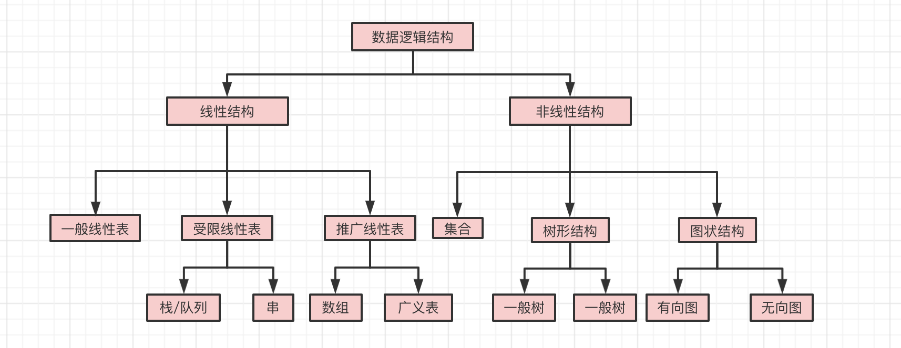

# 第一章 绪论
## 1.1数据结构的基本概念

### 1.1.1基本概念和术语
1. 数据

数据是信息的载体，是描述客观事物属性的数、字符及所有能输入到计算机中并被计算机程序识别和处理的符号的集合。数据是计算机程序加工的原料。

2. 数据元素

数据元素是数据的基本单位，通常作为一个整体进行考虑和处理。一个数据元素可由若干数据项组成，数据项是构成数据元素的不可分隔的最小单位。

3. 数据对象

数据对象是具有相同性质的数据元素的集合，是数据的一个子集。

4. 数据类型

数据类型是一个值的集合和定义在此集合上的一组操作的总称。
- 原子类型：其值不可再分的数据类型。
- 结构类型：其值可以再分解为若干成分（分量）的数据结构。
- 抽象数据类型：抽象数据组织及与之相关的操作。

5. 数据结构

数据结构是相互之间存在的一种或者多种特定关系的数据元素的集合。数据之间并不是单独存在的，是存在一定关系的，这种关系就叫做数据结构。

数据结构包含三个方面：
- 逻辑结构
- 存储结构
- 数据的运算
### 1.1.2数据结构的三要素

1. 数据的逻辑结构

    - 线性结构
    - 非线性结构

2. 数据的存储结构

- 顺序存储
- 链式存储
- 索引存储
- 散列存储
3. 数据的运算

施加在数据上的运算包括运算的定义和实现。运算的定义是针对逻辑结构的，指出运算的工能，运算的实现是针对存储结构的，指出运算的具体操作步骤。
## 1.2算法和算法评价

### 1.2.1算法的基本概念

算法Algorithm是对特定问题求解步骤的一种描述，它是指令的有限序列，其中的每条指令表示一个或者多个操作。

1. 有穷性：一个算法必须总在执行有穷步之后结束，且每一步都可以在有限的时间内完成。
2. 确定性：算法中每条指令必须有确切的含义，对于相同的输入只能得到相同的输出结果。
3. 可行性：算法中描述的操作都可以通过已经实现的基本运算执行有限次来实现。
4. 输入：一个算法的输入数据。
5. 输出：算法执行后的输出数据。

一个好的算法应该考虑以下目标：
1. 正确性
2. 可读性
3. 健壮性
4. 效率与低存储量需求

### 1.2.2算法效率的度量

#### 时间复杂度
一个语句在算法中被重复执行的次数。算法中所有语句的频度之和为T(n)，它是该算法问题规模n的函数，时间复杂度主要分析T(n)的数量级。

T(n) = O(f(n)) 

时间复杂度一般取最高数量级。

::: note 例如
f(n) = a*n^3^+b*n^2^+c*n的时间复杂度为O(n^3^)
:::

复杂情况下的时间复杂度的衡量：

1. 加法规则 : T(n) = T~1~(n) + T~2~(n) = O(f(n)) + O(g(n)) = O(max(f(n),g(n))) 

2. 乘法规则 : T(n) = T~1~(n) * T~2~(n) = O(f(n)) * O(g(n)) = O(f(n)*g(n)) 

常见的渐进复杂度为:
 O(1) &lt; O(log~2~n) &lt; O(n) &lt; O(nLog~2~n) &lt; O(n^2^) &lt; O(2^n^) &lt; O(n!) &lt; O(n^n^) 

#### 空间复杂度

算法的空间复杂度S(n)定义为该算法所耗费的存储空间，它是问题规模n的函数。

 S(n) = O(g(n)) 

算法原地工作是值算法所需要的辅助空间为常量，即O(1)