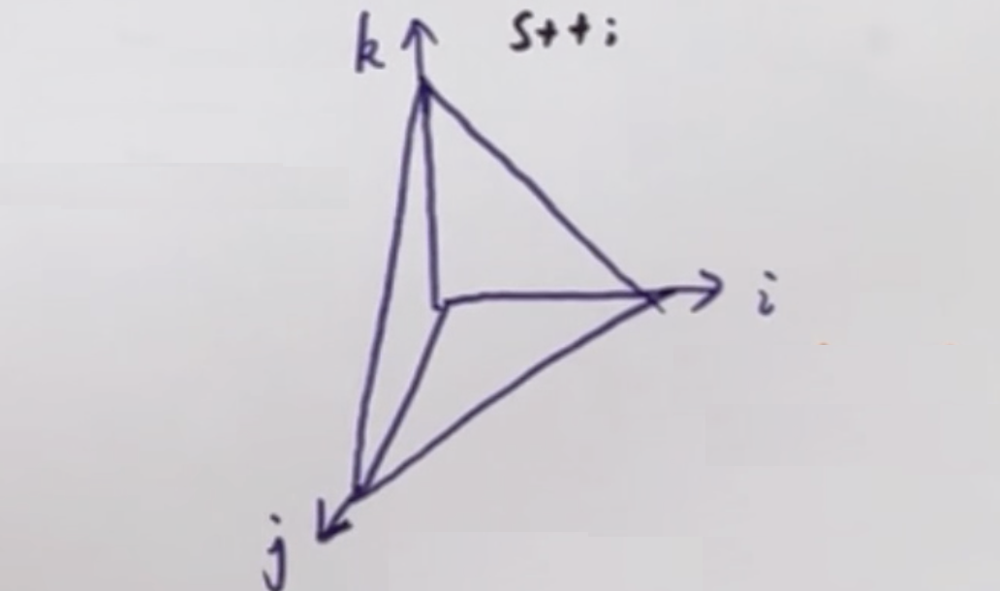

# 1.复杂度问题

## 时间复杂度

这里主要总结数据结构中时间复杂度的计算方法，在学习过程中，参考了B站的[数据结构——时间复杂度计算](https://www.bilibili.com/video/BV13d4y1K74p/)这个视频，可以在看完视频后，再阅读本文，效果更佳。

根据循环的层次不同，分为三个类别：

1. 单层循环
2. 两层循环
3. 多层循环

这里一一进行说明。

### 1.单层循环
::: tip 解决思路
1. 列出循环次数 t 以及每轮循环的变化值。
2. 找到 t 与 i 的关系
3. 确定循环的停止条件。
4. 联立两式，解方程。
5. 写结果。
:::

单层循环相对来讲是比较简单的，但是这里还是想整理成方法论，在做题过程中，不容易出错。下面我们来具体举例说明。

#### 例子1：简单

```c
int func(int n){
    int i = 0;

    while (i < n){
        i ++;
    }

    return i;
}
```

我们根据方法论，具体操作如下：
1. 列出循环次数 t 以及每轮循环的变化值。

|t|0|1|2|3|...|k|
|:---:|:---:|:---:|:---:|:---:|:---:|:---:|
|i|0|1|2|3|...|n - 1|
2. 找到 t 与 i 的关系
> 此时 t 和 i 的关系式为 i = t
3. 确定循环的停止条件。

>循环结束的条件为，i = n
4. 联立两式，解方程。
>联立即可得到 t = n
5. 写结果
> 即一共循环了 n 次

#### 例子2：中等难度

```c
int func(int n){
    int i = n * n;

    while (i != 1){
        i /= 2;
    }

    return i;
}
```
同样，我们根据方法论的步骤进行解答：

1. 列出循环次数 t 以及每轮循环的变化值。

|t|0|1|2|3|...|k|
|:---:|:---:|:---:|:---:|:---:|:---:|:---:|
|i|$n^2$|$\frac {n^2} {2}$|$\frac {n^2} {4}$|$\frac {n^2} {8}$|...|$\frac {n^2} {2^k}$|
2. 找到 t 与 i 的关系

> i = $\frac {n^2} {2^k}$
3. 确定循环的停止条件。
> 当 i = 1 时退出循环
4. 联立两式，解方程。

> i = $\frac {n^2} {2^k}$ = 1 , 解得 k = $2\log_ {2} {n}$
5. 写结果。
> 那么对应的时间复杂度就是 O($\log_ {2} {n}$)

#### 例子3：较难

```c
int func(int n){
    int i = 0;
    int sum = 0;

    while (sum < n){
        sum += ++i;
        // 这里实际上就可以拆分为两条语句。
        // 1. ++i;  这里是先 ++ 再返回。
        // 2. sum = sum + i;
    }
    return i;
}
```
1. 列出循环次数 t 以及每轮循环的变化值。

|t|0|1|2|3|...|T|
|:---:|:---:|:---:|:---:|:---:|:---:|:---:|
|i|0|1|2|3|...|I|
|sum|0|1|3|6|...|$\sum\limits _{t=0}^I$|

2. 找到 t 与 i 的关系
> t = i
3. 确定循环的停止条件。
> sum >= n
4. 联立两式，解方程。
> $\sum\limits _{t=0}^k = n = \frac {i * (i + 1)} {2}，解得 i =  \frac {-1 \pm \sqrt{1 + 8n}} {2}$
5. 写结果。
> t = i，则对应的时间复杂度为 O($n^ \frac {1} {2}$)
### 2.两层循环

::: tip 解题思路
1. 列出外层循环中 i 的变化量。
2. 列出内层语句的执行次数。
3. 求和，写结果。
:::

#### 例子1

```c
int func(int n,int m){
    for(int i = 0;i < n;i ++){
        for(int j = 0;j < m;j ++){
            arr[i][j] = 0;
        }
    }
    return n * m;
}
```

1. 列出外层循环中 i 的变化量。

> 和步骤2合并一起

2. 列出内层语句的执行次数。

|i|0|1|2|3|...|n - 1|
|:---:|:---:|:---:|:---:|:---:|:---:|:---:|
|j|m|m|m|m|...|m|

3. 求和，写结果。
> 一共执行的次数T = [(n - 1) - 0 + 1] * m = n * m;
> 
> 对应的时间复杂度为 O(nm)

#### 例子2

```c
int func(int n){
    for(int i = 0;i < n;i ++){
        for(int j = 0;j < i;j ++){
            arr[i][j] = 0;
        }
    }
    return n;
}
```

1. 列出外层循环中 i 的变化量。
> 和步骤2合并一起

2. 列出内层语句的执行次数。

|i|0|1|2|3|...|n - 1|
|:---:|:---:|:---:|:---:|:---:|:---:|:---:|
|j|0|1|2|3|...|i|

3. 求和，写结果。

> 一共执行的次数 $ T = \frac {n * [0 + (n - 1)]} {2} $
> 
> 则对应的时间复杂度  $O(n^2)$

### 3.三层循环

::: tip 解题思路
- 方法1: 抽象为计算三维体积
- 方法2: 列式求和
:::

#### 例子

```c
int func(int n){
    for(int i = 1;i <= n;i ++){
        for(int j = 1;j <= i;j++){
            for(int k = 1;k <= j;k++){
                arr[i][j][k] = 0;
            }
        }
    }
    return n;
}
```
第一种方法我目前也没有理解，具体是怎么做的。



体积公式 $V = \frac {1} {3} s * h$

第二种方法:

$\sum\limits _{i=1}^{n} \sum\limits _{j=1}^{i} \sum\limits _{k=1}^{j} 1 = \sum\limits _{i=1}^{n} \sum\limits _{j=1}^{i}j= \sum\limits _{i=1}^{n}  \frac {i(i + 1)} {2} = \frac {1} {2} (\sum\limits _{i=1}^{n} i^2 + \sum\limits _{i=1}^{n} i) = \frac {1} {2} (\frac {n(n+1)(2n+1)} {6} + \frac {n(n + 1)} {2}) = \frac {n^3+3n^2+2n} {6}$

则对应的时间复杂度为 $O(n^3)$

## 空间复杂度

空间复杂度是很容易判断的，这里主要对递归操作进行说明。

每次递归时，调用一次递归函数，则为 $O(n)$

每次递归时，调用两次递归函数，则为 $O(n^2)$

......

以此类推即可。