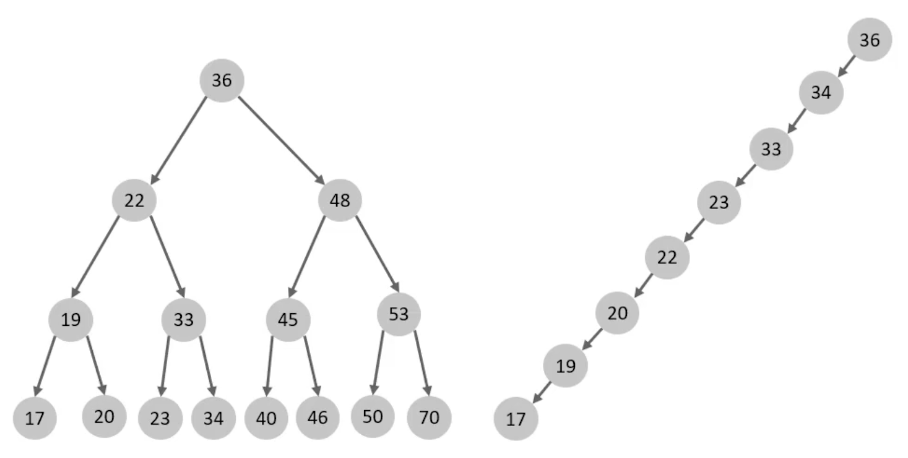
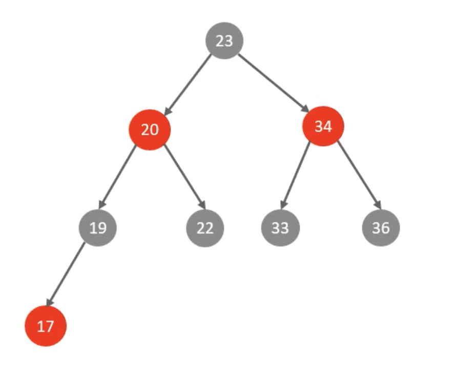

# 索引

## 索引概述
### 概念
索引是帮助MySQL<font color="blue">高效获取数据</font>的`数据结构`（有序）。在数据之外，数据库系统还维护着满足特定查找算法的数据结构，这些数据结构以某种方式饮用（指向）数据，这样就可以在这些数据结构上实现高级查找算法，这种数据结构就是索引。
### 优缺点
- 优点
1. 提高数据检索的效率，降低数据库的IO成本
2. 通过索引列对数据进行排序，降低数据排序的成本，降低CPU的消耗

- 缺点
1. 索引列也是要占用空间的
2. 索引大大提高了查询效率，同时却也降低更新表的速度，如对表进行INSERT、UPDATE、DELETE时，效率降低。

::: tip 注意
索引是一种典型的使用空间换时间的例子。
:::
## 索引结构

MySQL的索引是在存储引擎层实现的，不同的存储引擎有不同的结构，主要包含以下几种：

|索引结构|描述|
|:---:|:---:|
|<font color="red">B+Tree索引</font>|<font color="red">最常见的索引结构，大部分索引都支持B+树索引</font>|
|Hash索引|底层数据结构是用哈希表实现的，只有精确匹配索引列的查询才有效，不支持范围查询|
|R-tree<Badge text="空间索引" type="danger" /> | 空间索引是MyISAM引擎的一个特殊索引，主要用于地理空间数据类型，通常使用较少|
|Full-text<Badge text="全文索引" type="danger" />|是一种通过建立倒排索引，快速匹配文档的方式，类似于Lucene,Solr,Es|

### 二叉树


::: warning 缺点
使用二叉树做索引结构，顺序插入时，会退化成为一个链表，查询性能大大降低。大量数据的情况下，层级较深，检索速度慢。
:::

### 红黑树



::: warning 缺点
红黑树虽然解决了退化为单链表的这种现象，但是其本质上仍然是二叉树，在大量数据的情况下，层级较深，检索速度还是很慢。
:::
### B树

B树(B-Tree)又称为多路平衡查找树，一般是以阶树来衡量B树，以其最大度数作为B树的阶数，一棵n阶B树的节点最多能存储n-1个数据，n个指针。


::: tip 小知识
树的度数指的是一个节点的子节点个数。
:::

B树随着数据的插入或者删除会自动进行节点的裂变和合并，这里的具体细节可以去学习数据结构中的B树。

::: info B树知识点
// todo 待更新
[B树](https://www.codermast.com)
:::

### B+树

B+树是B树的一个变种，基本的结构和节点的变化规律不变，仅在非叶子结点中存储索引，在叶子结点中存储数据。并且在叶子结点中，相邻的叶子结点会有一个单向的指针连接，形成一个单向链表。


### 优化的B+树

MySQL索引数据结构对经典的B+Tree进行了优化。在原B+Tree的基础上增加了一个指向相邻叶子结点的链表指针，就形成了带有顺序指针的B+Tree，提高区间访问的性能。


### Hash

哈希索引就是采用一定的Hash算法，将键值换算成新的hash值，映射到对应的槽位上，然后存储在hash表中。

是哈希结构，那么就不可避免的会出现哈希碰撞（哈希冲突），即多个键值对映射到了同一个槽位上，此时就产生了哈希碰撞，可以通过构建链表来解决。
::: tip 知识点
解决哈希碰撞的方法有很多，如：拉链法、开放寻址法、再哈希法、建立公共溢出区等方法进行解决。
:::

哈希索引的特点：
1. hash索引只能用于对等比较（== ， in） ，不支持范围查找(between , > , < , ...)
2. 无法利用索引完成排序操作。
3. 查询效率高，通常只需要一次检索就可以了，效率通常要高于B+Tree索引。

::: note 存储引擎支持
在MySQL中，支持hash索引的是Memory引擎，而InnoDB中具有自适应hash功能，hash索引是存储引擎根据B+Tree索引在指定条件下自动构建的。其他引擎不支持。

自适应hash就是InnoDB存储引擎根据我们的查询条件，在指定的条件下会自动的将B+树索引构建成hash索引。
:::

### 思考
::: warning 思考题
为什么InnoDB存储引擎选择使用B+树索引结构？
:::
- 相对于二叉树，在相同数据规模的情况下，B+树具有更少的层级，查询速度更快
- 对于B树，无论是叶子结点还是非叶子结点，都会保存数据，这样导致一页中存储的键值减少，指针跟着减少，要保存大量数据，只能增加树的高度，导致性能降低。
- 对于Hash索引，B+树支持范围匹配和排序操作。

### 存储引擎支持

|索引|InnoDB|MyISAM|Memory|
|:---:|:---:|:---:|:---:|
|B+Tree索引|✅|✅|✅|
|Hash索引|❌|❌|✅|
|R-Tree索引|❌|✅|❌|
|Full-text索引|5.6版本以后✅|✅|❌|

## 索引分类

索引主要分为4个类型：主键索引、唯一索引、常规索引、全文索引

|分类|含义|特点|关键字|
|:---:|:---:|:---:|:---:|
|主键索引|针对于表中主键创建的索引|默认自动创建，只能有一个|PRIMARY|
|唯一索引|避免同一个表中某数据列中的值重复|可以有多个|UNIQUE|
|常规索引|快速定位特定数据|可以有多个||
|全文索引|全文索引查找的是文本中的关键词，而不是比较索引中的值|可以有多个|FULLTEXT|

在InnoDB存储引擎中，根据索引的存储形式，又可以分为以下两种：
|分类|含义|特点|
|:---:|:---:|:---:|
|聚集索引<Badge text="Clustered Index" type="danger" />|将数据和索引的存储放到了一块，索引结构的叶子结点保存了行数据|必须有，而且只能有一个|
|二级索引<Badge text="Secoundary Index" type="danger" />|将数据和索引分开存储，索引结构的叶子结点关联的是对应的主键|可以存在多个|

聚集索引的选取规则：
1. 如果存在主键，主键索引就是聚集索引
2. 如果不存在主键，将使用第一个唯一UNIQUE索引作为聚集索引。
3. 如果没有主键，也没有合适的唯一索引，那么InnoDB引擎就会生成一个rowid作为隐藏的聚集索引。

### 回表查询


我们在对数据的查询时，通常会给定查询条件，而当我们的查询条件并不是聚集索引中的值，而是二级索引中的值，这时候的查询过程为：

1. 先通过筛选条件在二级索引中查找对应的记录值，找到记录值的id；
2. 使用记录值的id再在聚集索引中查询，得到数据的记录值。

这个过程我们就叫做回表查询，虽然只执行了一条查询语句，但是实际的底层在B+树内查询了两次。

### 思考题

1. 以下SQL语句中，那个执行效率更高？为什么？
```sql
select * from user where id = 10;

select * from user where name = 'Mast';
```
备注：id为主键，name字段创建的有索引。

::: tip 答案
第一条SQL使用id查询的效率更高，因为id是主键，而主键会建立聚集索引，聚集索引中查询直接就能够得到数据的记录值。而使用name字段查询，虽然建立有索引，但是其为二级索引，查询后的值为该字段对应的id值，此时还需要通过id值在聚集索引中查询，有回表查询，查询了两次B+树，而第一条SQL只查询了一次B+树。
:::

2. InnoDB主键索引的B+Tree高度为多高呢？

::: tip 答案
- 假设：
    一行数据大小为1K=1024B=1024字节，一页中能存储16行这样的数据，InnoDB的指针占用6个字节的空间，主键即使为bigint，占用8个字节。
- 高度为2时：
    n * 8 + (n + 1) * 6 = 16 * 1024
    解得：n = 1170

    所以一共能存储 1171 * 16 = 18736 个数据
- 高度为3时：
    1171 * 1171 * 16 = 21939856 个数据
:::

## 索引语法

- 创建索引

```sql
CREATE [UNIQUE | FULLTEXT] INDEX index_name ON table_name(index_col_name,...);
```
> 在表 table_name 中创建名为index_name 的索引。

::: note 注意
[UNIQUE | FULLTEXT]是可选项，分别为创建唯一索引和全文索引，如果都不选的话，则创建的是常规索引。一个索引可以关联多个字段。
:::

根据索引关联字段的个数，可以讲索引分为两种类型：
1. 单列索引：索引列表只有一个字段。
2. 联合索引：又叫组合索引，即索引列表有多个字段。

- 查看索引
```sql
SHOW INDEX FROM table_name;
```
> 查看指定表的索引。

- 删除索引
```sql
DROP INDEX index_name ON table_name;
```
> 删除表 table_name 名为 index_name 的索引。
## SQL性能分析

- SQL执行频率

MySQL客户端连接成功后，通过 SHOW [session | global] status 命令可以查看服务器状态信息。

通过如下指令，可以查看当前数据库的INSERT、SELECT、UPDATE、DELETE操作的访问频次：

```sql
SHOW GLOBAL STATUS LIKE "Com_______";
```

> 需要注意的是，这里一共有7个空格。

这里查询完成以后就能够看到增删改查的执行次数。

- Com_insert：插入
- Com_update：更新
- Com_select：查询
- Com_delete：删除


我们可以根据这个数据来判断我们主要对那些操作进行优化。

## 索引使用

## 索引设计原则