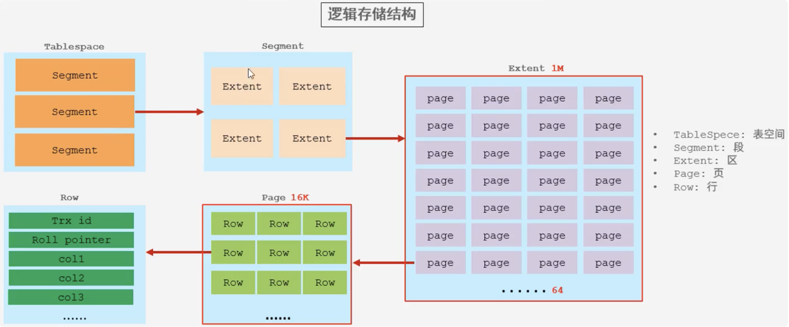
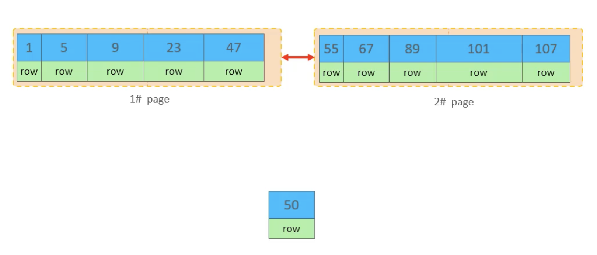

# SQL优化

## insert优化
### 批量插入
```sql
insert into table_name values (values_list...);
```
一次性可以插入多个数据，来减少多次请求带来的性能消耗，但是一次性插入的数据量不建议超过500-1000条。

### 手动提交事务
```sql
start transaction;
insert into table_name values (values_list1...);
insert into table_name values (values_list2...);
insert into table_name values (values_list3...);
commit;
```
在多次数据插入时，可以手动开启事务，将数据分组提交。
### 主键顺序插入
```
主键乱序：8 5 3 6 9 4 2 1 7 10
主键有序：1 2 3 4 5 6 7 8 9 10
```
::: info 提示
主键有序插入比主键乱序插入的速度要快，这是由于MySQL底层的数据结构造成的，我们在下一章节的主键优化里详细说明。
:::
### 大批量数据插入

如果一次性需要插入大量的数据，使用insert语句插入的性能不高，此时可以使用MySQL提供的load指令进行插入。

load指令可以将文件内的数据，一次性加载进数据库内。

具体操作如下：
```sql
-- 客户端连接服务端时，加上参数 --local-infile
mysql --local-infile -u root -p
-- 设置全局参数为local_infile = 1，开启从本地加载文件导入数据库的开关
set global local_infile = 1;
-- 执行load指令，将准备好的数据加载到数据表内
load data local infile 'file_path' into table `table_name` fields terminated by 'split_char' lines terminated by 'line_break';
```

::: note 参数说明
- file_path : 存储数据文件的路径地址
- table_name : 要插入数据的数据表名称
- split_char : 行内数据字段分隔符号
- line_break : 换行分隔符，即以什么标准判断数据行之间的分隔。
:::
## primery key优化

### 数据的组织方式

在InnoDB存储引擎中，表数据都是根据主键顺序组织存放的，这种存储方式的表称为索引组织表（index organized table IOT）。

而InnoDB存储引擎中，默认的聚集索引就是主键索引。



::: info 参数说明
- TableSpace：表空间，内存储的是segment段
- Segment：段，其存储的是extent区
- Extent：区，其存储的是page页【固定1M】
- Page：页，其内存储的是row行【固定16k】
- Row：行，其内存储的是数据行

这里的Extent和Page的空间大小是固定的，每个Extent区占据1M，每个Page页占据16K，则一个extent内包含了64个page
:::

### 页分裂
页可以为空，也可以填充一半，也可以填充100%。每个页包含了 2 - N 行数据，如果一行的数据过大，会行溢出，根据主键排序。

我们分别从 主键顺序插入 和 主键乱序插入 这两个角度来探究这个问题：

- 主键顺序插入
主键顺序插入数据，由于数据在页内存储会根据主键排序，那么此时所有的数据在页内都会顺序排列，页内剩余空间不足时，则开启下一个页，尽可能的保证了空间的利用率。也不存在数据的移动问题。

- 主键乱序插入
同理，数据按主键排序，那么在主键乱序插入一组数据以后，此时页内的数据是有序的，但是如果下一次想要插入的数据主键不为最大值，那么此时需要将数据插入到页中，而不是直接添加到页尾，则此时需要进行数据的移动。



1. 先开启一个新的数据页，page3

2. 将page1中50%的位置，将后半段数据移动到page3

3. 将主键为50的这行数据，插入到page3的末尾。

4. 由于要保证page之间有序，还需要调整页间指针的方向，调整为 page1 -> page3 -> page2

5. 此时则完成了数据的插入。

::: tip 小知识
我们将这种页面分裂的现象，叫做页分裂。那么在插入时会伴随页分裂，则相同的在数据删除时，就会出现页合并。
:::

### 页合并

当删除一行记录时，实际上并没有将记录值物理删除，只是记录被标记（flaged）为删除并且他的空间变得允许被其他记录值重新声明。当页中删除的记录达到MERGE_THRESHOLD(默认为页的50%)，innoDB会开始寻找最靠近的页（前或后）看看是否可以将两个页合并以优化空间使用。

::: info 小贴士
MERGE_THRESHOLD：合并页的阀值，可以自己设置，在创建表或者创建索引时指定。
:::

### 主键设计原则
- 满足业务需求的情况下，尽量降低主键的长度。
- 插入数据时，尽量使用顺序插入，选择使用AUTO_INCREMENT自增主键。
- 尽量不要使用UUID做主键或者是其他自然主键，如身份证号。
- 业务操作时避免对主键的修改。
## order by优化
### 查询类别
1. Using filesort : 通过表的索引或全表扫描，读取满足条件的数据行，然后在排序缓冲区sort buffer中完成排序操作，所有不是通过索引直接返回排序结果的排序都叫做FileSort排序。

2. Using index : 通过有序索引顺序扫描直接返回有序数据，这种情况即为Using index，不需要额外排序，操作效率较高。

对于满足排序列表的索引，在order by查询时是直接通过索引进行查询，是Using index，而不满足排序列表的索引则会通过全表扫描，是Using filesort

### 举例说明
举个简单的例子：

```sql
select id,age,name from tb_name order by age;
```
在没有建立任何索引的情况下，这条SQL是通过全表扫描进行查询的，但是如果对age字段建立索引，则再进行查询时，是通过索引查询的，Using index。

这里也是满足索引的最左前缀法则，即只要从左往右开始，有字段存在符合的索引，则就可以通过索引进行查询，如果全部都能通过索引则仅为Using index，否则为Using index和Using filesort并存。

::: warning 注意
建立索引时也会区分字段的排序规则，有ASC和DESC两种，默认为ASC。

如果存在和排序列表中相符合或者完全相反的索引，那么都是可以使用索引进行查询的，完全相同时则无可厚非，直接进行查询即可，而完全相反时只需要反向扫描即可。
:::
### 注意事项
- 根据排序字段建立合适的索引，多字段排序时，也是遵循最最前缀法则的。
- 尽量使用覆盖索引。
- 多字段排序，一个升序一个降序，此时需要注意联合索引在创建时的规则（ASC、DESC）。
- 如何不可避免的出现filesort，大数据量排序时，可以适当增大排序缓冲区大小`sort_buffer_size`（默认为256k）。

## group by优化

### 查询类型
1. Using index : 使用索引，直接使用索引对相关的信息进行查询。

2. Using temporary : 使用中间表，需要通过建立中间临时表对所需要的数据进行查询，效率相对较低。

### 注意事项
- 在分组操作时，可以通过索引来提高效率。
- 分组操作时，索引的使用也是满足最左前缀法则的。
- 尽量建立联合索引，覆盖索引，避免回表查询。

## limit优化

### 优化场景
对limit来讲，从越大数据开始的分页，耗时越长。需要对此优化。
### 举例说明
如：返回 2000000 - 200010的数据，其他数据全部丢弃，此时查询的代价就比较大。

### 优化思路
一般分页查询时，通过创建覆盖索引能够比较好地提高性能，可以通过覆盖索引加子查询形式进行优化。

## count优化

MyISAM引擎把一个表的总行数存在了磁盘上，因此执行count(*)的时候会直接返回这个数，效率很高。

但是对于InnoDB引擎，它count(*)的时候，需要把数据一行一行地从引擎里面读出来，然后累积计数。

### 优化思路

自己计数，不通过InnoDB引擎提供的计数方式进行计算。

::: note 例如
我们在使用Redis时，将数据量的存储起来，对于数据的变动，维护好这个存储的变量即可。

也可以建立相关的表，于使用Redis类似，维护好数据表内的数据即可。
:::

### count的用法

count()是一个聚合函数，对于返回的结果集，一行行地判断，如果count函数的参数不是Null，累计值就加1，否则不加，最后返回累计值。

- count(*)
InnoDB 引擎并不会把全部字段取出来，而是专门做了优化，不取值，服务层直接按行进行累加。

- count(主键)

InnoDB引擎会遍历整张表，把每一行的主键ID值都取出来，返回给服务层。服务层拿到主键以后，直接按行进行累加（主键不可能为null）
- count(字段)
没有not null约束：innoDB引擎会遍历整张表，把每一行的字段值都取出来，返回给服务层，服务层判断是否为null，不为null，计数累加。

有not null约束：InnoDB引擎会遍历整张表，把每一行的字段值都取出来，返回给服务层，直接按行进行累加。
- count(1)
InnoDB引擎遍历整张表，但不取值，服务层对于返回的每一行，放一个数字“1”进去，直接按行进行累加。
::: tip 效率排行
count(字段) < count(主键 id) < count(1) ≈ count(*)

尽量使用count(*)
:::
## update优化

### 注意事项

InnoDB引擎中的行锁是针对索引加的锁，不是针对记录值加的锁，并且该索引不能失效，否则会从行锁升级为表锁。

::: tip 提示
所以在更新操作时，尽量使用主键、索引字段进行更新，以减少在并发环境下，造成的影响。
:::
### 举例说明

如未使用索引字段进行数据更新，则在筛选该数据记录值时会进行全表扫描，则会占用的是整张表的资源。