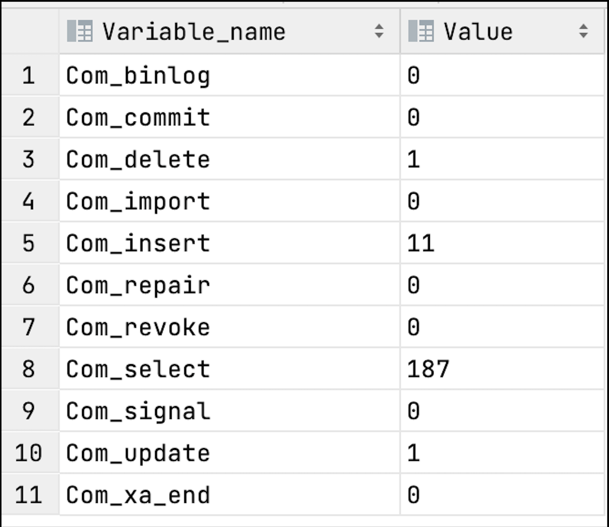

# MySQL进阶 - SQL性能分析

## SQL执行频率

MySQL客户端连接成功后，通过 SHOW [session | global] status 命令可以查看服务器状态信息。

通过如下指令，可以查看当前数据库的INSERT、SELECT、UPDATE、DELETE操作的访问频次：

```sql
SHOW GLOBAL STATUS LIKE "Com_______";
```

> 需要注意的是，这里一共有7个空格。

这里查询完成以后就能够看到增删改查的执行次数。

- Com_insert：插入
- Com_update：更新
- Com_select：查询
- Com_delete：删除



我们可以根据这个数据来判断我们主要对那些操作进行优化。

## 慢查询日志
慢查询日志记录了所有执行时间超过指定参数(long_query_time，单位：秒，默认10秒)的所有SQL语句的日志。

MySQL中默认不开启慢查询日志，开启的话需要在MySQL的配置文件（/etc/my.cnf）中配置如下信息：

```sql
-- 开启MySQL中的慢查询
slow_query_log = 1
-- 设置慢查询的	时间为2秒钟，SQL语句执行超过两秒，则会被视为慢查询，记录慢查询日志
long_query_time = 2
```

配置完毕以后，通过以下指令重新启动MySQL服务器进行测试，查看慢日志文件中记录的信息`/var/lib/mysql/localhost-slow.log`

::: info 功能
慢查询日志主要就是为了记录那些查询时间较长的SQL语句，方便于我们的优化。
:::

::: note 前景提要
通过慢查询日志，我们能够找到查询时间较低的SQL，但是有时候我们对于SQL已经优化到了极致，由于数据量的巨大，无法再压缩SQL的执行时间，或者有些SQL本应该很快执行完毕，但是仍耗费了很长时间，而耗费的时间又在我们慢日志统计时间的临界值，而这类SQL是非常需要我们进行优化的。这两种情况时，需要优化的没有被统计，而无法优化的又被统计到，那么此时慢查询就无法满足我们的需求，这时候就需要使用Profile分析。
:::

## Profile分析

show profiles分析能够在做SQL优化时帮助我们了解时间都耗费到哪去了。通过have_profiling参数，能够看到当前MySQL是否支持profile操作：

- 查看是否支持profile
```sql
SELECT @@have_profiling;
```

默认情况下profile是关闭的，可以通过 set 语句在 globle|session 级别开启profiling;

- 开启profile
```sql
set [session|globle] profile = 1;
```

- 查看每一条执行过的SQL语句的耗时情况
```sql
show profiles;
```
- 查看指定query_id 的SQL语句各个阶段的耗时情况
```sql
shwo profile for query query_id;
```
- 查看指定query_id 的SQL语句的CPU的使用情况
```sql
show profile cpu for query query_id;
```

## explain执行计划
::: note 前景提要
前面我们了解的几种方法要么通过SQL的执行频率，要么通过SQL的执行时间来判断SQL是否需要优化，而这些方式并不能够真正的评判一条SQL的性能。
:::

explain 或者 desc 命令获取MySQL如何执行SELECT语句的信息，包括SELETC语句执行过程中表如何连接和连接的顺序。

- 语法
```sql
-- 直接在SELECT语句之前加上关键字 explain 或者 desc
EXPLAIN SELECT 字段列表 FROM 表名 WHERE 条件列表;
```

explain执行计划各字段的含义：
- **id**
SELECT 查询的序列号，表示查询中执行 SELECT 子句或者是操作表的顺序（id相同，执行顺序从上到下；id不同，值越大，越先执行）。

- select_type
表示SELECT的类型，常见的取值有SIMPLE（简单表，即不使用表连接或者子查询）、PRIMARY（主查询，即外层的查询）、UNION（UNION中的第二个或者后面的查询语句）、SUBQUERY（SELECT/WHERE之后包含了子查询）等。

- **type**【重要】
表示连接类型，性能由好到差的连接类型为：NULL、system、const、eq_ref、ref、range、index、all。

- possible_key
显示可能应用到这张表上的索引，一个或者多个。

- key
实际使用的索引，如果为NULL，则表示没有使用索引。

- key_len
表示索引中使用的字节数，该值为索引字段最大可能长度，并非实际使用长度，再不损失精度的前提下，长度越短越小。

- rows
MySQL认为必须要执行查询的行数，在innodb引擎的表中，是一个估计值，可能并不总是准确的。

- filtered
表示查询返回结果的行数占需要的读取行数的百分比，filtered的值越大越好。

- extra
备注信息，一般为NULL。
