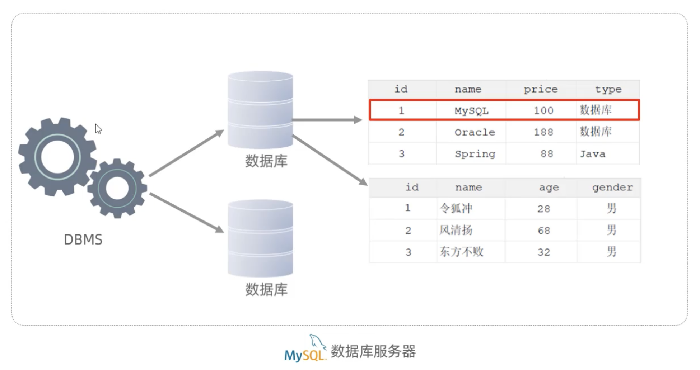

# 基础概念

## 基本概念

:::info 区别
在学习MySQL之前，我们需要明确一些基本概念，以便于后续的理解和学习。
:::

- 数据库

数据库是存储数据的仓库，数据是有组织的进行存储。简写为DataBase （DB）

- 数据库管理系统

操纵和管理数据库的大型软件系统。简写为DataBase Management System （DBMS）

- SQL

操作关系型数据库的编程语言，定义了一套操作关系型数据库的统一标准。又叫架构话查询语言，Structured Query Language（SQL）

- MySQL

由瑞典MySQL AB公司开发的一款关系型数据库管理系统（Relational DataBase Management System RDBMS），属于Oracle旗下。

## MySQL的安装

:::tip 
直接在MySQL官方网站，根据自己的操作系统下载安装即可。
:::

[MySQL官方下载地址：https://www.mysql.com/downloads/](https://www.mysql.com/downloads/)

## MySQL版本

- 社区版 MySQL Community Server
    - 免费
    - 不提供技术支持

- 商业版 MySQL Enterprise Edition
    - 收费
    - 提供专业技术支持

## 数据库类型

### 关系型数据库

建立在关系模型基础上，由多张相互连接的二维表组成的数据库。

::: info 特点
1. 使用表存储数据，格式统一，便于维护
2. 使用SQL语言操作，标准统一，使用方便。
::: 

### 非关系型数据库

分布式的、非关系型的、不保证遵循ACID原则的数据存储系统。最常见的解释就是NoSQL，non-relational或者Not only SQL。非关系型可以分为以下几种类型：

- 键值(Key-Value)存储数据库
::: note
主要有：Tokyo Cabinet/Tyrant， Redis， Voldemort， Oracle BDB
:::
- 列存储数据库

::: note 
主要有：Cassandra， HBase， Riak
::: 
- 文档型数据库

::: note
主要有：CouchDB， MongoDb
:::
- 图形(Graph)数据库

::: note 
主要有：Neo4J， InfoGrid， Infinite Graph
:::

## MySQL数据模型

