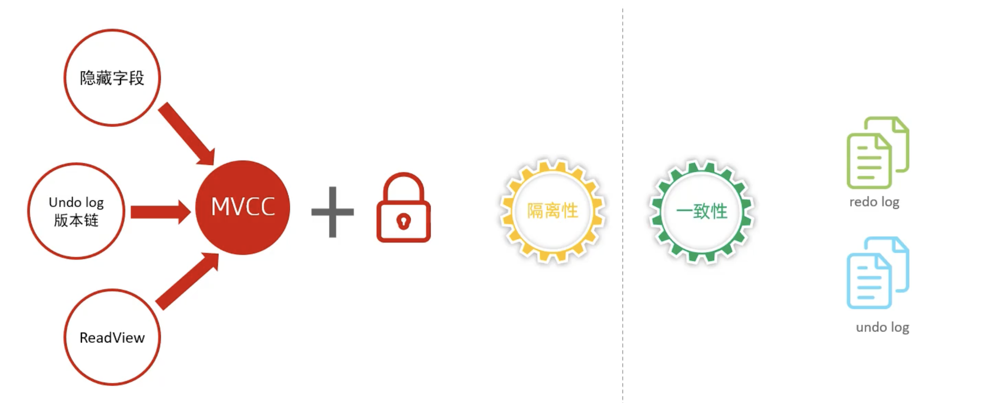

# MySQL进阶 - MVCC多版本并发控制

## 概念介绍

### MVCC

MVCC全称为Multi-Version Concurrency Control，多版本并发控制。指维护一个数据的多个版本，使得读写操作没有冲突，快照读为MySQL实现MVCC提供了一个非阻塞读功能。MVCC的具体实现，还需要依赖于数据库记录中的三个隐藏字段、undo log 日志、readView。

### 当前读

读取的是记录的最新版本，读取时还要保证其他并发事务不能修改当前记录，会对读取的记录进行加锁。对于我们日常的操作，如：
select ... lock in share mode （共享锁），select ... for update 、insert、delete（排他锁）都是一种当前读。

### 快照读

简单的select语句（不加锁）就是快照读，快照读读取的是记录数据的可见版本，有可能是历史数据，不加锁，是非阻塞读。

- Read Commit：每次select，都生成一个快照读。
- Repeated Read：开启事务后第一个select语句才是快照读的地方。
- Serializable：快照读会退化为当前读。

## 实现原理

记录中的隐藏字段分别为：DB_TRX_ID、DB_ROLL_PTR、DB_ROW_ID。

|隐藏字段|含义|
|:---:|:---:|
|DB_TRX_ID|最近修改事务的ID，记录插入这条记录或最后一次修改该记录的事务ID|
|DB_ROLL_PTR|回滚指针，指向这条记录的上一个版本，用于配合undo log，指向上一个版本|
|DB_ROW_ID|隐藏主键，如果表结构没有指定主键，将会生成该隐藏字段|

::: tip ibd2sdi指令
ibd2sdi指令可以查看ibd文件，语法如下：

`
ibd2sdi 'filename.ibd'
`
:::

## Undo Log

回滚日志，在insert、update、delete的时候产生的便于数据回滚的日志。

当insert的时候，产生的 undo log 日志只在回滚时需要，在事务提交后，可以被立即删除。

而update、delete的时候，产生的 undo log 日志不仅在回滚时需要，在快照读时也需要，不会立刻被删除。

## Undo Log 版本链

在并发访问的情况下，有多个事务需要对同一个数据进行操作，此时则在Undo Log 中记录下每一次操作的原数据，作为事务在未提交情况下回滚的依据。

不同事务或者相同事务对同一条数据记录进行操作，会导致该记录的 Undo Log 生成一条记录版本链条，链表的头部是最新的旧数据，链表的尾部是最早的旧数据。

具体的事务回滚，不单单依赖Undo Log，还依靠ReadView。Undo Log记录事务回滚的数据，ReadView决定回滚到哪个链条节点。

## ReadView 读视图

Read View 读视图是快照读SQL执行时MVCC提取数据的依据，记录并维护系统当前活跃的事务（未提交）ID。

ReadView中包含了4个核心字段：

|字段|含义|
|:---:|:---:|
|m_ids|当前活跃的事务ID集合，即当前还未提交的事务ID集合|
|min_trx_id|最小活跃事务ID|
|max_trx_id|预分配事务ID，当前最大事务ID+1（因为事务ID是自增的）|
|creator_trx_id|ReadView创建者的事务ID|

### 版本链数据访问规则

trx_id 代表的是当前的事务ID：

1. trx_id == creator_trx_id : 可以访问该版本
2. trx_id < min_trx_id : 可以访问该版本
3. trx_id > max_trx_id : 不可以访问该版本
4. min_trx_id <= trx_id <= max_trx_id : 如果 trx_id 不在 m_ids 中是可以访问该版本的，即事务已经提交了

::: warning 注意
不同的隔离级别，生成ReadView的时机不同：
- Read Commited : 在事务中每一次执行快照读时生成ReadView
- Repeatable Read : 仅在事务中第一次执行快照读时生成ReadView，后续复用该ReadView
:::

|特性|实现方式|
|:---:|:---:|
|原子性|Undo Log|
|持久性|Redo Log|
|一致性|Undo Log + RedoLog|
|隔离性|MVCC + 锁|