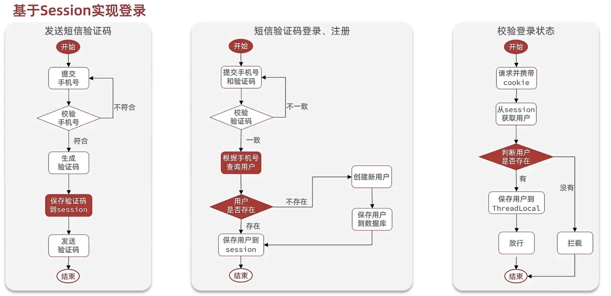
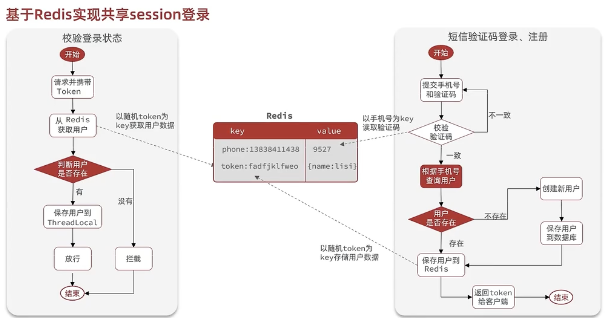

# Redis实战 - 短信登录

## API
在实现之间我们需要先通过阅读源代码或者查看文档方式，了解这个功能所需要实现的 API 接口。

前端访问的 URL 地址：`/login.html`

具体调用的是`com/hmdp/controller/UserController.java`控制器类中的方法，我们实现即可。

### 发送短信验证码

|请求方式|`POST`|
|:---:|:---:|
|请求路径|`/user/code`|
|请求参数|`phone`手机号|
|返回值|`null`|
|方法名|`sendCode`|

### 短信验证码注册、登录


|请求方式|`POST`|
|:---:|:---:|
|请求路径|`/user/login`|
|请求参数|1. `phone` 手机号<br />2. `code` 验证码|
|返回值|`null`|
|方法名|`login`|

### 校验登录状态 

|请求方式|`GET`|
|:---:|:---:|
|请求路径|`/user/me`|
|请求参数|`null`|
|返回值|用户对象信息|
|方法名|`me`|


## 基于 Session 实现
基于 Session 的实现我们主要是实现这三个部分：




### 发送短信验证码

```java
public Result senCode(String phone, HttpSession session) {

    // 1. 校验手机号是否符合
    if (RegexUtils.isPhoneInvalid(phone)) {
        // 2. 如果不符合，则返回失败
        return Result.fail("手机号格式错误！");
    }
    // 3. 手机号格式正确，则生成验证码
    String code = RandomUtil.randomNumbers(6);

    // 4. 发送验证码
    log.info("手机验证码为：" + code);

    // 5. 将验证码存放到 session 中
    session.setAttribute("login:code:" + phone,code);


    // 6. 返回信息
    return Result.ok("发送成功");
    }
```
### 短信验证码注册、登录

```java
public Result login(LoginFormDTO loginForm, HttpSession session) {
    // 1. 准备信息
    String loginPhone = loginForm.getPhone();
    String cacheCode = loginForm.getCode();
    String code = session.getAttribute("login:code:" + loginPhone);

    // 2. 校验手机号
    if (RegexUtils.isPhoneInvalid(loginPhone)) {
        return Result.fail("手机号格式不符合！");
    }


    // 3. 校验验证码
    if (!cacheCode.equals(code)) {
        return Result.fail("验证码错误！");
    }

    // 4. 查询数据库
    User user = query().eq("phone", loginPhone).one();

    // 5. 用户不存在则注册并登陆
    if (user == null) {
        user = createUserByPhone(loginPhone);
    }

    // 6. 用户存在则直接登录，即将用户信息存储至 session 中

    // 6.1 随机生成用户登录令牌 Token
    String token = UUID.randomUUID().toString(true);

    // 6.2 将 User 对象转化为 UserDTO 存储
    UserDTO userDTO = BeanUtil.copyProperties(user, UserDTO.class);


    // 完整的登录 token
    String tokenKey = "login:token:" + token;
    
    // 存储至 session
    session.setAttribute(tokenKey,userDTO);

    return Result.ok(token);
}
```
### 校验登录状态

```java
public Result me(){
    UserDTO userDTO = UserHolder.getUser();
    return Result.ok(userDTO);
}
```

## 基于 Redis 实现



### 发送验证码

```java
public Result senCode(String phone, HttpSession session) {
        ValueOperations<String, Object> stringOps = redisTemplate.opsForValue();

    // 1. 校验手机号是否符合
    if (RegexUtils.isPhoneInvalid(phone)) {
        // 2. 如果不符合，则返回失败
        return Result.fail("手机号格式错误！");
    }
    // 3. 手机号格式正确，则生成验证码
    String code = RandomUtil.randomNumbers(6);

    // 4. 发送验证码
    log.info("手机验证码为：" + code);

    // 5. 将验证码存放到 Redis 中，并设置 2 分钟有效期
    stringOps.set(RedisConstants.LOGIN_CODE_KEY + phone, code, RedisConstants.LOGIN_CODE_TTL, TimeUnit.MINUTES);

    // 6. 返回信息
    return Result.ok("发送成功");
}
```

### 短信验证码注册、登录

```java
public Result login(LoginFormDTO loginForm, HttpSession session) {

    ValueOperations<String, Object> stringOps = redisTemplate.opsForValue();
    HashOperations<String, Object, Object> hashOps = redisTemplate.opsForHash();
    // 1. 准备信息
    String loginPhone = loginForm.getPhone();
    String cacheCode = loginForm.getCode();
    String code = (String) stringOps.get(RedisConstants.LOGIN_CODE_KEY + loginPhone);

    // 2. 校验手机号
    if (RegexUtils.isPhoneInvalid(loginPhone)) {
        return Result.fail("手机号格式不符合！");
    }

    // 3. 校验验证码
    if (!cacheCode.equals(code)) {
        return Result.fail("验证码错误！");
    }

    // 4. 查询数据库
    User user = query().eq("phone", loginPhone).one();

    // 5. 用户不存在则注册并登陆
    if (user == null) {
        user = createUserByPhone(loginPhone);
    }

    // 6. 用户存在则直接登录，即将用户信息存储至 Redis 中

    // 6.1 随机生成用户登录令牌 Token
    String token = UUID.randomUUID().toString(true);

    // 6.2 将 User 对象转化为 Hash 存储
    UserDTO userDTO = BeanUtil.copyProperties(user, UserDTO.class);

    Map<String, Object> userMap = BeanUtil.beanToMap(userDTO);

    // 完整的登录 token
    String tokenKey = RedisConstants.LOGIN_USER_KEY + token;
    // 存入 redis
    hashOps.putAll(tokenKey, userMap);
    // 设置有效期
    redisTemplate.expire(tokenKey,RedisConstants.LOGIN_USER_TTL, TimeUnit.MINUTES);

    return Result.ok(token);
}
```

### 校验登录状态 

```java
public Result me(){
    UserDTO userDTO = UserHolder.getUser();
    return Result.ok(userDTO);
}
```

## 更新 Redis 中的有效期

在 session 中，用户的操作会更新有效时间，而在 Redis 中需要我们手动更新。

这里我们可以在拦截器中进行更新，每当用户发起请求时，我们就可以更新其的有效时间。这里使用两个拦截器进行实现

- RefreshInterceptor 刷新拦截器
- LoginInterceptor 登录拦截器

刷新拦截器负责用户登录刷新 Redis 中对应信息的有效期，而登录拦截器校验用户是否登录。

刷新拦截器需要先执行，拦截所有路径。登录拦截器后执行，只拦截制定路径。
