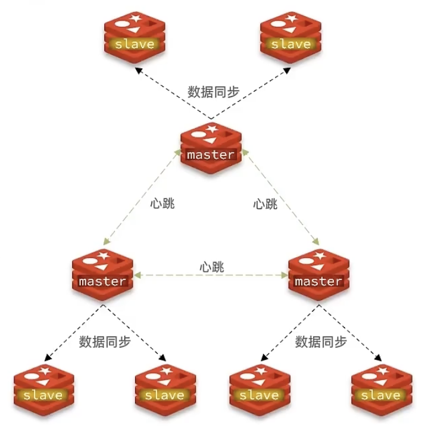
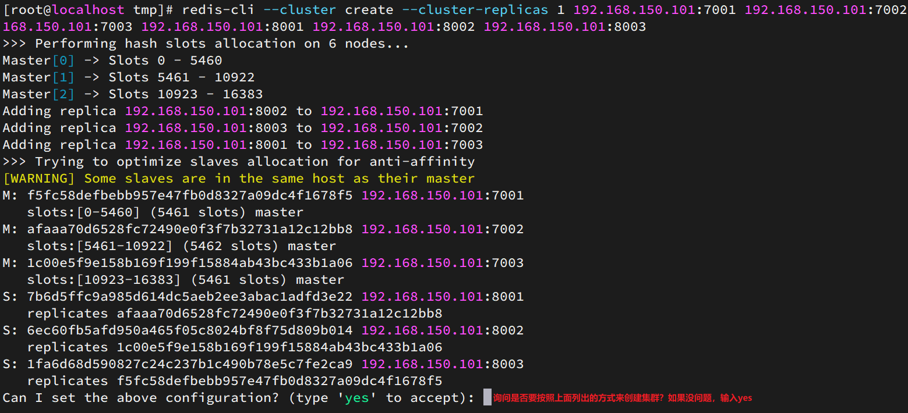
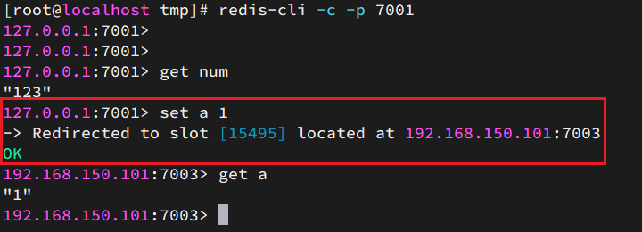

# Redis进阶 - Redis分片集群

## 搭建分片集群

主从和哨兵可以解决高可用、高并发读的问题。但是依然有两个问题没有解决：

- 海量数据存储问题
- 高并发写的问题

使用分片集群可以解决上述问题，分片集群特征：

- 集群中有多个 master，每个 master 保存不同数据
- 每个 master 都可以有多个 slave 节点
- master 之间通过 ping 监测彼此健康状态
- 客户端请求可以访问集群任意节点，最终都会被转发到正确节点


### 集群结构

分片集群需要的节点数量较多，这里我们搭建一个最小的分片集群，包含3个master节点，每个master包含一个slave节点，结构如下：




这里我们会在同一台虚拟机中开启6个redis实例，模拟分片集群，信息如下：

|       IP        | PORT |  角色  |
| :-------------: | :--: | :----: |
| 192.168.150.101 | 7001 | master |
| 192.168.150.101 | 7002 | master |
| 192.168.150.101 | 7003 | master |
| 192.168.150.101 | 8001 | slave  |
| 192.168.150.101 | 8002 | slave  |
| 192.168.150.101 | 8003 | slave  |


### 准备实例和配置

删除之前的7001、7002、7003这几个目录，重新创建出7001、7002、7003、8001、8002、8003目录：

```sh
# 进入/tmp目录
cd /tmp
# 删除旧的，避免配置干扰
rm -rf 7001 7002 7003
# 创建目录
mkdir 7001 7002 7003 8001 8002 8003
```


在/tmp下准备一个新的redis.conf文件，内容如下：

```ini
port 6379
# 开启集群功能
cluster-enabled yes
# 集群的配置文件名称，不需要我们创建，由redis自己维护
cluster-config-file /tmp/6379/nodes.conf
# 节点心跳失败的超时时间
cluster-node-timeout 5000
# 持久化文件存放目录
dir /tmp/6379
# 绑定地址
bind 0.0.0.0
# 让redis后台运行
daemonize yes
# 注册的实例ip
replica-announce-ip 192.168.150.101
# 保护模式
protected-mode no
# 数据库数量
databases 1
# 日志
logfile /tmp/6379/run.log
```

将这个文件拷贝到每个目录下：

```sh
# 进入/tmp目录
cd /tmp
# 执行拷贝
echo 7001 7002 7003 8001 8002 8003 | xargs -t -n 1 cp redis.conf
```

修改每个目录下的redis.conf，将其中的6379修改为与所在目录一致：

```sh
# 进入/tmp目录
cd /tmp
# 修改配置文件
printf '%s\n' 7001 7002 7003 8001 8002 8003 | xargs -I{} -t sed -i 's/6379/{}/g' {}/redis.conf
```


### 启动

因为已经配置了后台启动模式，所以可以直接启动服务：

```sh
# 进入/tmp目录
cd /tmp
# 一键启动所有服务
printf '%s\n' 7001 7002 7003 8001 8002 8003 | xargs -I{} -t redis-server {}/redis.conf
```

通过ps查看状态：

```sh
ps -ef | grep redis
```

发现服务都已经正常启动：


如果要关闭所有进程，可以执行命令：

```sh
ps -ef | grep redis | awk '{print $2}' | xargs kill
```

或者（推荐这种方式）：

```sh
printf '%s\n' 7001 7002 7003 8001 8002 8003 | xargs -I{} -t redis-cli -p {} shutdown
```


### 创建集群

虽然服务启动了，但是目前每个服务之间都是独立的，没有任何关联。

我们需要执行命令来创建集群，在Redis5.0之前创建集群比较麻烦，5.0之后集群管理命令都集成到了redis-cli中。


1. Redis5.0之前

Redis5.0之前集群命令都是用redis安装包下的src/redis-trib.rb来实现的。因为redis-trib.rb是有ruby语言编写的所以需要安装ruby环境。

 ```sh
# 安装依赖
yum -y install zlib ruby rubygems
gem install redis
 ```


然后通过命令来管理集群：

```sh
# 进入redis的src目录
cd /tmp/redis-6.2.4/src
# 创建集群
./redis-trib.rb create --replicas 1 192.168.150.101:7001 192.168.150.101:7002 192.168.150.101:7003 192.168.150.101:8001 192.168.150.101:8002 192.168.150.101:8003
```


2. Redis5.0以后

我们使用的是Redis6.2.4版本，集群管理以及集成到了redis-cli中，格式如下：

```sh
redis-cli --cluster create --cluster-replicas 1 192.168.150.101:7001 192.168.150.101:7002 192.168.150.101:7003 192.168.150.101:8001 192.168.150.101:8002 192.168.150.101:8003
```

命令说明：

- `redis-cli --cluster`或者`./redis-trib.rb`：代表集群操作命令
- `create`：代表是创建集群
- `--replicas 1`或者`--cluster-replicas 1` ：指定集群中每个master的副本个数为1，此时`节点总数 ÷ (replicas + 1)` 得到的就是master的数量。因此节点列表中的前n个就是master，其它节点都是slave节点，随机分配到不同master

运行后的样子：



这里输入yes，则集群开始创建：


通过命令可以查看集群状态：

```sh
redis-cli -p 7001 cluster nodes
```


### 测试

尝试连接7001节点，存储一个数据：

```sh
# 连接
redis-cli -p 7001
# 存储数据
set num 123
# 读取数据
get num
# 再次存储
set a 1
```

结果悲剧了：


集群操作时，需要给`redis-cli`加上`-c`参数才可以：

```sh
redis-cli -c -p 7001
```

这次可以了：



## 散列插槽


Redis 会把每一个 master 节点映射到 0~16383 共 16384 个插槽（hash slot）上，查看集群信息时就能看到：

数据 key 不是与节点绑定，而是与插槽绑定。Redis 会根据 key 的有小部分计算插槽值，分两种情况：
- key 中包含 `{}` ，且`{}`中至少包含 1 个字符，`{}`中的部分是有效部分
- key 中不包含 `{}`，整个 key 都是有效部分

::: 例如
key 是 num，那么就根据 num 计算，如果是 {itcast}num，则根据 itcast 计算。计算方式是利用 CRC16 算法得到一个 hash 值，然后对 16384 取余，得到的结果就是 slot 值。
:::

**Redis如何判断某个 key 应该在哪个实例？**

- 将 16384 个插槽分配到不同的实例
- 根据 key 的有效部分计算哈希值，对 16384 取余
- 余数作为插槽，寻找插槽所在实例即可

**如何将同一类数据固定的保存在同一个 Redis 实例？**

- 这一类数据使用相同的有效部分，例如 key 都以 { typeid } 为前缀


## 集群伸缩


集群伸缩就是集群节点能够动态的增加和减少，并且在集群伸缩的同时，也伴随着槽位及槽位中数据在节点之间的移动。

redis-cli --cluster 提供了很多操作集群的命令，可以通过`redis-cli --cluster help`指令查看。

**向集群中添加一个新 master 节点，并存储 num = 1000 ：**

1. 启动一个新的 Redis 实例，端口为 7004

```sh
# 创建实例目录
mkdir 7004
# 创建 redis 服务
sed -i s/6379/7004/g 7004/redis.conf
# 运行 redis 服务
redis-server 7004/redis.conf
```

2. 添加 7004 到之前的集群，并作为一个 master 节点

```sh
redis-cli --cluster add-node 192.168.150.101:7004 192.168.150.101:7001
```

3. 给 7004 节点分配插槽，使得 num 这个 key 可以存储到 7004 实例
```sh
# 重新分片
redis-cli --cluster reshard 192.168.150.101:7001
# 移动 3000 个插槽
How many slots do you want to move (from 1 to 16384)? 3000
# 接收插槽的 ID
What is the receiving node ID? 「这里输入 7001 的 ID 即可」
# 使用 done 结束
# 是否确认移动
Do you want to proceed with the proposed rehard plan (yes/no)? yes
```

## 故障转移

当集群中有一个 master 宕机会发生什么？

1. 首先是该实例与其他实例失去连接

2. 然后是疑似宕机

3. 最后是确定下线，自动提升一个 slave 为新的 master

> 这里选取 slave 的方式是根据 offset 偏移量和 id 进行筛选

**数据迁移**

利用 cluster failover 命令可以手动让集群中的某个 master 宕机，切换到执行 cluster failover 命令的这个 slave 节点，实现无感知的数据迁移。具体的流程如下：


手动的 Failover 支持三种不同模式：

- 缺省：默认的流程
- force：省略的对 offset 的一致性校验
- takeover：直接执行第 5 步，忽略数据一致性、忽略 master 状态和其他 master 的意见

## RedisTemplate访问分片集群

RedisTemplate 底层同样基于 lettuce 实现了分片集群的支持，而使用的步骤与哨兵模式基本一致：

1. 引入 redis 的 starter 依赖

2. 配置分片集群地址

3. 配置读写分离

与哨兵模式相比，其中只有分片集群的配置方式略有差异，如下:

```yml
spring:
  redis:
    cluster:
      nodes:    # 指定分片集群的每一个节点信息
        - 192.168.150.101:7001
        - 192.168.150.101:7002
        - 192.168.150.101:7003
        - 192.168.150.101:8001
        - 192.168.150.101:8002
        - 192.168.150.101:8003
```
