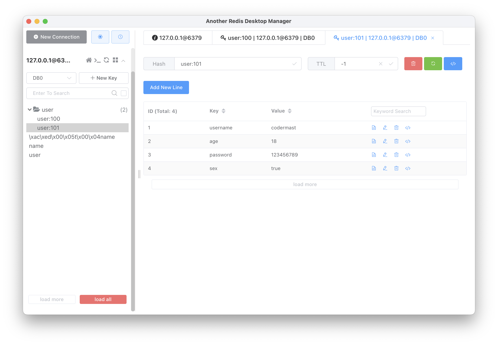

# 数据类型及其操作指令

## 通用指令
在正式介绍Redis数据结构及其操作指令之前，我们需要先掌握一些最基础的通用指令。

这些都是Redis操作过程中的一些常见指令
|指令| 描述|
|:---:|:---:|
|keys| 查看符合模板的所有key，不建议在⽣产环境设备上使⽤|
|del |删除⼀个指定的key|
|esists| 判断key是否存在|
|expire |给⼀个key设置有效期，有效期到期时该key会被⾃动删除|
|ttl |查看⼀个KEY的剩余有效期|
|quit |退出|
|shutdown| 关闭服务器|
|select [0-15] |选择指定的数据库|

::: tip help指令
可以通过 help [command]可以查看⼀个命令的具体⽤法！

例如查看set指令的帮助文档：`help set`
:::

## 数据类型

Redis支持五种基本数据类型和3种特殊数据类型
- 5种基本数据类型
1. string（字符串）
2. hash（哈希）
3. list（列表）
4. set（集合）
5. zset(sorted set：有序集合)。

- 特殊数据类型

1. Geo
2. Bitmap
3. Hyperloglog

::: tip 说明
在我们平常的业务中基本只会使用到Redis的基本数据类型（String、List、Hash、Set、Sorted Set），特殊类型（Geo、Bitmap、Hyperloglog）类型只有在特殊的业务场景下会使用到，通常只需要掌握基本数据类型即可，特殊类型作为了解即可。
:::
### String 字符串
String类型，也就是字符串类型，是Redis中最简单的存储类型。String 类型是二进制安全的。意思是 redis 的 String 可以包含任何数据。比如jpg图片或者序列化的对象。

其value是字符串，不过根据字符串的格式不同，又可以分为3类：

- string：普通字符串
- int：整数类型，可以做自增、自减操作
- float：浮点类型，可以做自增、自减操作

不管是哪种格式，底层都是字节数组形式存储，只不过是编码方式不同。字符串类型的最大空间不能超过512m.

**String类型的常见操作命令**：

|命令	|描述|
|:---:|:---:|
|SET	|添加或者修改已经存在的一个String类型的键值对|
|GET	|根据key获取String类型的value|
|MSET	|批量添加多个String类型的键值对|
|MGET	|根据多个key获取多个String类型的value|
|INCR	|让一个整型的key自增1|
|INCRBY	|让一个整型的key自增并指定步长，例如：incrby num 2 让num值自增2|
|INCRBYFLOAT	|让一个浮点类型的数字自增并指定步长|
|SETNX	|添加一个String类型的键值对，前提是这个key不存在，否则不执行|
|SETEX	|添加一个String类型的键值对，并且指定有效期|

Redis的key中虽然没有目录结构，但是允许有多个单词形成层级结构，多个单词之间用” ：“隔开，一般情况下使用的格式为：`项目名:业务名:类型:id`。

这个格式并非固定，也可以根据自己的需求来删除或添加词条。

::: info 举例说明

例如我们的项目名称叫 myblog ，有user和product两种不同类型的数据，我们可以这样定义key：

user相关的key：myblog:user:1

product相关的key：myblog:product:1

如果Value是一个Java对象，例如一个User对象，则可以将对象序列化为JSON字符串后存储

|KEY|	VALUE|
|:---:|:---:|
|myblog:user:1	|\{“id”:1, “name”: “Jack”, “age”: 21\}|
|myblog:product:1	|\{“id”:1, “name”: “小米11”, “price”: 4999\}|

:::

### Hash 哈希

Hash类型，也叫散列，又可以成为哈希类型。其value是一个无序字典，类似于Java中的HashMap结构。

Hash结构可以将对象中的每个字段独立存储，可以针对单个字段做CRUD

Hash的常见命令有：

|         命令         |                             描述                             |
| :------------------: | :----------------------------------------------------------: |
| HSET key field value |              添加或者修改hash类型key的field的值              |
|    HGET key field    |                获取一个hash类型key的field的值                |
|        HMSET         |       hmset 和 hset 效果相同 ，4.0之后hmset可以弃用了        |
|        HMGET         |              批量获取多个hash类型key的field的值              |
|       HGETALL        |         获取一个hash类型的key中的所有的field和value          |
|        HKEYS         |             获取一个hash类型的key中的所有的field             |
|        HVALS         |             获取一个hash类型的key中的所有的value             |
|       HINCRBY        |           让一个hash类型key的字段值自增并指定步长            |
|        HSETNX        | 添加一个hash类型的key的field值，前提是这个field不存在，否则不执行 |
### List 列表
Redis中的List类型与Java中的LinkedList类似，可以看做是一个双向链表结构。既可以支持正向检索和也可以支持反向检索。

特征也与LinkedList类似：

- 有序
- 元素可以重复
- 插入和删除快
- 查询速度一般

常用来存储一个有序数据，例如：朋友圈点赞列表，评论列表等.

|          命令           |                             描述                             |
| :---------------------: | :----------------------------------------------------------: |
|   LPUSH key element …   |                 向列表左侧插入一个或多个元素                 |
|        LPOP key         |        移除并返回列表左侧的第一个元素，没有则返回nil         |
| **RPUSH key element …** |                 向列表右侧插入一个或多个元素                 |
|        RPOP key         |                移除并返回列表右侧的第一个元素                |
|   LRANGE key star end   |                 返回一段角标范围内的所有元素                 |
|      BLPOP和BRPOP       | 与LPOP和RPOP类似，只不过在没有元素时等待指定时间，而不是直接返回nil |

### Set 集合

Redis的Set结构与Java中的HashSet类似，可以看做是一个value为null的HashMap。因为也是一个hash表，因此具备与HashSet类似的特征

- 无序
- 元素不可重复
- 查找快
- 支持交集、并集、差集等功能

|         命令         |            描述             |
| :------------------: | :-------------------------: |
|  SADD key member …   |  向set中添加一个或多个元素  |
|  SREM key member …   |     移除set中的指定元素     |
|      SCARD key       |     返回set中元素的个数     |
| SISMEMBER key member | 判断一个元素是否存在于set中 |
|       SMEMBERS       |     获取set中的所有元素     |
|  SINTER key1 key2 …  |     求key1与key2的交集      |
|  SDIFF key1 key2 …   |     求key1与key2的差集      |
|  SUNION key1 key2 …  |     求key1和key2的并集      |

### SortedSet 有序集合

Redis的SortedSet又可以成为Zset，是一个可排序的set集合，与Java中的TreeSet有些类似，但底层数据结构却差别很大。

SortedSet中的每一个元素都带有一个score属性，可以基于score属性对元素排序，底层的实现是一个跳表（SkipList）加 hash表。

**SortedSet具备下列特性：**

- 可排序
- 元素不重复
- 查询速度快

因为SortedSet的可排序特性，经常被用来实现排行榜这样的功能。

**SortedSet的常见命令有**

|             命令             |                             描述                             |
| :--------------------------: | :----------------------------------------------------------: |
|    ZADD key score member     | 添加一个或多个元素到sorted set ，如果已经存在则更新其score值 |
|       ZREM key member        |                删除sorted set中的一个指定元素                |
|      ZSCORE key member       |             获取sorted set中的指定元素的score值              |
|       ZRANK key member       |              获取sorted set 中的指定元素的排名               |
|          ZCARD key           |                  获取sorted set中的元素个数                  |
|      ZCOUNT key min max      |           统计score值在给定范围内的所有元素的个数            |
| ZINCRBY key increment member |    让sorted set中的指定元素自增，步长为指定的increment值     |
|      ZRANGE key min max      |          按照score排序后，获取指定排名范围内的元素           |
|  ZRANGEBYSCORE key min max   |          按照score排序后，获取指定score范围内的元素          |
|    ZDIFF、ZINTER、ZUNION     |                      求差集、交集、并集                      |

::: warning 注意
所有的排名默认都是升序，如果要降序则在命令的Z后面添加`REV`即可
:::

### GEO类型

GEO，Geographic，地理信息的缩写。该类型，就是元素的2维坐标，在地图上就是经纬度。redis基于该类型，提供了经纬度设置，查询，范围查询，距离查询，经纬度Hash等常⻅操作。

- geoadd：添加地理位置的坐标。
- geopos：获取地理位置的坐标。
- geodist：计算两个位置之间的距离。
- georadius：根据⽤户给定的经纬度坐标来获取指定范围内的地理位置集合。
- georadiusbymember：根据储存在位置集合⾥⾯的某个地点获取指定范围内的地理位置集合。
- geohash：返回⼀个或多个位置对象的 geohash 值。

|命令 |描述|
|:---:|:---:|
|GEOHASH key member [member ...] |返回⼀个或多个位置元素的 Geohash 表示
|GEOPOS key member [member ...] |从key⾥返回所有给定位置元素的位置（经度和纬度）
|GEODIST key member1 member2 [m\|km\|ft\|mi] |返回两个给定位置之间的距离
|GEORADIUS key longitude latitude radius m\|km\|ft\|mi [WITHCOORD] [WITHDIST] [WITHHASH] [COUNT count] [ASC\|DESC] [STORE key] [STOREDIST key] |以给定的经纬度为中⼼， 找出某⼀半径内的元素|
|GEOADD key longitude latitude member [longitude latitude member ...] |将指定的地理空间位置（纬度、经度、名称）添加到指定的key中|
|GEORADIUSBYMEMBER key member radius m\|km\|ft\|mi [WITHCOORD] [WITHDIST] [WITHHASH] [COUNT count] [ASC\|DESC] [STORE key] [STOREDIST key] |找出位于指定范围内的 元素，中⼼点是由给定的位置元素决定|

### Bitmap类型

从本质上来说，bitmap不是⼀种数据类型，本质是字符串key-value，但是其可以对位进⾏操作。也可以将bitmap想象成⼀个只能存储0、1的整型数组，可以随时对任意⼀位进⾏运算。下标在bitmap中成为偏移量。

|命令| 描述|
|:---:|:---:|
|setbit |设置Bitmaps中某个偏移量的值（0或1）(offset:偏移量从0开始)|
|getbit |获取Bitmaps中某个偏移量的值（偏移量不存在，也是返回0）|
|bitcount[start end]| 统计字符串被设置为1的bit数。|
|bitop and(or/not/xor) [key…] |bitop是⼀个复合操作， 它可以做多个Bitmaps的and（交集） 、 or（并集） 、 not（⾮） 、 xor（异或） 操作并将结果保存在destkey中。|

### Hyperloglog类型

Redis HyperLogLog 是⽤来做基数统计的算法，HyperLogLog 的优点是，在输⼊元素的数量或者体积⾮常⾮常⼤时，计算基数所需的空间总是固定 的、并且是很⼩的。

在 Redis ⾥⾯，每个 HyperLogLog 键只需要花费 12 KB 内存，就可以计算接近 2^64 个不同元素的基 数。这和计算基数时，元素越多耗费内存就越多的集合形成鲜明对⽐。

但是，因为 HyperLogLog 只会根据输⼊元素来计算基数，⽽不会储存输⼊元素本身，所以HyperLogLog 不能像集合那样，返回输⼊的各个元素。

|命令| 描述|
|:---:|:---:|
|pfadd \<element\> [element ...]|将所有元素添加到指定HyperLogLog数据结构中。如果执⾏命令后HLL估计的近似基数发⽣变化，则返回1，否则返回0。|
|pfcount [key ...] |计算HLL的近似基数，可以计算多个HLL，⽐如⽤HLL存储每天的UV，计算⼀周的UV可以使⽤7天的UV合并计算即可|
|pfmerge [sourcekey ...]|将⼀个或多个HLL合并后的结果存储在另⼀个HLL中，⽐如每⽉活跃⽤户可以使⽤每天的活跃⽤户来合并计算可得|

