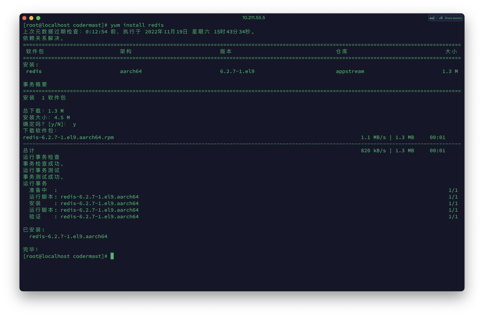
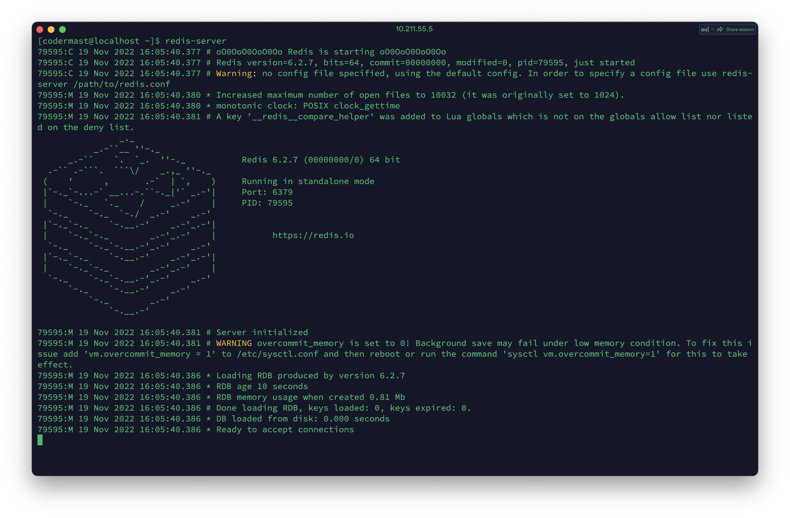

# Redis入门 - Redis概念和基础

## 什么是NoSQL

- NoSQL，泛指非关系型的数据库。
- NoSQL最常见的解释是 "non-relational"， 很多人也说它是"Not Only SQL"
- NoSQL仅仅是一个概念，泛指**非关系型的数据库**
- 区别于关系数据库，它们不保证关系数据的ACID特性
- NoSQL是一项全新的数据库革命性运动，提倡运用非关系型的数据存储，相对于铺天盖地的关系型数据库运用，这一概念无疑是一种全新的思维的注入
- 常见的NoSQL数据库有：`Redis`、`MemCache`、`MongoDB`等

## NoSQL与SQL


|     |    SQL  | NoSQL |
|:-----:|:-----:|:-----:|
|数据结构|结构化  |非结构化 |
|数据关联|关联   |无关联   |
|查询方式|SQL查询|非SQL查询|
|事务特性|ACID   |BASE    |
|存储方式|磁盘|内存|
|扩展性  |垂直|水平|
|使用场景|1.数据结构固定<br />2.相关业务对数据安全性、一致性要求较高|1.数据结构不固定<br /> 2.对一致性、安全性要求不高 <br />3.对性能要求高|

::: tip NoSQL数据库的常见种类
1. 键值类型（Redis）
2. 文档类型（MongoDB）
3. 列类型（HBase）
4. Graph类型（Neo4j）
:::

## 认识Redis

Redis诞生于2009年，全称为 Remote Dictionary Server，远程字典服务器，是一个基于内存的键值型的NoSQL数据库。

Redis特征
- 键值型（Key-Value），value支持多种不同的数据结构，功能丰富。
- 单线程，每个命令具备原子性。Redis6.0开始对网络请求启用多线程，但是对命令的执行依然是单线程。
- 低延迟，速度快（<font color="red">基于内存</font>、IO多路复用、良好的编码）
- 支持数据持久化
- 支持主从集群、分片集群
- 支持多语言客户端（C语言、Java、C++、Python等）
## 安装Redis
由于Redis的作者仅编写了Linux环境下的版本，且在生产环境时大多数使用的Linux系统，故我们在Centos操作系统内进行安装。

安装Redis
```sh
yum install redis
```


::: note 其他安装
除了上述安装方式以外还有很多安装方式，这里不再赘述。
:::

## Redis启动的三种方式

### 前台启动
安装完Redis以后，在任意目录下输入`redis-server`命令即可启动Redis。




前台启动Redis后，就是如上界面，此时命令终端会一直响应Redis服务，而无法进行其他操作，要进行其他指令操作时，则必须关闭Redis服务，很不方便，此时我们可以使用后台启动。

### 后台启动

如果要让Redis以后台方式启动，则必须修改Redis配置文件，配置文件所在目录就是Redis安装目录。

修改Redis配置文件`redis.conf`文件中的配置项。

```sh
# 允许访问的地址，默认是127.0.0.1，会导致只能在本地访问。修改为0.0.0.0则可以在任意IP访问，生产环境不要设置为0.0.0.0
bind 0.0.0.0
# 守护进程，修改为yes后即为后台运行
daemonize yes 
# 密码，设置后访问Redis必须输入密码，此时密码即为 codermast
requirepass codermast
```

此时启动Redis时需要加上配置文件，即可后台启动redis。

```sh
redis-server redis.conf
```

### 开机启动

1. 要实现开机启动，需要配置一个系统服务文件

```sh
vi /etc/systemd/system/redis.service
```

2. 将以下内容作为文件内容：

```
[Unit]
Description=redis-server
After=network.target

[Service]
Type=forking
ExecStart=/usr/local/bin/redis-server /usr/local/src/redis-6.2.6/redis.conf
PrivateTmp=true

[Install]
WantedBy=multi-user.target
```
3. 重载系统服务

```sh
systemctl daemon-reload
```

4. 开启redis开机自启动

```sh
systemctl enable redis
```

::: tip 操作Redis指令
- 启动：`systemctl start redis`
- 停止：`systemctl stop redis`
- 重启：`systemctl restart redis`
- 查看状态：`systemctl status redis`
:::

## Redis客户端
Redis本身仅有一个基于命令行的客户端，但是这种方式在我们使用过程中不太直观，所以市面上就出现了很多的客户端，但主要分为三种类型：命令行客户端、图形化客户端、编程语言客户端。

### 命令行客户端

Redis安装完成后就自带了命令行客户端：redis-cli，使用方式如下：

```sh
redis-cli [options] [commonds]
```
> 这里options为选项，commonds为命令，加上[]为可选项。这也是一种常见的文档编写规范。


::: warning 注意
这里要注意的是，在使用redis-cli客户端连接redis服务时，需要保证redis服务是开启的，无论是在远程连接或者本地连接，这是新手阶段容易忽视的一点。
:::

其中常见的options有：

- h 127.0.0.1：指定要连接的redis节点的IP地址，默认是127.0.0.1
- p 6379：指定要连接的redis节点的端口，默认是6379
- a 132537：指定redis的访问密码

其中的commonds就是Redis的操作命令，例如：

- ping：与redis服务端做心跳测试，服务端正常会返回pong
- 不指定commond时，会进入redis-cli的交互控制台。

### 图形化客户端
图形化客户端，顾名思义就是通过可视化的软件，来对redis数据库进⾏操作。
图形化界⾯的客户端种类很多，可以选择⾃⼰喜欢的⼀款就可以，这⾥我选择的是Another Redis Desktop Manager这款，⽀持Mac、Linux、Windows系统，更重要的是还免
费。
> 笔者的电脑系统为macos，故就演示Mac环境下的图形化客户端，windows系统下的客户端种类很多，网络上的资源也很多，这里就不赘述。


Github地址：https://github.com/qishibo/AnotherRedisDesktopManager/releases/tag/v1.5.9

Gitee地址：https://gitee.com/qishibo/AnotherRedisDesktopManager/releases/tag/v1.5.8

::: info 
对于Github访问慢的⽤户，可以直接在国内的Gitee中下载安装，⼀般来说两者都没有什么差别，唯⼀的区别就在于Github上的更新⽐较及时。
:::
### 编程语言客户端

编程语言客户端也有很多种，如Java语言的Jedis客户端，Go语言的Go-Redis客户端等，这里以Java语言的Jedis客户端为例进行说明。

1. 新建一个Maven工程并引入以下依赖

```xml
<!--引入Jedis依赖-->
<dependency>
    <groupId>redis.clients</groupId>
    <artifactId>jedis</artifactId>
    <version>4.2.0</version>
</dependency>

<!--引入单元测试依赖-->
<dependency>
    <groupId>org.junit.jupiter</groupId>
    <artifactId>junit-jupiter</artifactId>
    <version>5.8.2</version>
    <scope>test</scope>
</dependency>
```

2. 编写测试类并与Redis建立连接
```java
private Jedis jedis;

@BeforeEach //被该注解修饰的方法每次执行其他方法前自动执行
void setUp(){
    // 1. 获取连接
    jedis = new Jedis("192.168.230.88",6379);
    // 2. 设置密码
    jedis.auth("132537");
    // 3. 选择库（默认是下标为0的库）
    jedis.select(0);
}
```
3. 编写一个操作数据的方法（这里以操作String类型为例）

```java
@Test
public void testString(){
    // 1.往redis中存放一条String类型的数据并获取返回结果
    String result = jedis.set("url", "https://www.oz6.cn");
    System.out.println("result = " + result);

    // 2.从redis中获取一条数据
    String url = jedis.get("url");
    System.out.println("url = " + url);
}
```
4. 最后不要忘记编写一个释放资源的方法


```java
    @AfterEach //被该注解修饰的方法会在每次执行其他方法后执行
    void tearDown(){
        // 1.释放资源
        if (jedis != null){
            jedis.close();
        }
    }
```
5. 执行testString()方法后测试结果。