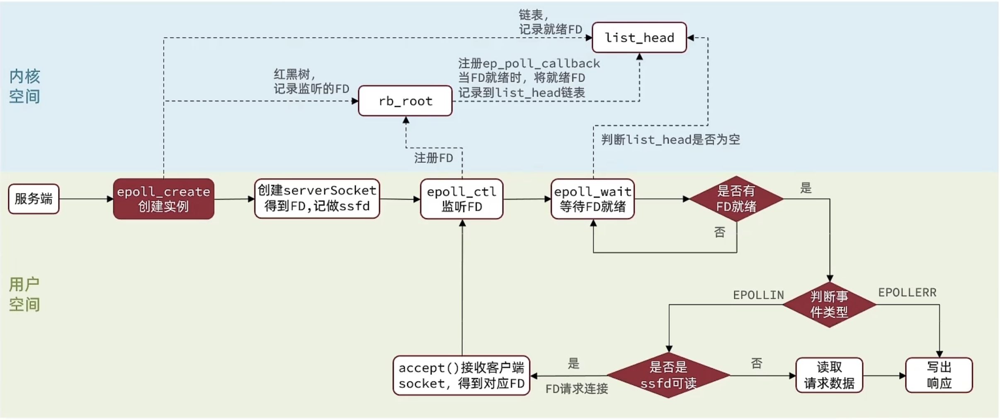
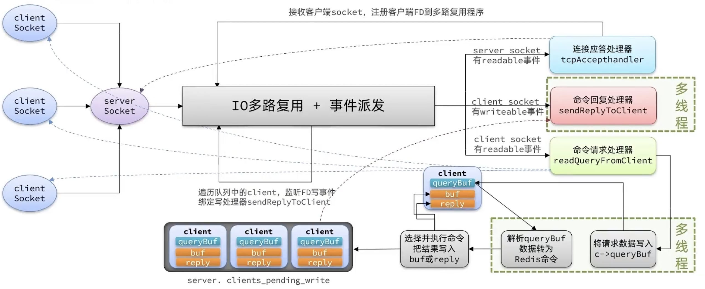

--- 
order : 29
---

# Redis原理 - Redis网络模型

## 思考

**Redis 到底是单线程还是多线程？**

- 如果仅仅针对 Redis 的核心业务部分（命令处理部分），则是单线程
- 如果针对 Redis 整体，那么就是多线程

**在 Redis 的版本迭代过程中，在两个重要的时间节点上引入了多线程的支持：**

- Redis v4.0：引入多线程异步处理一些耗时较长的任务，例如异步删除命令 unlike
- Redis v6.0：在核心网络模型中引入多线程，进一步提高对多核 CPU 的利用率


**为什么Redis要选择单线程?**

- 抛开持久化不谈，Redis是纯内存操作，执行速度非常快，它的性能瓶颈是网络延迟而不是执行速度，因此多线程并不会带来巨大的性能提升。
- 多线程会导致过多的上下文切换，带来不必要的开销
- 引入多线程会面临线程安全问题，必然要引入线程锁这样的安全手段，实现复杂度增高，而且性能也会大打折扣

## 网络模型

Redis 通过 IO 多路复用来提高网络性能，并且支持各种不同的多路复用实现，并且将这些实现进行封装，提供了统一的高性能事件库 API 库 AE：

- ae_epoll
- ae_evport
- ae_kqueue
- ae_select（通用）

这是 Redis 中四种实现方式，根据不同的操作系统，选择不同的实现。

具体的 API 主要有以下几个：

- aeApiCreate：创建多路复用程序，比如 epoll_create
- aeApiResize
- aeApiFree
- aeApiAddEvent：注册 FD ，比如 epoll_ctl
- aeApiDelEvent：删除 FD
- aeApiPoll：等待 FD 就绪，比如 epoll_wait
- aeApiName：select、poll


ae_evport 实现方式中独有的API

- aeApiLookupPending
- aeApiAssociate

在ae.c 文件中可以选择使用那种实现方式。



## 单线程网络模型

Redis 6 以前的网络模型都是单线程的，Redis 单线程网络模型的整个过程：


- 在 aeApiPoll 时，会判断是**客户端**可读还是**服务端**可读，调用不同的处理器
- 当客户端 Client Socket 发起连接请求时，服务端 Server Socket 可读，触发连接应答处理器 tcpAccepthandler
- 当客户端 Client Socket 发起命令时，客户端可读，触发命令请求处理器 readQueryFromClient 
- 当客户端可写时，会由命令回复处理器进行处理。


::: warning 核心
本质上就是 **IO 多路复用 + 事件派发** 的应用。

server socket 不断接收 client socket 的响应，然后根据事件类型的不同，派发给对应的处理器进行处理。
:::

## 多线程网络模型

Redis 6.0 版本中引入了多线程，目的是为了提高 IO 读写效率。因此在 **解析客户端命令**、 **写响应结果** 时采用了多线程。核心的命令执行、IO 多路复用模块依然是由主线程执行。

通过对单线程网络模型的分析，主要的性能瓶颈在命令的读写处理和命令的响应输出两个方面。



故Redis 在命令读处理和命令的响应两个部分引入了多线程。

::: warning 注意
性能的瓶颈一般情况下都是 IO 的影响或者 网络请求 的影响。
:::

## 底层实现

- main

```c
// server.c
int main(
    int argc,
    char **argv
){
    // ...
    // 初始化服务
    initServer();
    // ...
    // 开始监听事件循环
    aeMain(server.el);
    // ...
}
```

- initServer

```c
void initServer(void){
    // ...
    // 内部会调用 aeApiCreate(eventLoop)，类似epoll_create
    server.el= aeCreateEventLoop(server.maxclients+CONFIG_FDSET_INCR);
    //...

    // 监听TCP端口，创建ServerSocket，并得到FD
    listenToPort(server.port,&server.ipfd)
    // ...

    // 注册 连接处理器，内部会调用 aeApiAddEvent(&server.ipfd)监听FD
    createSocketAcceptHandler(&server.ipfd，acceptTcpHandler)

    // 注册 ae_api_poll 前的处理器
    aeSetBeforeSleepProc(server.el,beforeSleep);
}


```
- aeMain

```c
void aeMain(aeEventloop*eventloop){
    eventLoop->stop = 0;
    // 循环监听事件
    while (!eventLoop->stop){
        aeProcessEvents(
            eventLoop，
            AE_ALL_EVENTS | 
            AE_CALL_BEFORE_SLEEP |
            AE_CALL_AFTER_SLEEP);
    }
}
```
- aeProcessEvents
```c
int aeProcessEvents(aeEventLoop *eventLoop,int flags){
    // ... 调用前置处理器 beforesleep
    eventLoop->beforesleep(eventLoop);
    // 等待FD就绪，类似 epoll_wait
    numevents = aeApiPoll(eventLoop，tvp);

    for (j = 0; j < numevents; j ++){
        // 遍历处理就绪的 FD，调用对应的处理器
    }
}
```

- acceptTcpHandler

```c
void acceptTcpHandler( ... ){
    // ...
    // 接收 socket 连接，获取 FD 
    fd = accept(s,sa,len);

    // ... 
    // 创建 connection ，关联 fd
    connection *conn = connCreateSocket();
    conn.fd = fd;

    // ...
    // 内部调用 aeApiAddEvent(fd,READABLE)
    // 监听 socket 的FD读事件，并绑定读处理器readQueryFromClient
    connSetReadHandler(conn, readQueryFromClient);
}
```
- readQueryFromClient
```c
void readQueryFromClient(connection *conn){
    // 获取当前客户端，客户端中有缓冲区用来读和写
    client *c = connGetPrivateData(conn);
    // 获取c->querybuf缓冲区大小
    long int qblen = sdslen(c->querybuf);
    // 读取请求数据到 c->querybuf 缓冲区
    connRead(c->conn，c->Guerybuf+qblen，readlen);
    // 解析缓冲区字符串，转为Redis命令参数存入 c->argv 数组
    processInputBuffer(c);
    // ...
    // 处理 c->argv 中的命令
    processCommand(c);
}
```
- processCommand
```c
int processCommand(client *c) {
    // 根据命令名称，寻找命令对应的command，例如 setCommand
    c->cmd = c->lastcmd = lookupCommand(c->argv[0]->ptr);
    // ...
    // 执行command，得到响应结果，例如ping命令，对应pingCommand
    c->cmd->proc(c);
    // 把执行结果写出，例如ping命令，就返回"pong"给cLient
    // shared.pong是 字符串"pong"的SDS对象
    addReply(c, shared.pong);
}
```

- addReply
```c
void addReply(client *c，robj *obj) {
    // 尝试把结果写到 c-buf 客户端写缓存区
    if (_addReplyToBuffer(c,obj->ptr,sdslen(obj->ptr)) != C_OK)
    // 如果c->buf写不下，则写到 c->reply，这是一个链表，容量无上限
    _addReplyProtoToList(c,obj->ptr,sdslen(obj->ptr));
    // 将客户端添加到server.clients_pending_write这个队列，等待被写出
    listAddNodeHead(server.clients_pending_ write,c);
}
```