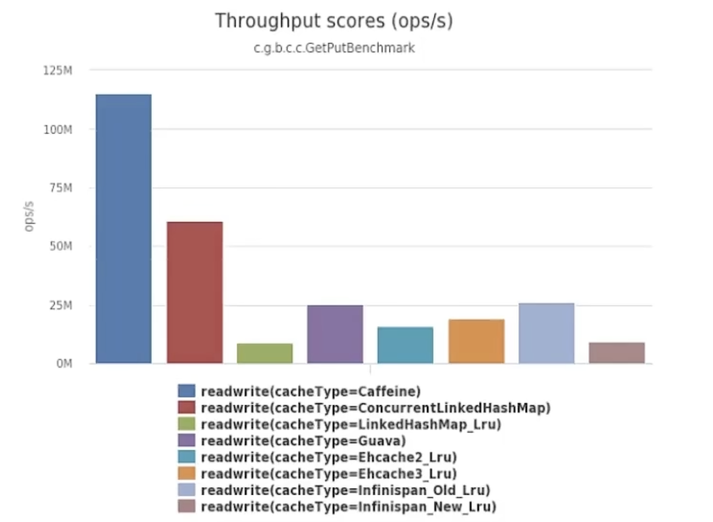

# Redis进阶 - JVM进程缓存

**传统缓存的问题**

传统的缓存策略一般是请求到达 Tomcat 后，先查询 Redis ，如果未命中则查询数据库，存在下面的问题：

- 请求要经过 Tomcat 处理，Tomcat 的性能成为整个系统的瓶颈
- Redis 缓存失效时，会对数据库产生冲击


**多级缓存方案**

多级缓存就是充分利用请求处理的每个环节，分别添加缓存，减轻 Tomcat 压力，提升服务性能：


## 本地进程缓存

缓存在日常开发中起着至关重要的作用，由于是存储在内存汇总，数据的读取速度是非常快的，能大量减少对数据库的访问，减少数据库的压力。我们把缓存分为两类：

- 分布式缓存：例如 Redis
    - 优点：存储容量更大、可靠性更好、可以再集群间共享
    - 缺点：访问缓存有网络开销
    - 场景：缓存数据量较大、可靠性要求较高、需要在集群间共享

- 进程本地缓存：例如 HashMap、GuavaCache
    - 优点：读取本地内存，没有网络开销，速度更快
    - 缺点：存储容量有限、可靠性能较低、无法共享
    - 场景：性能要求较高，缓存数据量较小

Caffeine 是一个基于 Java8 开发的，提供了近乎最佳命中率的高性能的本地缓存库。目前 Spring 内部的缓存使用的就是 Caffeine。

Github 地址：https://github.com/ben-manes/caffeine



## Caffeine

Caffeine 是一个基于 Java8 开发的提供了近乎最佳命中率的高性能的缓存库。

缓存和 ConcurrentMap 有点相似，但还是有所区别。最根本的区别是 ConcurrentMap 将会持有所有加入到缓存当中的元素，直到它们被从缓存当中手动移除。但是，Caffeine 的缓存 Cache 通常会被配置成自动驱逐缓存中元素，以限制其内存占用。在某些场景下，LoadingCache 和AsyncLoadingCache 因为其自动加载缓存的能力将会变得非常实用。

Caffeine 提供了灵活的构造器去创建一个拥有下列特性的缓存：

- 自动加载元素到缓存当中，异步加载的方式也可供选择
- 当达到最大容量的时候可以使用基于就近度和频率的算法进行基于容量的驱逐
- 将根据缓存中的元素上一次访问或者被修改的时间进行基于过期时间的驱逐
- 当向缓存中一个已经过时的元素进行访问的时候将会进行异步刷新
- key 将自动被弱引用所封装
- value 将自动被弱引用或者软引用所封装
- 驱逐(或移除)缓存中的元素时将会进行通知
- 写入传播到一个外部数据源当中
- 持续计算缓存的访问统计指标

为了提高集成度，扩展模块提供了 JSR-107 JCache 和 Guava 适配器。 JSR-107 规范了基于 Java 6 的 API，在牺牲了功能和性能的代价下使代码更加规范。

Guava 的 Cache 是 Caffeine 的原型库并且 Caffeine 提供了适配器以供简单的迁移策略。

::: info 原文地址
https://github.com/ben-manes/caffeine/wiki/Home-zh-CN
:::
## Caffeine示例

```java
@Test
void testCaffeine(){
    // 1.创建缓存对象
    Cache<String,String> cache = Caffeine.newBuilder().build();

    // 2.存数据
    cache.put("username","codermast");

    // 3.1取数据，不存在则返回 Null
    String username = cache.getIfPresent("username");
    System.out.println("username = " + username);

    // 3.2取数据，不存在则从数据库查询
    String username2 = cache.get("username",key -> {
        // 这里写的是去数据库查询的业务逻辑
        // ...
        return "Hello World!";
    });
    System.out.println("username2 = " + username2);
}
```

## Caffeine缓存驱逐策略

Caffeine 提供了三种缓存驱逐策略：

- 基于容量：设置缓存的数量上限，使用 LRU 规则选择

```java:no-line-numbers
// 创建缓存对象
Cache<String,String> cache = Caffeine.newBuilder()
    .maximumSize(1) // 设置缓存大小上限为 1
    .build();
```

- 基于时间：设置缓存的有效时间

```java:no-line-numbers
// 创建缓存对象
Cache<String,String> cache = Caffeine.newBuilder()
    .expireAfterWrite(Duration.ofSeconds(10)) // 设置缓存有效期为 10 s，从最后一次写入操作开始计时
    .build();
```

- 基于引用：设置缓存为软引用或者弱引用，利用 GC 来回收缓存数据。性能较差，不建议使用。

在默认情况下，当一个缓存元素过期的时候，Caffeine 不会自动立即将其清理和驱逐。而是在一次读或者写操作后，或者在空闲时间完成对失效数据的驱逐。

::: note 注释
JVM 进程缓存和 Redis 缓存，本质上都是对数据的缓存，目的都是为了加速数据的读取。
:::