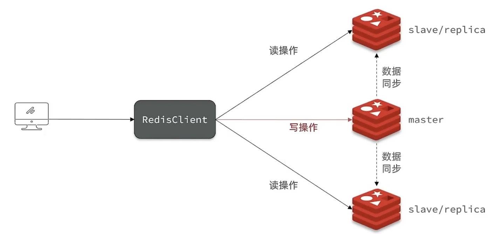

# Redis进阶 - Redis主从

## 搭建主从架构

单节点 Redis 的并发能力是有上限的，要进一步提高 Redis 的并发能力，就需要搭建主从集群，实现读写分离。

> 在 Redis 5.0 以前，从节点都叫做 slave，在 5.0 版本以后被称为 replica，本质上是一个东西。

### 1.集群结构
 
我们搭建的主从集群结构如图：
 



共包含三个节点，一个主节点，两个从节点。
 
这里我们会在同一台虚拟机中开启3个redis实例，模拟主从集群，信息如下：
 
|       IP        | PORT |  角色  |
| :-------------: | :--: | :----: |
| 192.168.150.101 | 7001 | master |
| 192.168.150.101 | 7002 | slave  |
| 192.168.150.101 | 7003 | slave  |
 
### 2.准备实例和配置
 
要在同一台虚拟机开启3个实例，必须准备三份不同的配置文件和目录，配置文件所在目录也就是工作目录。
 
1. 创建目录
 
我们创建三个文件夹，名字分别叫7001、7002、7003：
 
```sh
# 进入/tmp目录
cd /tmp
# 创建目录
mkdir 7001 7002 7003
```
 
 
2. 恢复原始配置
 
修改redis-6.2.4/redis.conf文件，将其中的持久化模式改为默认的RDB模式，AOF保持关闭状态。
 
```properties
# 开启RDB
# save ""
save 3600 1
save 300 100
save 60 10000
 
# 关闭AOF
appendonly no
```
 
 
 
3. 拷贝配置文件到每个实例目录
 
然后将redis-6.2.4/redis.conf文件拷贝到三个目录中（在/tmp目录执行下列命令）：
 
```sh
# 方式一：逐个拷贝
cp redis-6.2.4/redis.conf 7001
cp redis-6.2.4/redis.conf 7002
cp redis-6.2.4/redis.conf 7003
 
# 方式二：管道组合命令，一键拷贝
echo 7001 7002 7003 | xargs -t -n 1 cp redis-6.2.4/redis.conf
```
 
 
 
4. 修改每个实例的端口、工作目录
 
修改每个文件夹内的配置文件，将端口分别修改为7001、7002、7003，将rdb文件保存位置都修改为自己所在目录（在/tmp目录执行下列命令）：
 
```sh
sed -i -e 's/6379/7001/g' -e 's/dir .\//dir \/tmp\/7001\//g' 7001/redis.conf
sed -i -e 's/6379/7002/g' -e 's/dir .\//dir \/tmp\/7002\//g' 7002/redis.conf
sed -i -e 's/6379/7003/g' -e 's/dir .\//dir \/tmp\/7003\//g' 7003/redis.conf
```
 
 
 
5. 修改每个实例的声明IP
 
虚拟机本身有多个IP，为了避免将来混乱，我们需要在redis.conf文件中指定每一个实例的绑定ip信息，格式如下：
 
```properties
# redis实例的声明 IP
replica-announce-ip 192.168.150.101
```
 
每个目录都要改，我们一键完成修改（在/tmp目录执行下列命令）：
 
```sh
# 逐一执行
sed -i '1a replica-announce-ip 192.168.150.101' 7001/redis.conf
sed -i '1a replica-announce-ip 192.168.150.101' 7002/redis.conf
sed -i '1a replica-announce-ip 192.168.150.101' 7003/redis.conf
 
# 或者一键修改
printf '%s\n' 7001 7002 7003 | xargs -I{} -t sed -i '1a replica-announce-ip 192.168.150.101' {}/redis.conf
```
 
### 3.启动
 
为了方便查看日志，我们打开3个ssh窗口，分别启动3个redis实例，启动命令：
 
```sh
# 第1个
redis-server 7001/redis.conf
# 第2个
redis-server 7002/redis.conf
# 第3个
redis-server 7003/redis.conf
```

如果要一键停止，可以运行下面命令：
 
```sh
printf '%s\n' 7001 7002 7003 | xargs -I{} -t redis-cli -p {} shutdown
```

### 4.开启主从关系
 
现在三个实例还没有任何关系，要配置主从可以使用replicaof 或者slaveof（5.0以前）命令。
 
有临时和永久两种模式：
 
- 修改配置文件（永久生效）
 
  - 在redis.conf中添加一行配置：```slaveof <masterip> <masterport>```
 
- 使用redis-cli客户端连接到redis服务，执行slaveof命令（重启后失效）：
 
  ```sh
  slaveof <masterip> <masterport>
  ```
 
<strong><font color='red'>注意</font></strong>：在5.0以后新增命令replicaof，与salveof效果一致。
 
 
这里我们为了演示方便，使用方式二。
 
通过redis-cli命令连接7002，执行下面命令：
 
```sh
# 连接 7002
redis-cli -p 7002
# 执行slaveof
slaveof 192.168.150.101 7001
```
 
 
通过redis-cli命令连接7003，执行下面命令：
 
```sh
# 连接 7003
redis-cli -p 7003
# 执行slaveof
slaveof 192.168.150.101 7001
```
 
然后连接 7001节点，查看集群状态：
 
```sh
# 连接 7001
redis-cli -p 7001
# 查看状态
info replication
```
 
 
### 5.测试
 
执行下列操作以测试：
 
- 利用redis-cli连接7001，执行```set num 123```
 
- 利用redis-cli连接7002，执行```get num```，再执行```set num 666```
 
- 利用redis-cli连接7003，执行```get num```，再执行```set num 888```
 
 
 
可以发现，只有在7001这个master节点上可以执行写操作，7002和7003这两个slave节点只能执行读操作。
 
## 数据同步原理

### 全量同步

主从第一次同步是全量同步：


master 是如何判断 slave 是不是第一次来同步数据？这里会用到两个很重要的概念：
- Replication ID：简称replid，是数据集的标记，id 一致则说明是同一数据集。每一个 master 都有位移的 replid，slave 则会继承 master 节点的 replid。

- Offset：偏移量，随着记录在 repl_baklog 中的数据增多而逐渐增大。slave 完成同步时也会记录当前同步的 offset。如果 slave 的 offset 小于 master 的 offset，说明 slave 数据落后于 master，需要更新。

因此 slave 做数据同步，必须想 master 声明自己的 replication id 和 offset，master 才可以判断到底需要同步哪些数据。

先判断 replication id 是否相同，再判断 offset 的大小关系。

::: info 全量同步的流程
1. slave 节点请求增量同步
2. master 节点判断 replid，发现不一致，拒绝增量同步。
3. master 将完整内存数据生成 RDB，发送 RDB到 slave
4. slave 清空本地数据，加载master 的 RDB
5. master 将 RDB 期间的命令记录在 repl_baklog，并持续将 log 中的命令发送给 slave
6. slave 收到接受的命令，保持与 master 之间的同步。
:::

### 增量同步

主从第一次同步是全量同步，但如果 slave 冲去后同步，则执行增量同步。


::: warning 注意
repl_baklog 大小有上限，写满以后会覆盖最早的数据。如果 slave 断开时间过久，导致数据被覆盖，则无法实现增量同步，只能再次全量同步。
:::

可以从以下几个方面来优化 Redis 主从集群：

- 在 master 中配置 repl_diskless-sync yes 启用无磁盘复制，避免全量同步时的磁盘 IO。一般适用于网络带宽较大的情况下。
- Redis 单节点上的内存占用不要太大，减少 RDB 导致的过多磁盘 IO。
- 适当提高 repl_baklog 的大小，发现 slave 宕机时尽快实现故障恢复，尽可能避免全量同步
- 限制一个 master 上的 slave 节点数量，如果实在是太多 slave，则可以采用 主-从-从链式结构，减少 master 压力


## 总结

**简述全量同步和增量同步的区别？**

- 全量同步：master 将完整内存数据生成 RDB，发送 RDB 到 slave。后续命令则记录在repl_baklog，逐个发送给 slave。
- 增量同步：slave 提交自己的 offset 到 master，master 获取 repl_baklog 中从 offset 之后的命令给 slave

**什么时候执行全量同步？**

- slave 节点第一次连接 master 节点时。
- slave 节点断开时间太久，repl_baklog 中的 offset 已经被覆盖时

**什么时候执行增量同步？**
- slave 节点断开又恢复，并且在 repl_baklog 中能找到 offset 时。