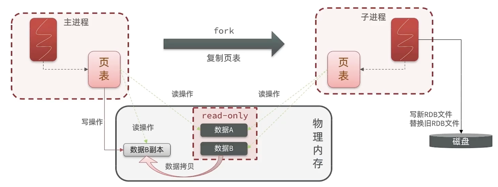

# Redis进阶 - Redis持久化

::: warning 单点Redis的问题
- 数据丢失问题：Redis 是内存存储，服务重启可能会丢失数据。通过**实现 Redis 数据持久化解决。**
- 并发能力问题：单节点 Redis 并发能力虽然不错，但是也无法满足如 618 这样的高并发场景。**搭建主从集群，实现读写分离解决。**
- 故障恢复问题：如果 Redis 宕机，则服务不可用，需要一种自动的故障恢复手段。**利用 Redis 哨兵，实现健康检测和自动恢复。**
- 存储能力问题：Redis 基于内存，单点能存储的数据量难以满足海量数据需求。**搭建分片集群，利用插槽机制实现动态扩容。**
:::


## RDB持久化

RDB 全称为 Redis Database Backup file （Redis 数据备份文件），也被叫做 Redis 数据快照。简单来说就是把内存中的所有数据都记录到磁盘中。当 Redis 实例故障重启后，从磁盘读取快照文件，恢复数据。

快照文件称为 RDB 文件，默认是保存在当前运行目录。

- `save`命令：创建 RDB 快照，由 Redis 主进程来执行，会阻塞所有命令。RDB 是需要写入磁盘中，IO 操作较慢。
- `bgsave`命令：开启子进程执行 RDB ，避免主进程受到影响。

Redis 停机时会执行一次 RDB 。

默认情况下会在当前目录生成一个 dump.rdb 的文件，下一次启动 Redis 时，默认会加载这个文件，恢复 Redis 数据。

Redis 内部有触发 RDB 的机制，可以在 redis.conf 文件中找到，格式如下：

```conf
save 900 1      // 900 秒内，如果至少有 1 个 key 被修改，则执行 bgsave
save 300 10     // 300 秒内，如果至少有 10 个 key 被修改，则执行 bgsave
save 60 10000   // 60 秒内，如果至少有 10000 个 key 被修改，则执行 bgsave
save ""         // 表示禁用 RDB

rdbcompression yes  // 是否压缩，建议不开启，压缩也会消耗 CPU ，磁盘空间相对廉价
dbfilename dump.rdb // RDB 文件名称
dir ./              // 文件保存的路径目录
```

bgsave 开始时会 fork 主进程得到子进程，子进程共享主进程的内存数据。完成 fork 后读取内存数据并写入 RDB 文件。

fork 过程是阻塞的，此时 Redis 无法响应客户端请求。fork 的速度是非常快的，因为 fork 只复制了对应的页表，而不是复制真实的数据，类似于只复制数据的索引。

fork 采用的是 copy-on-write 技术：

- 当主进程执行读操作时，访问共享内存
- 当主进程执行写操作时，则会拷贝一份数据，执行写操作。



::: warning 极端情况
当子进程写新的 RDB 文件时，此时主进程大量修改数据，则需要对数据进行拷贝，当主进程需要对所有的数据都进行修改时，则需要两倍原来的内存，故我们在配置 Redis 服务时，不能将所有的实际内存分配给 Redis ，需要预留一部分缓冲空间。
:::

**<font size=5>RDB 持久化小结：</font>**

RDB 方式 bgsave 的流程：
1. fork 主进程得到一个子进程，共享内存空间
2. 子进程读取内存数据并写入新的 RDB 文件
3. 用新的 RDB 文件替换旧的 RDB 文件

RDB 会在什么时候执行？save 60 1000代表什么含义？

- 默认是在 Redis 服务停止时执行 RDB。
- save 60 10000代表60秒内至少执行 1000 次修改则触发 RDB

RDB 的缺点？

- RDB 执行间隔时间长，两次 RDB 之间写入数据有丢失的风险
- fork 子进程、压缩、写出 RDB 文件都比较耗时


## AOF持久化

AOF 全称为 Append Only File（追加文件）。Redis 处理的每一个写命令都会记录在 AOF 文件，可以看做是命令日志文件。

AOF 默认是关闭的，需要修改 redis.conf 配置文件来开启 AOF

```
appendonly yes  // 是否开启 AOF 功能，默认是关闭的
appendfilename "appendonly.aof" // AOF 的文件名称
```

AOF 的命令记录的频率也可以通过 redis.conf 文件来进行配置：
```
appendfsync always      // 表示每执行一次写命令，立刻记录到 AOF 文件中 
appendfsync everysec    // 写命令执行完先放入 AOF 缓冲区，然后每隔 1 秒将缓冲区数据写入到 AOF 文件，是默认方案
appendfsync no          // 写命令执行完先放入 AOF 缓冲区，由操作系统决定何时将缓冲区内容写回磁盘
```

|配置项|刷盘时机|优点|缺点|
|:---:|:---:|:---:|:---:|
|Always|同步刷盘|可靠性高，几乎不丢数据|性能影响大|
|everysec|每秒刷盘|性能适中|最多丢失1秒数据|
|no|操作系统控制|性能最好|可靠性差，可能丢失大量数据|

AOF 是记录命令，AOF 文件会比 RDB 文件大很多。而且 AOF 会记录对同一个 key 的 多次写操作，但只有最后一次写操作才有意义。通过执行 bgrewriteaof 命令，可以让 AOF 文件执行重写功能，用最少的命令达到相同效果。


Redis 也会在触发阈值时自动去重写 AOF 文件。阈值也可以在 redis.conf 中配置：

```
auto-aof-rewrite-percentage 100 // AOF 文件比上次文件增长多少百分比，则触发重写
auto-aof-rewrite-min-size 64mb  // AOF 文件体积最小多大以上才触发重写
```

## RDB与AOF对比

RDB和AOF各有自己的优缺点，如果对数据安全性要求较高，在实际开发中往往会结合两者来使用。

|持久化方式|数据完整性|文件大小|宕机恢复速度|数据恢复优先级|系统资源占用|使用场景|
|:---:|:---:|:---:|:---:|:---:|:---:|:---:|
|RDB|定时对整个内存做快照|不完整，两次备份之间会丢失|会有压缩，文件体积小|很快|低，因为数据完整性不如AOF|高，大量CPU和内存消耗|可以容忍数分钟的数据丢失，追求更快的启动速度|
|AOF|记录每一次执行的命令|相对完整，取决于刷盘策略|记录命令，文件体积很大|慢|高，因为数据完整性更高|低，主要是磁盘IO资源但AOF重写时会占用大量CPU和内存资源|对数据安全性要求较高常见|