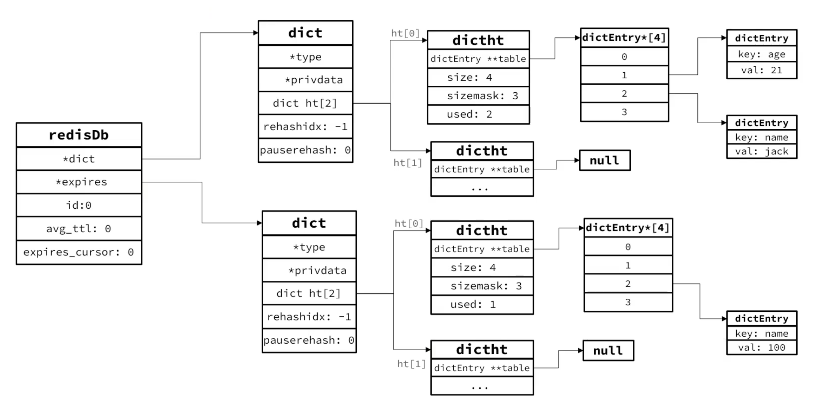
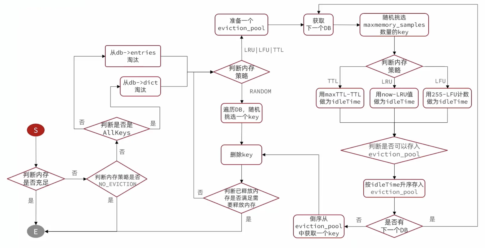

# Redis原理 - 内存策略

Redis 本身是一个典型的 key-value 内存存储数据库，因此所有的 key、value 都保存在之前学习过的 Dict 结构中。不过在其 database 结构体中，有两个 Dict ：一个用来记录 key-value；另外一个用来记录 key-TTL




```c
typedef struct redisDb {
    dict *dict;     // 存放所有 key 和 value 的地方
    dict *expires;  // 存放每一个 key 及其对应的 TTL 存活时间，只包含设置了 TTL 的 key
    dict *blocking_keys;   
    dict *ready_keys;
    dict *watched_keys;
    int id;         // Database ID ：0 ~ 15
    long long avg_ttl;  
    unsigned long expires_cursor;   // expire 检查时在 dict 中抽样的索引位置
    list *defrag_later; // 等待碎片整理的 key 列表
} redisDb;
```

**Redis 是如何知道一个 key 是否过期呢？**

答：利用两个 Dict 分别记录 key-value 和 key-ttl 

**是不是 TTL 到期就立刻删除呢？**

答：并不是到期立刻删除，而是采用 ***惰性删除*** 和 ***周期删除***。

## 删除策略


- 定时删除：TTL 到期后，立刻删除对应的 key

- 惰性删除：并不是在 TTL 到期后就立刻删除，而是在访问一个 key 的时候，检查该 key 的存活时间，如果已经过期，才执行删除。

- 周期删除：是通过一个定时任务，周期性的抽样部分过期的 key，然后执行删除。执行周期有两种：
    - Redis 会设置一个定时任务 serverCron()，按照 server.hz 的频率来执行过期 key 清理，模式为 SLOW，默认为 10
    - Redis 的每个事情循环前会调用beforeSleep()函数，执行过期key清理，模式为FAST

**SLOW模式规则:**

1. 执行频率受server.hz影响，默认为10，即每秒执行10次，每个执行周期100ms。
2. 执行清理耗时不超过一次执行周期的25%.

3. 逐个遍历db，逐个遍历db中的bucket，抽取20个key判断是否过期
4. 如果没达到时间上限 (25ms)并且过期key比例大于10%，再进行一次抽样，否则结束

**FAST模式规则 (过期key比例小于10%不执行)**
1. 执行频率受beforeSleep()调用频率影响，但两次FAST模式间隔不低于2ms
2. 执行清理耗时不超过1ms
3. 逐个遍历db，逐个遍历db中的bucket，抽取20个key判断是否过期
4. 如果没达到时间上限 (1ms)并且过期key比例大于10%，再进行一次抽样，否则结束

## 淘汰策略

内存淘汰就是当 Redis 内存使用达到设置的阈值时，Redis 主动挑选部分 key 删除以释放更多的内存的流程。Redis 会在处理客户端命令的方法 processCommand() 中尝试做内存淘汰。

Redis 一共支持 8 种淘汰策略

- noeviction：当内存使用超过配置的时候会返回错误，不会驱逐任何键。

- allkeys-lru：加入键的时候，如果过限，首先通过LRU算法驱逐最久没有使用的键。

- volatile-lru：加入键的时候如果过限，首先从设置了过期时间的键集合中驱逐最久没有使用的键。

- allkeys-random：加入键的时候如果过限，从所有key随机删除。

- volatile-random：加入键的时候如果过限，从过期键的集合中随机驱逐。

- volatile-ttl：从配置了过期时间的键中驱逐马上就要过期的键。

- volatile-lfu：从所有配置了过期时间的键中驱逐使用频率最少的键。

- allkeys-lfu：从所有键中驱逐使用频率最少的键。

LRU(Least Recently Used)：最少最近使用，用当前时间减去最后一次访问时间，这个值越大则淘汰优先级越高。

LFU(Least Frequently Used)：最少频率使用，会统计每个 key 的访问频率，值越小淘汰优先级越高。

```c
typedef struct redisObject(

    unsigned type:4;//对象类型
    unsigned encoding:4;// 编码方式
    unsigned lru:LRU_BITS;
    //LRU: 以秒为单位记录最近一次访问时间，长度24bit
    //LFU: 高16位以分钟为单位记录最近一次访问时间，低8位记录逻辑访问次数
    int refcount;   // 引用计数，计数为0则可以回收
    void *ptr;      // 数据指针，指向真实数据
) robj;
```

LRU 的访问次数之所以叫做逻辑访问次数，是因为并不是每次 key 被访问都计数，而是通过运算：

1. 生成 0 ~ 1 之间的随机数 R
2. 计算 1 / (旧次数 * lfu_log_factor + 1)，记录为 R，lfu_log_factor 默认为 10
3. 如果 R < P，则计数器 + 1，且最大不超过 255
4. 访问次数会随时间缩减，距离上一次访问时间每隔 lfu_decay_time 分钟（默认 1），计数器 -1

