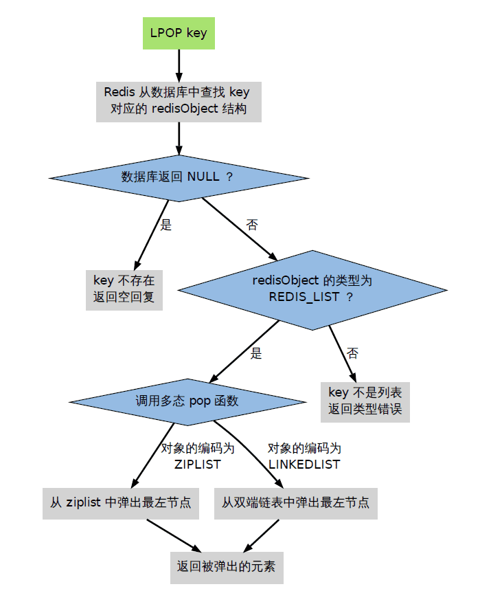

# Redis原理 - RedisObject对象机制

## 为什么会设计RedisObject

在 Redis 中，我们的操作都是使用指令进行，而这些的命令中，用于对键处理的命令占据一大部分。有些指令只能针对某些特定的类型，而有些指令却能够针对所有的类型。但是要正确实现这些命令，必须为不同类型的键设置不同的处理方式。比如删除一个列表键和删除一个字符串键的操作过程是不一样的，在底层就需要调用不同的视线方式。

集合类型有字典和整数集合两种不同的底层实现方式，而用户在对集合进行操作时，并不想关心具体的底层实现是什么样的，只要 Redis 能根据自己的指令，完成对应的功能即可，比如对元素进行添加、删除等操作，具体的实现底层对用户来说是透明的，不可见的。

所以 Redis 必须让每个键都带有类型信息, 并且带有其底层的编码方式，拥有这两个信息时，Redis 才能够准确无误的实现用户的指令。那么 RedisObject 对象起码就应该包含3个属性，类型信息、编码方式、实际数据。

## RedisObject

Redis 中的任意数据类型的键和值都会被封装为一个 RedisObject，也叫做 Redis 对象，在`/src/server.h`文件中实现如下：

```c::no-line-numbers
typedef struct redisObject {
    unsigned type:4;        
    unsigned encoding:4;    // 共有 11 种编码方式，占据 4 个比特位
    unsigned lru:LRU_BITS;  /* LRU 表示该对象最后一次被访问的时间，其占用 24 个 bit 位，
                               便于判断空闲时间太久的key */
    int refcount;           // 对象引用计数器，计数器为 0 则说明对象无人引用，可以被回收。
    void *ptr;              // 指针，指向数据的真实存储空间地址。一般为 8 个字节
} robj;
```

- <Badge text="unsigned type:4" type="tip" vertical="middle" />占 4 个 bit 位，分别是 string、list、set、zset、hash 对应 0 1 2 3 4
- <Badge text="unsigned encoding:4" type="danger" vertical="middle" />共有 11 种编码方式，占据 4 个比特位
- <Badge text="unsigned lru:LRU_BITS" type="warning" vertical="middle" />LRU 表示该对象最后一次被访问的时间，其占用 24 个bit 位，便于判断空闲时间太久的key 
- <Badge text="int refcount" type="note" vertical="middle" />对象引用计数器，计数器为 0 则说明对象无人引用，可以被回收。
- <Badge text="void *ptr" type="info" vertical="middle" />指针，指向数据的真实存储空间地址。一般为 8 个字节

## 编码方式

Redis 中会根据存储的数据类型不同，选择不同的编码方式，共包含 11 种不同类型：

|编号|编码方式|说明|
|:---:|:---:|:---:|
|1|OBJ ENCODING RAW|raw编码动态字符串|
|2|OBJ ENCODING INT|Long类型的整数的字符串|
|3|OBJ_ENCODING_HT|hash表(字典dict)|
|4|OBJ ENCODING ZIPMAP|已废弃|
|5|OBJ_ENCODING_LINKEDLIST|双端链表|
|6|OBJ ENCODING ZIPLIST|压缩列表|
|7|OBJ_ENCODING INTSET|整数集合|
|8|OBJ ENCODING SKIPLIST|跳表|
|9|OBJ_ENCODING EMBSTR|embstr的动态字符串|
|10|OBJ_ENCODING QUICKLIST|快速列表|
|11|OBJENCODING STREAM|Stream流|

## 数据类型
Redis 中根据存储的数据类型不同，选择不同的编码方式。每种数据类型使用的编码方式如下：

|数据类型|编码方式|编号|说明|
|:---:|:---:|:---:|:---:|
|OBJ_STRING|int、embstr、raw|0|字符串|
|OBJ_LIST|LinkedList和ZipList(3.2以前)、QuickList(3.2以后) |1|列表|
|OBJ_SET|intset、HT|2|集合|
|OBJ_ZSET|ZipList、HT、SkipList|3|有序集|
|OBJ_HASH|ZipList、HT|4|哈希表|

::: note 注意
这里只有 5 种基本类型，而没有提到 3 种特殊类型，是因为这三种特殊类型的底层是使用`OBJ_STRING`来实现的，并没有新的底层实现方式。
:::

## 命令处理

通过前面的描述，Redis 在执行命令时，需要判断所执行的数据类型和编码方式，则 Redis 执行一个处理数据类型命令的时候，Redis 执行以下步骤：

1. 根据给定的key，在数据库字典中查找和他相对应的redisObject，如果没找到，就返回NULL
2. 检查redisObject的type属性和执行命令所需的类型是否相符，如果不相符，返回类型错误
3. 根据redisObject的encoding属性所指定的编码，选择合适的操作函数来处理底层的数据结构
4. 返回数据结构的操作结果作为命令的返回值

**比如现在执行LPOP命令：**

## 对象共享

Redis 一般会把一些常见的值放到一个共享对象中，这样可使程序避免了重复分配的麻烦，也节约了一些CPU时间。

**Redis预分配的值对象如下**

- 各种命令的返回值，比如成功时返回的OK，错误时返回的ERROR，命令入队事务时返回的QUEUE，等等
- 包括0 在内，小于REDIS_SHARED_INTEGERS的所有整数（REDIS_SHARED_INTEGERS的默认值是10000）

::: warning 注意
共享对象只能被字典和双向链表这类能带有指针的数据结构使用，只有指针才能够指向任意的地址。而整数集合和压缩列表这些只能保存字符串、整数等实际数据的类型，则无法共享。
:::
**为什么redis不共享列表对象、哈希对象、集合对象、有序集合对象，只共享字符串对象？**

- 列表对象、哈希对象、集合对象、有序集合对象，本身可以包含字符串对象，复杂度较高。
- 如果共享对象是保存字符串对象，那么验证操作的复杂度为O(1)
- 如果共享对象是保存字符串值的字符串对象，那么验证操作的复杂度为O(N)
- 如果共享对象是包含多个值的对象，其中值本身又是字符串对象，即其它对象中嵌套了字符串对象，比如列表对象、哈希对象，那么验证操作的复杂度将会是O(N的平方)
- 如果对复杂度较高的对象创建共享对象，需要消耗很大的CPU，用这种消耗去换取内存空间，是不合适的。并且对象的复杂度过高，说明对象的个性较大，共性较少，则使用到该对象的次数和频率都会很低。


## 引用计数器

RedisObject 中有 refcount 属性，为对象引用计数器，用于记录对象引用数量。

当计数器为 0 时，则代表该对象没有被引用，则就不会再被使用，那么说明该对象可以被删除销毁。

当新创建一个对象时，它的refcount属性被设置为1。

当对一个对象进行共享时，Redis 将这个对象的 refcount 加一。

当使用完一个对象后，或者消除对一个对象的引用之后，程序将对象的refcount减一。


