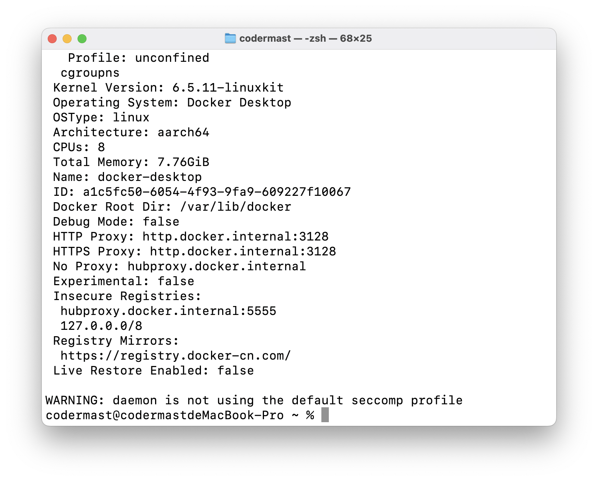

# Docker - 入门基础


## Docker架构

Docker 使用的是客户端-服务端（C/S）架构模式，使用远程 API 来管理和创建 Docker 容器。

Docker 客户端与 Docker 守护进程，负责构建、运行和 分发 Docker 容器。Docker 客户端和守护程序可以 在同一系统上运行，或者您可以将 Docker 客户端连接到远程 Docker 守护进程。Docker 客户端和守护程序使用 REST API 通过 UNIX 进行通信 套接字或网络接口。另一个 Docker 客户端是 Docker Compose， 这样，您就可以使用由一组容器组成的应用程序。

- Docker客户端：可以是基于命令行的 Docker 客户端，也可以是基于图形化界面的 Docker 应用。

- Docker服务端：一个运行 Docker 服务的机器，可以是本地主机，也可以是远程的服务器。

- Docker守护进程：Docker 守护程序 （） 侦听 Docker API 请求并管理 Docker 对象，例如映像、容器、网络和卷。守护进程也可以 与其他守护进程通信以管理 Docker 服务。

- Docker桌面：是指在 Windows、Mac、Linux环境中易于安装，可视化构建和共享容器的应用程序。

> Docker 的架构和 Redis 的几乎相同。


## Docker镜像加速

Docker 安装好之后，在使用时我们需要拉取 Docker 镜像，这些 Docker 镜像存储在国外的 DockerHub 中，在国内访问不稳定，故此 Docker 官方和国内许多服务商提供了国内的加速器服务。

- Docker官方：https://registry.docker-cn.com
- 阿里云：https://help.aliyun.com/document_detail/60750.html
- 网易：http://hub-mirror.c.163.com
- USTC：https://docker.mirrors.ustc.edu.cn
- 七牛云：https://reg-mirror.qiniu.com

这里以 Docker 官方提供的国内加速服务为样例，进行配置教程，其他服务商的配置同理。

- **命令行配置**

对于使用 systemd 的系统，请在 `/etc/docker/daemon.json` 中写入如下内容（如果文件不存在请新建该文件）

之后重新启动服务

```sh
sudo systemctl daemon-reload
sudo systemctl restart docker
```

- **可视化界面配置**

在设置中的 Docker Engine 内，插入如下配置即可。

```json
"registry-mirrors":[
        "https://registry.docker-cn.com"
]
```


插入，保存后，需要重启才能够生效。

- **检查镜像是否生效**

```sh
docker info 
```



```text
Registry Mirrors:
    https://registry.docker-cn.com/
```

只要出现如上的镜像链接，就是已经配置成功了。

## 样例剖析

::: tip 

对上一节中的 centos 实例进行分析

:::

Docker 允许在容器内运行应用程序，使用 `docker run` 命令来在容器内运行一个应用程序。这里同样是个`Hello World`，不同在于它是在容器内部运行的。

```sh:noline
docker run centos:latest /bin/echo "Hello World"
```

我们看下各个参数的含义：

- `docker`： Docker 的二进制执行文件。
- `run`： 与前面的 docker 组合来运行一个容器。
- `centos:latest`：指定要运行的镜像，Docker 首先从本地主机上查找镜像是否存在，如果不存在，Docker 就会从镜像仓库 Docker Hub 下载公共镜像。
- `/bin/echo "Hello world"`： 在启动的容器里执行的命令以上命令。

完整的意思可以解释为：`Docker` 以 `centos` 最新的（默认是latest) 镜像创建一个新容器，然后在容器里执行 `bin/echo "Hello world"`，然后输出结果。

