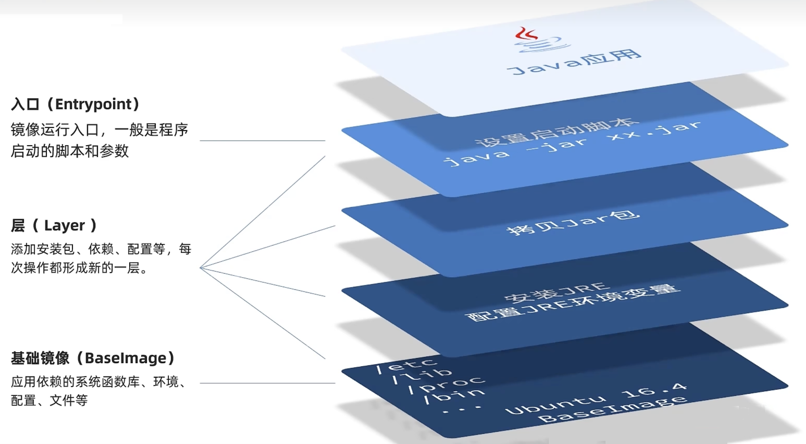

# Docker - Dockerfile

## 什么是Dockerfile？

DockerFile 是用于构建 Docker 镜像的文本文件。Docker 是一种容器化平台，允许开发者将应用程序及其依赖项打包到一个可移植的容器中，以确保在不同环境中的一致性和可移植性。

DockerFile 包含一系列指令，这些指令描述了如何构建 Docker 镜像。每个指令都对应一个操作，例如安装软件包、设置环境变量、复制文件等。当 Docker 引擎读取 DockerFile 时，它会逐行执行其中的指令，以最终创建一个镜像。

## 示例说明

在空目录下，新建一个名为 Dockerfile 的文件，并在其中添加如下内容。

```dockerfile
# 使用官方的基础镜像
FROM ubuntu:latest

# 设置工作目录
WORKDIR /app

# 复制当前目录下的所有文件到工作目录
COPY . .

# 安装依赖
RUN apt-get update && apt-get install -y \
    python3 \
    python3-pip

# 安装应用程序依赖
RUN pip3 install -r requirements.txt

# 暴露应用程序的端口
EXPOSE 5000

# 定义启动命令
CMD ["python3", "app.py"]
```

在上面的示例中：

- FROM 指定了基础镜像，即用作构建的起点的操作系统和环境。
- WORKDIR 设置了工作目录，即后续指令执行时的当前工作目录。
- COPY 将当前目录下的所有文件复制到容器的工作目录。
- RUN 执行命令，例如更新包列表、安装软件等。
- EXPOSE 声明应用程序将监听的端口。
- CMD 定义了容器启动时要执行的默认命令。

通过编写 DockerFile，开发者可以将应用程序的构建过程和运行时环境的配置以代码的方式进行描述，实现了可重复、可移植和可自动化的容器化部署。


## 镜像结构

Docker File 文件中的每条指令都会创建一个新的镜像层，当本地环境中已经下载好了某些镜像，那么会直接使用这些镜像，不会重复下载，提高了效率。

但是过多的层也会导致镜像过大，可以适当进行简化，仅在关键部分进行分层。



## 编写规则

- 每条保留字指令都必须为大写字母且后面要跟随至少一个参数
- 指令顺序执行，遵循从上到下原则
- #表示注释
- 每条指令都会创建一个新的镜像层，并对镜像进行提交


## 指令汇总

- FROM： 指定基础镜像，作为构建的起点。

```dockerfile:no-line-numbers
FROM ubuntu:latest
```

- WORKDIR： 设置工作目录，后续指令将在该目录下执行。

```dockerfile:no-line-numbers
WORKDIR /app
```

- COPY： 复制文件或目录到容器中。

```dockerfile:no-line-numbers
COPY . .
```
- ADD： 类似于COPY，还支持URL解压缩和tar文件自动解压。

```dockerfile:no-line-numbers
ADD https://example.com/file.tar.gz/app/
```

- RUN： 执行命令，通常用于安装软件包、更新系统等。

```dockerfile:no-line-numbers
RUN apt-get update && apt-get install -y python3
```

- ENV： 设置环境变量。

```dockerfile:no-line-numbers
ENV MY_VAR=value
```

- EXPOSE： 声明容器将监听的端口，但并不映射到主机。

```dockerfile:no-line-numbers
EXPOSE 80
```

- CMD： 定义容器启动时要执行的默认命令。可以被覆盖。

```dockerfile:no-line-numbers
CMD ["python", "app.py"]
```

- ENTRYPOINT： 定义容器启动时要执行的默认命令。不可被覆盖，但可以追加参数。

```dockerfile:no-line-numbers
ENTRYPOINT ["nginx", "-g", "daemon off;"]
```

- VOLUME： 创建挂载点，用于持久化数据。

```dockerfile:no-line-numbers
VOLUME /data
```

- USER： 设置执行后续命令的用户或 UID。

```dockerfile:no-line-numbers
USER appuser
```

- ARG： 定义构建时的变量，可通过构建命令传递。

```dockerfile:no-line-numbers
ARG version=latest
```

- LABEL： 添加元数据，通常用于描述镜像。

```dockerfile:no-line-numbers
LABEL version="1.0" description="My custom image" author="codermast"
```


:::tip Docker File 指令官方文档
https://docs.docker.com/engine/reference/builder/
:::