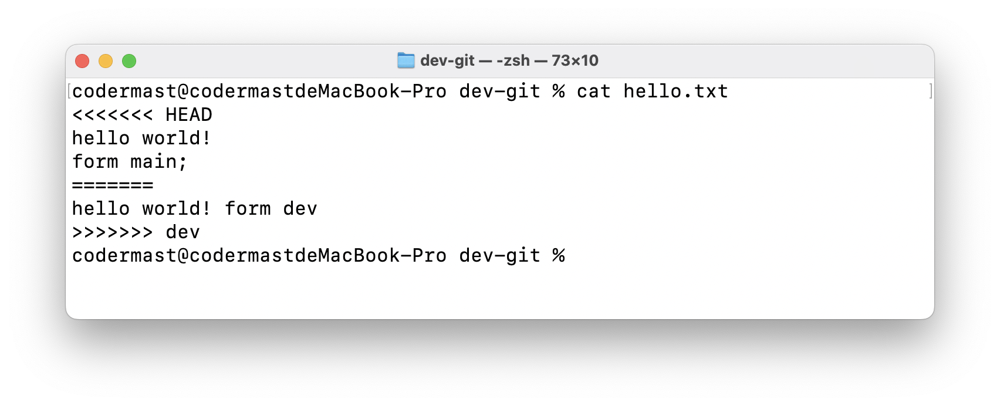

# Git 分支管理


在 Git 中，分支是指向提交对象（commits）的可变指针。它们是一系列提交的引用，其中的每个提交都包含了一组文件的状态以及指向其父提交的指针。主要的分支通常是 master 或 main，其他分支可以基于主分支或其他分支创建。

几乎每一种版本控制系统都以某种形式支持分支，一个分支代表一条独立的开发线。使用分支意味着你可以从开发主线上分离开来，然后在不影响主线的同时继续工作。

Git 分支实际上是指向更改快照的指针。

## 创建分支

使用该指令可创建一个名为 branchname 的分支

```sh
git branch <branchname>
```
::: info 
创建分支时，一定要先有一个分支，这个分支一般在 git init 时已经帮我们创建好了，一般名称为 `main` 或 `master`，创建的分支内容和当前所在的分支内容相同，因为是基于当前分支的分支，故一定和当前分支一致。
:::

## 切换分支

- 切换到已有分支

```sh
git checkout <branchname>
```

- 创建并切换分支

一般情况下切换分支时需要先创建分支，然后再切换，但是为了提高效率，可以使用如下指令，一步增加并切换分支。

```sh
git checkout -b <new-branch-name>
```
- 切换到前一个分支

```sh
git checkout -
```

当你切换分支的时候，Git 会用该分支的最后提交的快照替换你的工作目录的内容，所以多个分支不需要多个目录。

::: warning 注意
但是，需要注意的是，如果在切换分支之前对当前分支的工作目录做了一些修改，但没有提交这些更改，那么这些更改将会被暂存或者丢弃，而不会被应用到切换后的目标分支。只有在提交后，这些更改才会成为该分支的一部分，然后在切换到其他分支时，Git 才会自动更新工作目录以匹配目标分支的状态。

总而言之，就是只会恢复到最后一次提交时候的工作目录状态。
:::

## 删除分支

```sh
git branch -b <branchname>
```

该指令的功能是删除名为 `branchname` 的分支。

## 查看分支

- 查看本地分支

```sh
git branch
```


- 查看所有分支

```sh
git branch -a
```
在未加任何参数的时候，默认查看所有的分支。 带 `*` 的分支是当前分支。


## 合并分支

```sh
git merge 
```

可以多次合并到统一分支， 也可以选择在合并之后直接删除被并入的分支。

::: info 分支合并说明
对于分支合并，举一个简单的例子。目前一个项目内有 `main` 和 `dev` 两个分支，现在需要将 `dev` 分支合并到 `main` 分支，即将 `dev` 中修改和添加的功能加入到 `main` 分支，这时需要先切换到 `main` 分支，然后执行 `git merge dev` 指令。
:::

## 合并冲突

::: danger 为什么会发生冲突？
当两个分支对同一个文件进行操作，当这两个分支合并的时候，Git 陷入了两难境地，并不知道以哪个分支为准，于是就发生了冲突。
:::

分支的合并并不是简单的文件添加、移除等操作，其 Git 也会合并修改。

### 冲突发生

当在合并分支时，提示如下信息，即发生了合并冲突

```text
Auto-merging hello.txt
CONFLICT (content): Merge conflict in hello.txt
Automatic merge failed; fix conflicts and then commit the result.
```
此时信息告诉我们在合并 hello.txt 文件时发生了冲突，处理冲突以后提交结果，这时处于合并的中间态。

::: tip 合并中间态
即能够成功合并的文件全部合并，发生冲突的文件产生冲突。

与事务有所区别，事务是一旦发生错误，则全部回滚。而合并中间态是尽可能的进行合并，合并不了的抛出。
:::
### 冲突查看

当冲突发生后可以使用 `git status` 来查看冲突信息


- “You have unmerged paths”：我们现在正处于合并的中间状态，有一些没有合并的文件；
- “Changes to be committed deleted: test.txt”：要提交的更改已经被删除
- “Unmerged paths”：未合并的路径，可以看到 hello.txt 没有被合并，因为两个分支都修改了它

现在我们查看冲突，用编辑器打开没有被合并的文件，查看其内容会发现（可以使用vim查看，也可以使用 `cat <filename>`）



里面多了三行我们看不懂的记号：

```text
<<<<<<< HEAD
=======
>>>>>>> dev
```

- <<<<<<< HEAD和=======之间的内容：是 main 分支修改的内容（准确来说是HEAD指针指向的分支修改的内容，一般是指当前使用的分支）；

- =======和>>>>>>> dev 之间的内容：是 dev 分支修改的内容；

- 分割线之外的内容：是两个分支都没有改动的内容。
	
### 冲突解决

解决冲突的本质其实就是 Git 把这个两难问题的决定权交给我们，需要我们对冲突文件进行操作，主要有以下步骤：

1. 编辑冲突文件，决定要保留的内容。
2. `git add` 将冲突文件添加到暂存区
3. `git commit` 提交

这里我们编辑后的内容，Git 会原封不动的提交，因为 Git 认为我们已经成功的解决了冲突。一般情况下都会删除这三条线，保留我们所需要的文本即可。

另外，常常遇到当冲突发生后，其实是我们自己没有做好控制，这时需要撤回合并，即冲突发生后退出合并的中间状态。

```sh
git merge --abort
```

该指令会回到分支合并之前的状态，即成功合并的部分文件也会进行回退。


