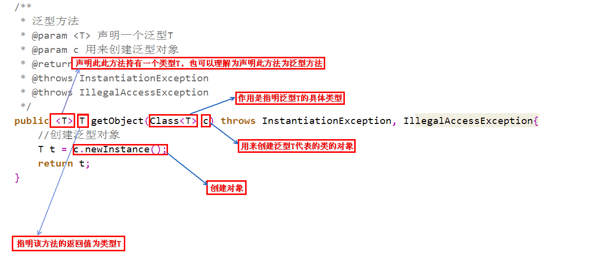

# Java - 泛型

## 什么是泛型？

Java 泛型（generics）是 JDK 5 中引入的一个新特性, 泛型提供了编译时类型安全检测机制，该机制允许程序员在编译时检测到非法的类型。

泛型的核心就是参数化类型，通过参数将类型传递进来，也就是说所操作的数据类型被指定为一个参数。即就是在泛型的使用过程中，操作的数据类型被指定为一个参数，这种参数可以使用在 接口、类、方法上，称为 泛型接口、泛型类、泛型方法。

JDK 为了兼容以前的版本，Java 泛型的实现采用的是“伪泛型”，即在语法上支持泛型，但是在编译时会进行“泛型擦除”，将所有的泛型修改为传入的具体类型。

## 为什么要用泛型？

在说明为什么使用泛型之前，我们先看一个简单的例子：

假如现在要写一个 排序方法，要求这个排序方法能够排序 int、long、float，甚至是 String 类型的数组，应该怎么做。

通过前面了解的知识，可以实现这个功能的只有方法的重载，通过不同的参数列表来匹配不同的类型。

```java
public class MethodOverLoading {
    public void sort(int[] arr){
        Arrays.sort(arr);
    }

    public void sort(float[] arr){
        Arrays.sort(arr);
    }
    
    public void sort(long[] arr){
        Arrays.sort(arr);
    }
    
    public void sort(double[] arr){
        Arrays.sort(arr);
    }
    
    public void sort(String[] arr){
        Arrays.sort(arr);
    }
}
```

这样做的后果就是不同的排序算法中出现了大量重复的逻辑，仅有数据类型不同，但是实际的处理逻辑都是相同的，此时我们可以使用泛型来更简单的实现。

```java
public class Generics<T> {
    public void sort(T[] arr) {
        Arrays.sort(arr);
    }
}
```

相比之下，泛型类更加的简单，而且更易维护。

总的来说适用泛型的情况就是：多种数据类型执行相同的代码（代码复用）

泛型中的类型在使用时指定，不需要强制类型转换（类型安全，编译器会检查类型）

## 泛型的使用

::: tip 泛型类相关的标识符

- E - Element (在集合中使用，因为集合中存放的是元素)
- T - Type（Java 类）
- K - Key（键）
- V - Value（值）
- N - Number（数值类型）
- ？- 表示不确定的 Java 类型
:::

### 泛型上下限

在使用泛型的时候，我们可以为传入的泛型类型实参进行上下边界的限制，如：类型实参只准传入某种类型的父类或某种类型的子类。

可能有时候，你会想限制那些被允许传递到一个类型参数的类型种类范围。例如，一个操作数字的方法可能只希望接受Number或者Number子类的实例。这就是有界类型参数的目的。

要声明一个有界的类型参数，首先列出类型参数的名称，后跟extends关键字，最后紧跟它的上界。

```java
<? extends E> extends // 关键字声明了类型的上界，表示参数化的类型可能是所指定的类型，或者是此类型的子类
<? super E> super     // 关键字声明了类型的下界，表示参数化的类型可能是指定的类型，或者是此类型的父类
```


### 泛型类

泛型类的声明和非泛型类的声明类似，除了在类名后面添加了类型参数声明部分。泛型类的类型参数声明部分包含一个或多个类型参数，参数间用逗号隔开。一个泛型参数，也被称为一个类型变量，是用于指定一个泛型类型名称的标识符。因为他们接受一个或多个参数，这些类被称为参数化的类或参数化的类型。

```java
class Student <T> {
    T name;

    public T getName() {
        return name;
    }

    public void setName(T name) {
        this.name = name;
    }
}
```


### 泛型接口

```java
public interface Person<T> {
    T getName();
    void set(T name);
}
```

### 泛型方法




定义泛型方法的规则：

- 所有泛型方法声明都有一个类型参数声明部分（由尖括号分隔），该类型参数声明部分在方法返回类型之前（在下面例子中的 \<E\>），来说明该方法中使用到了 \<E\> 泛型类。
- 每一个类型参数声明部分包含一个或多个类型参数，参数间用逗号隔开。一个泛型参数，也被称为一个类型变量，是用于指定一个泛型类型名称的标识符。
- 类型参数能被用来声明返回值类型，并且能作为泛型方法得到的实际参数类型的占位符。
- 泛型方法体的声明和其他方法一样。注意类型参数只能代表引用型类型，不能是原始类型（像 int、double、char 等）
- 如果该泛型方法是泛型类中的，那么可以在任意位置使用泛型类。
- 如果泛型方法仅在该方法内使用泛型，那么仅能在该方法中使用。

**泛型方法测试类**：

```java
public class GenericsMethodTest {                   
    public static <E> void printArray(E[] arr) {
        // 输出数组元素            
        for (E element : arr) {
            System.out.printf("%s ", element);
        }
        System.out.println();
    }
}
```

::: warning 如何使用泛型类来创建泛型对象？
这里可以使用反射，先获取该泛型类的 class 对象，在获取 构造器，通过构造器来实例化对象。
反射可参考该文：https://www.codermast.com/java/basis/reflection.html
:::