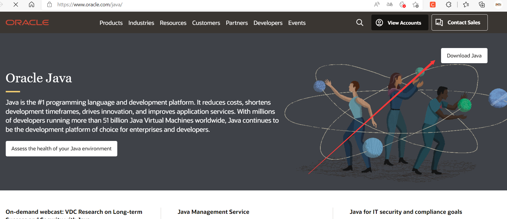
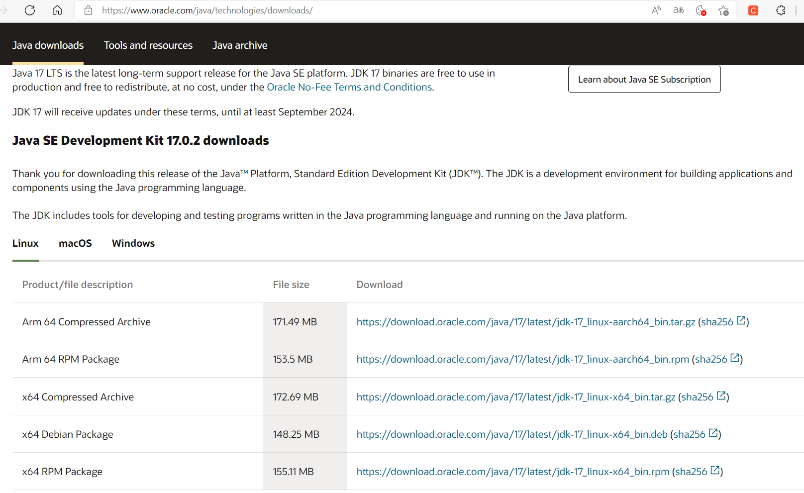
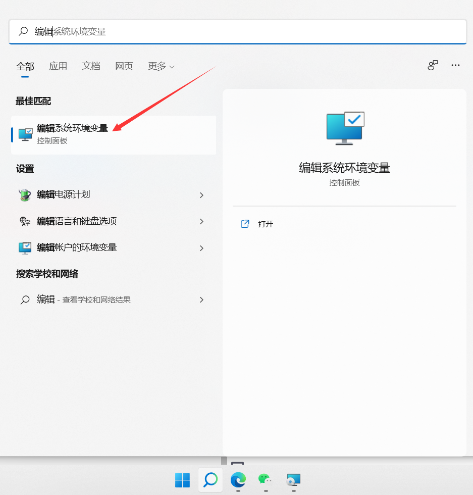
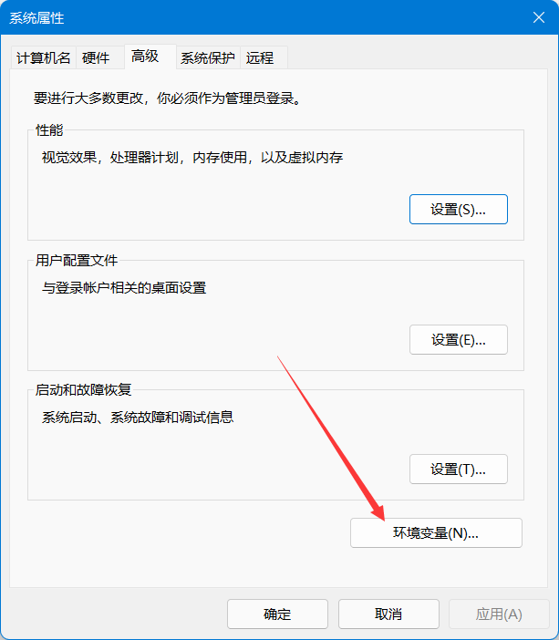
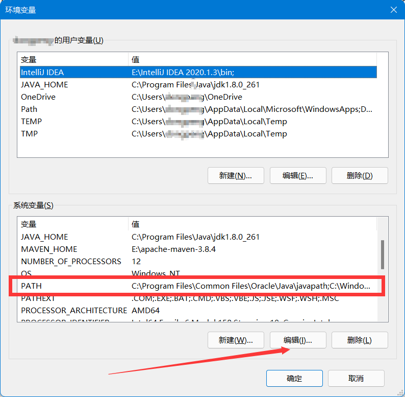
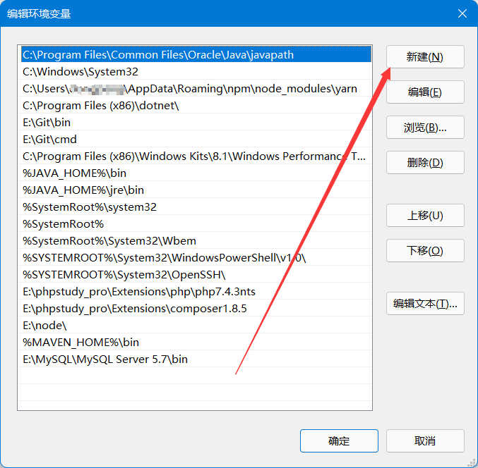

# Java - 环境认识及搭建

## 下载 JDK

**1. 官网下载**

::: tip Oracle官网
https://www.oracle.com/cn/java/technologies/downloads/
:::

选择适配自己电脑的版本，点击下载即可。

1. 访问Oracle官网，找到该位置的Java


2. 点击此处的下载



3. 选择对应的版本下载



## 安装JDK

1. 打开下载好的安装包，点击下一步


2. 选择指定目录，点击下一步


3. 等待安装完成。


> 注意：java这个时候我们只是安装好了JDK，但是并没有设置其环境变量，所以我们是没有办法使用命令行运行javac程序的。必须配置环境变量才能使用。

2. 使用 IDEA 中的集成配置

选择一个项目并打开，打开项目结构设置，选择 JDK 下载即可。


## 配置环境变量

### Windows

1. 在电脑搜索栏搜索**编辑环境变量**



2. 选择环境变量



3. 选择系统变量中的PATH这一行，点击编辑



4. 点击新建



5. 输入刚才JDK的安装路径，直到bin目录为止


6. 点击确定，这个时候就已经配置成功了。


### Macos

::: tip
参考本篇文章：https://blog.csdn.net/m0_51520179/article/details/131295356
:::


## 环境检测

在系统命令行中，任意位置处执行如下指令，均能获取到 Java 版本信息，说明配置成功。
```sh
java -version
```


::: warning 注意
在确保自己都是正确操作的情况下，仍无法正确执行，此时重启一下电脑，使配置项生效即可。
:::

## JDK、JRE、JVM

### JDK

&emsp;&emsp;JDK全称（`Java Development Kit`），根据其意思我们可以看出来其是Java开发时环境和所包含的配套元件，是整个JAVA的核心，包括了Java运行环境（`Java Runtime Envirnment`），一堆Java工具（javac/java/jdb等）和Java基础的类库。

&emsp;&emsp;这里要提一下javac，这个工具，其本质就是一个编译器，用来将程序员写好的Java代码编译成Class文件，这时候才能使用java命令进行运行，运行时是运行的编译好的Class文件，而不是我们写好的java文件。

&emsp;&emsp;JDK包含了JRE和JVM，程序员在开发时候需要进行运行调试，这个时候就需要用到JRE和JVM进行程序的运行调试。

### JRE

&emsp;&emsp;JRE全称（`Java Runtime Environment`），很显然我们看到全称，就很容易的理解，它是Java运行时环境，包含了运行Java程序的所有配置工具，其中包括JVM。

&emsp;&emsp;用户在使用时，并不需要将我们写的Java文件进行编译，用户拿到的只是的打包好的jar包或者war包，本质上是Class文件，就不需要类似于javac编译器这种工具，只需要运行时的一些类库，和JVM即可。

### JVM

&emsp;&emsp;JVM全称（`Java Virtual Machine`），即为Java虚拟机，是Java将编译好的Class文件进行解释，解释成操作系统能够识别的字节码，然后进行执行。

&emsp;&emsp;Java的一个特性就是一次编译，到处运行，就是基于JVM的，JVM就相当于一本字典，无论版本如何，字典内输出的内容都是相同的，无论在那种环境下，通过JVM解释的含义都是相同的，这就实现了一次编译，到处运行。

## 什么关系？


&emsp;&emsp;JDK中包含了JRE和JVM，JRE中包含了JVM。三者的关系并不难懂，实质上根据需求来分析很容易。

&emsp;&emsp;JDK是程序员编写时需要用到的，需要进行程序的调试，所以这里就必须包括编译运行的相关工具，还需要编写程序相关的工具。

&emsp;&emsp;JRE是运行时环境，通常是用户进行使用，用户进行只是使用，并不会重新编写程序，更不会去调试，所以只需要进行运行就可以了，不需要相关的编译工具，需要相关的类库工具和JVM即可。

&emsp;&emsp;JVM是把Class文件进行解释的工具，是虚拟化出来的一个独立的机器，在程序运行时需要使用。