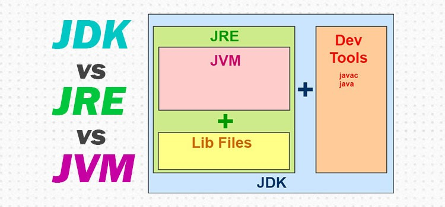

# Java - JDK、JRE、JVM

## 是什么？

### JDK

&emsp;&emsp;JDK全称（`Java Development Kit`），根据其意思我们可以看出来其是Java开发时环境和所包含的配套元件，是整个JAVA的核心，包括了Java运行环境（`Java Runtime Envirnment`），一堆Java工具（javac/java/jdb等）和Java基础的类库。

&emsp;&emsp;这里要提一下javac，这个工具，其本质就是一个编译器，用来将程序员写好的Java代码编译成Class文件，这时候才能使用java命令进行运行，运行时是运行的编译好的Class文件，而不是我们写好的java文件。

&emsp;&emsp;JDK包含了JRE和JVM，程序员在开发时候需要进行运行调试，这个时候就需要用到JRE和JVM进行程序的运行调试。

### JRE

&emsp;&emsp;JRE全称（`Java Runtime Environment`），很显然我们看到全称，就很容易的理解，它是Java运行时环境，包含了运行Java程序的所有配置工具，其中包括JVM。

&emsp;&emsp;用户在使用时，并不需要将我们写的Java文件进行编译，用户拿到的只是的打包好的jar包或者war包，本质上是Class文件，就不需要类似于javac编译器这种工具，只需要运行时的一些类库，和JVM即可。

### JVM

&emsp;&emsp;JVM全称（`Java Virtual Machine`），即为Java虚拟机，是Java将编译好的Class文件进行解释，解释成操作系统能够识别的字节码，然后进行执行。

&emsp;&emsp;Java的一个特性就是一次编译，到处运行，就是基于JVM的，JVM就相当于一本字典，无论版本如何，字典内输出的内容都是相同的，无论在那种环境下，通过JVM解释的含义都是相同的，这就实现了一次编译，到处运行。

## 什么关系？

&emsp;&emsp;JDK中包含了JRE和JVM，JRE中包含了JVM。三者的关系并不难懂，实质上根据需求来分析很容易。

&emsp;&emsp;JDK是程序员编写时需要用到的，需要进行程序的调试，所以这里就必须包括编译运行的相关工具，还需要编写程序相关的工具。

&emsp;&emsp;JRE是运行时环境，通常是用户进行使用，用户进行只是使用，并不会重新编写程序，更不会去调试，所以只需要进行运行就可以了，不需要相关的编译工具，需要相关的类库工具和JVM即可。

&emsp;&emsp;JVM是把Class文件进行解释的工具，是虚拟化出来的一个独立的机器，在程序运行时需要使用。