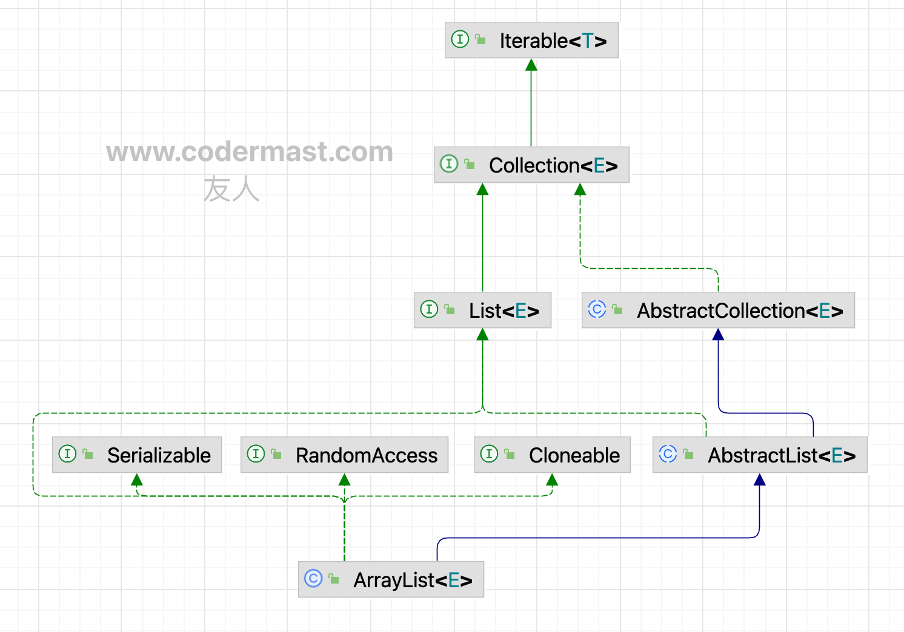
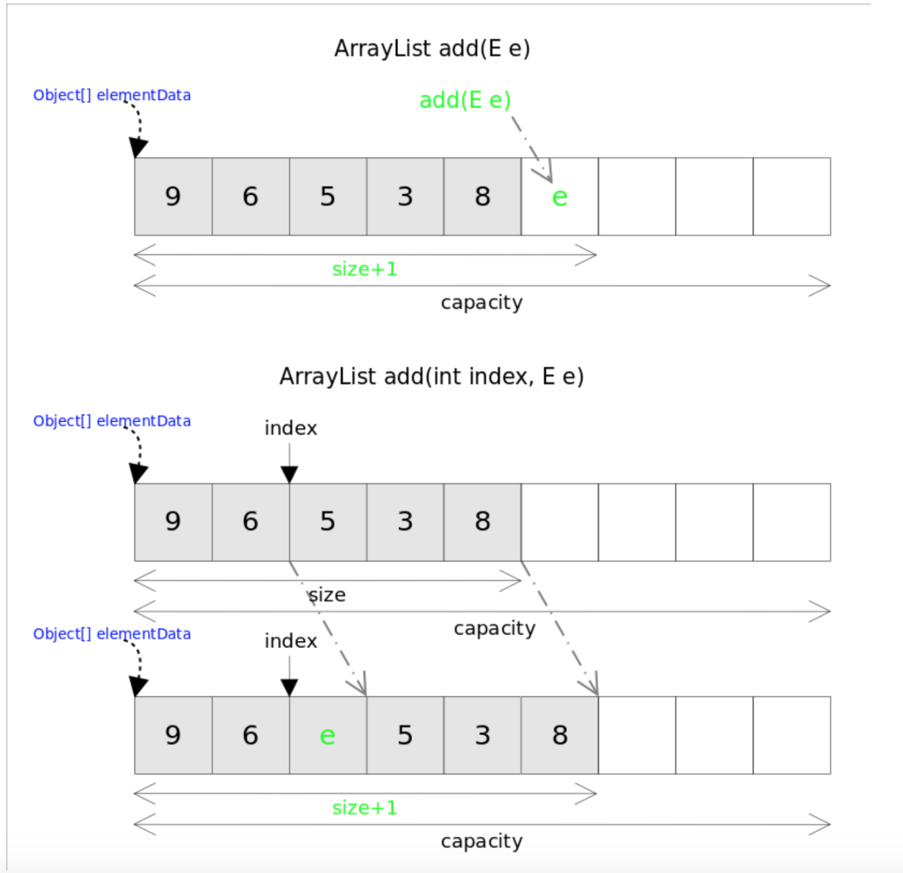
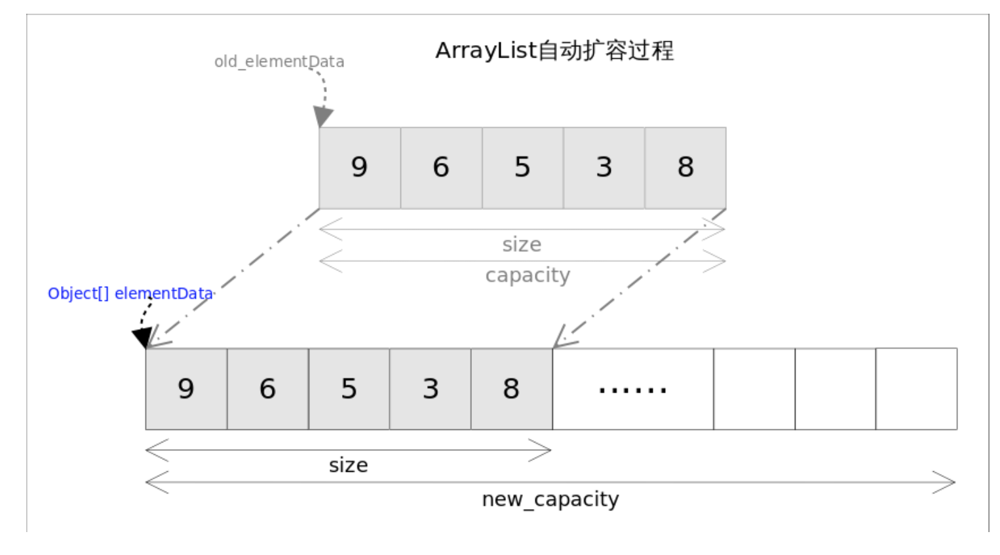

# Collection - ArrayList 源码解析




## 介绍

ArrayList 是 List 接口基于数组的一个实现类，故其是一个顺序集合，放入元素的顺序和实际存储的顺序是相同的，并且可以动态修改，与普通数组的区别就是它是没有固定大小的限制，我们可以添加或删除元素。

ArrayList 继承了 AbstractList ，并实现了 List 接口。

## 使用

ArrayList 位于 java.util 包下，语法格式如下：

```java
ArrayList<E> list = new ArrayList<>();
// 由于 ArrayList 是 List 接口的实现类，故常常这样使用
List<E> list = new ArrayList<>();
```

- E : 代表想要存进 ArrayList 中的数据类型，只能是引用类型，想存基本数据类型时，使用其包装类即可。

由于无法对 ArrayList 中的底层数组进行操作，想要操作时只能通过引用去调用对应的方法进行操作。常见的方法有：

- add()：增加一个元素
- addAll()：增加多个元素
- set()：修改元素
- remove()：删除一个元素
- get()：获取指定位置的元素
- toArray()：获取一个转换数组
- sort()：排序
- size()：计算大小
- isEmpty()：判断是否为空

## ArrayList实现

### 底层存储

```java
/**
 * The array buffer into which the elements of the ArrayList are stored.
 * The capacity of the ArrayList is the length of this array buffer. Any
 * empty ArrayList with elementData == DEFAULTCAPACITY_EMPTY_ELEMENTDATA
 * will be expanded to DEFAULT_CAPACITY when the first element is added.
 */
// non-private to simplify nested class access
transient Object[] elementData; 

/**
 * The size of the ArrayList (the number of elements it contains).
 *
 * @serial
 */
private int size;
```

由 ArrayList 的源码不难看出，其底层本质上还是一个数组，只不过提供了一些封装了各种操作该数组的方法，并且维护好了各项数据。


### 构造方法

ArrayList 集合提供了三个构造方法：分别是 无参构造法、指定容量的构造法、指定内容的构造法。

```java
/**
 * Default initial capacity.
 */
private static final int DEFAULT_CAPACITY = 10;

/**
 * Constructs an empty list with the specified initial capacity.
 *
 * @param  initialCapacity  the initial capacity of the list
 * @throws IllegalArgumentException if the specified initial capacity
 *         is negative
 */
public ArrayList(int initialCapacity) {
    if (initialCapacity > 0) {
        this.elementData = new Object[initialCapacity];
    } else if (initialCapacity == 0) {
        this.elementData = EMPTY_ELEMENTDATA;
    } else {
        throw new IllegalArgumentException("Illegal Capacity: "+
                                            initialCapacity);
    }
}

/**
 * Constructs an empty list with an initial capacity of ten.
 */
public ArrayList() {
    this.elementData = DEFAULTCAPACITY_EMPTY_ELEMENTDATA;
}

/**
 * Constructs a list containing the elements of the specified
 * collection, in the order they are returned by the collection's
 * iterator.
 *
 * @param c the collection whose elements are to be placed into this list
 * @throws NullPointerException if the specified collection is null
 */
public ArrayList(Collection<? extends E> c) {
    Object[] a = c.toArray();
    if ((size = a.length) != 0) {
        if (c.getClass() == ArrayList.class) {
            elementData = a;
        } else {
            elementData = Arrays.copyOf(a, size, Object[].class);
        }
    } else {
        // replace with empty array.
        elementData = EMPTY_ELEMENTDATA;
    }
}
```
::: tip 默认容量
由该部分的源码可以看出，初始化时如果未指定容量，则默认的容量大小为10；
:::

### add方法

ArrayList 中提供了 4 个 add 方法，具体如下：

|方法名|功能|
|:---:|:---:|
|public boolean add(E e)|实现的 List 接口内的 add 方法，添加并判断是否添加成功|
|public void add(E e)|添加元素 e 到列表的末尾|
|public void add(int index, E element)|添加元素 element 到数组的 index 位置|
|public boolean addAll(Collection<? extends E> c)|将指定集合 c 中的元素依次添加到列表的末尾|
|public boolean addAll(int index, Collection<? extends E> c)|将指定集合 c 中的元素依次添加到列表的 index 位置|




```java
/**
 * Appends the specified element to the end of this list.
 *
 * @param e element to be appended to this list
 * @return {@code true} (as specified by {@link Collection#add})
 */
public boolean add(E e) {
    modCount++;
    add(e, elementData, size);
    return true;
}

public void add(int index, E element) {
    rangeCheckForAdd(index);
    checkForComodification();
    root.add(offset + index, element);
    updateSizeAndModCount(1);
}

public void add(E e) {
    checkForComodification();

    try {
        int i = cursor;
        ArrayList.this.add(i, e);
        cursor = i + 1;
        lastRet = -1;
        expectedModCount = modCount;
    } catch (IndexOutOfBoundsException ex) {
        throw new ConcurrentModificationException();
    }
}

/**
 * Appends all of the elements in the specified collection to the end of
 * this list, in the order that they are returned by the
 * specified collection's Iterator.  The behavior of this operation is
 * undefined if the specified collection is modified while the operation
 * is in progress.  (This implies that the behavior of this call is
 * undefined if the specified collection is this list, and this
 * list is nonempty.)
 *
 * @param c collection containing elements to be added to this list
 * @return {@code true} if this list changed as a result of the call
 * @throws NullPointerException if the specified collection is null
 */
public boolean addAll(Collection<? extends E> c) {
    Object[] a = c.toArray();
    modCount++;
    int numNew = a.length;
    if (numNew == 0)
        return false;
    Object[] elementData;
    final int s;
    if (numNew > (elementData = this.elementData).length - (s = size))
        elementData = grow(s + numNew);
    System.arraycopy(a, 0, elementData, s, numNew);
    size = s + numNew;
    return true;
}

/**
 * Inserts all of the elements in the specified collection into this
 * list, starting at the specified position.  Shifts the element
 * currently at that position (if any) and any subsequent elements to
 * the right (increases their indices).  The new elements will appear
 * in the list in the order that they are returned by the
 * specified collection's iterator.
 *
 * @param index index at which to insert the first element from the
 *              specified collection
 * @param c collection containing elements to be added to this list
 * @return {@code true} if this list changed as a result of the call
 * @throws IndexOutOfBoundsException {@inheritDoc}
 * @throws NullPointerException if the specified collection is null
 */
public boolean addAll(int index, Collection<? extends E> c) {
    rangeCheckForAdd(index);

    Object[] a = c.toArray();
    modCount++;
    int numNew = a.length;
    if (numNew == 0)
        return false;
    Object[] elementData;
    final int s;
    if (numNew > (elementData = this.elementData).length - (s = size))
        elementData = grow(s + numNew);

    int numMoved = s - index;
    if (numMoved > 0)
        System.arraycopy(elementData, index,
                            elementData, index + numNew,
                            numMoved);
    System.arraycopy(a, 0, elementData, index, numNew);
    size = s + numNew;
    return true;
}
```


### get方法

ArrayList 中 get 方法只有一种实现：public E get(int index) 获取指定下标的元素

```java
/**
 * Returns the element at the specified position in this list.
 *
 * @param  index index of the element to return
 * @return the element at the specified position in this list
 * @throws IndexOutOfBoundsException {@inheritDoc}
 */
public E get(int index) {
    rangeCheck(index);

    return elementData(index);
}
```

### set方法

set 方法的功能为，修改指定下标的元素为 element。

```java
/**
 * Replaces the element at the specified position in this list with
 * the specified element.
 *
 * @param index index of the element to replace
 * @param element element to be stored at the specified position
 * @return the element previously at the specified position
 * @throws IndexOutOfBoundsException {@inheritDoc}
 */
public E set(int index, E element) {
    rangeCheck(index);

    E oldValue = elementData(index);
    elementData[index] = element;
    return oldValue;
}
```

### remove方法

ArrayList 中的 remove 方法有两个实现：

- public E remove(int index)：删除指定下标的元素
- public boolean remove(Object o)：删除第一个匹配成功的指定对象

```java
/**
 * Removes the element at the specified position in this list.
 * Shifts any subsequent elements to the left (subtracts one from their
 * indices).
 *
 * @param index the index of the element to be removed
 * @return the element that was removed from the list
 * @throws IndexOutOfBoundsException {@inheritDoc}
 */
public E remove(int index) {
    rangeCheck(index);

    modCount++;
    E oldValue = elementData(index);

    int numMoved = size - index - 1;
    if (numMoved > 0)
        System.arraycopy(elementData, index+1, elementData, index,
                            numMoved);
    elementData[--size] = null; // clear to let GC do its work

    return oldValue;
}

/**
 * Removes the first occurrence of the specified element from this list,
 * if it is present.  If the list does not contain the element, it is
 * unchanged.  More formally, removes the element with the lowest index
 * <tt>i</tt> such that
 * <tt>(o==null&nbsp;?&nbsp;get(i)==null&nbsp;:&nbsp;o.equals(get(i)))</tt>
 * (if such an element exists).  Returns <tt>true</tt> if this list
 * contained the specified element (or equivalently, if this list
 * changed as a result of the call).
 *
 * @param o element to be removed from this list, if present
 * @return <tt>true</tt> if this list contained the specified element
 */
public boolean remove(Object o) {
    if (o == null) {
        for (int index = 0; index < size; index++)
            if (elementData[index] == null) {
                fastRemove(index);
                return true;
            }
    } else {
        for (int index = 0; index < size; index++)
            if (o.equals(elementData[index])) {
                fastRemove(index);
                return true;
            }
    }
    return false;
}
```

### 自动扩容

每次向数组中添加元素时，都会去检查添加元素的个数是否会超过当前数组的长度，如果超出，数组则会进行扩容，直到满足添加数据的需求为止。ArrayList 中的扩容是通过 ensureCapacity(int minCapacity) 方法，实际执行扩容的过程是通过调用 grow(int minCapacity) 方法来实现的。每次扩容后会变为原来容量的 1.5 倍。

**扩容过程为：**

1. 当添加元素时，首先会检查当前数组的容量是否足够存放新元素。如果容量不够，则会执行扩容操作。
2. 扩容操作会创建一个新的数组，通常是原来容量的 1.5 倍大小。
3. 然后将原数组中的元素复制到新数组中。
4. 最后，将新数组设置为 ArrayList 的内部数组，以替代原来的数组。



```java
/**
 * Increases the capacity of this <tt>ArrayList</tt> instance, if
 * necessary, to ensure that it can hold at least the number of elements
 * specified by the minimum capacity argument.
 *
 * @param   minCapacity   the desired minimum capacity
 */
public void ensureCapacity(int minCapacity) {
    int minExpand = (elementData != DEFAULTCAPACITY_EMPTY_ELEMENTDATA)
        // any size if not default element table
        ? 0
        // larger than default for default empty table. It's already
        // supposed to be at default size.
        : DEFAULT_CAPACITY;

    if (minCapacity > minExpand) {
        ensureExplicitCapacity(minCapacity);
    }
}

    private void ensureCapacityInternal(int minCapacity) {
    ensureExplicitCapacity(calculateCapacity(elementData, minCapacity));
}

private void ensureExplicitCapacity(int minCapacity) {
    modCount++;

    // overflow-conscious code
    if (minCapacity - elementData.length > 0)
        grow(minCapacity);
}

/**
 * Increases the capacity to ensure that it can hold at least the
 * number of elements specified by the minimum capacity argument.
 *
 * @param minCapacity the desired minimum capacity
 */
private void grow(int minCapacity) {
    // overflow-conscious code
    int oldCapacity = elementData.length;
    int newCapacity = oldCapacity + (oldCapacity >> 1);
    if (newCapacity - minCapacity < 0)
        newCapacity = minCapacity;
    if (newCapacity - MAX_ARRAY_SIZE > 0)
        newCapacity = hugeCapacity(minCapacity);
    // minCapacity is usually close to size, so this is a win:
    elementData = Arrays.copyOf(elementData, newCapacity);
}
```
