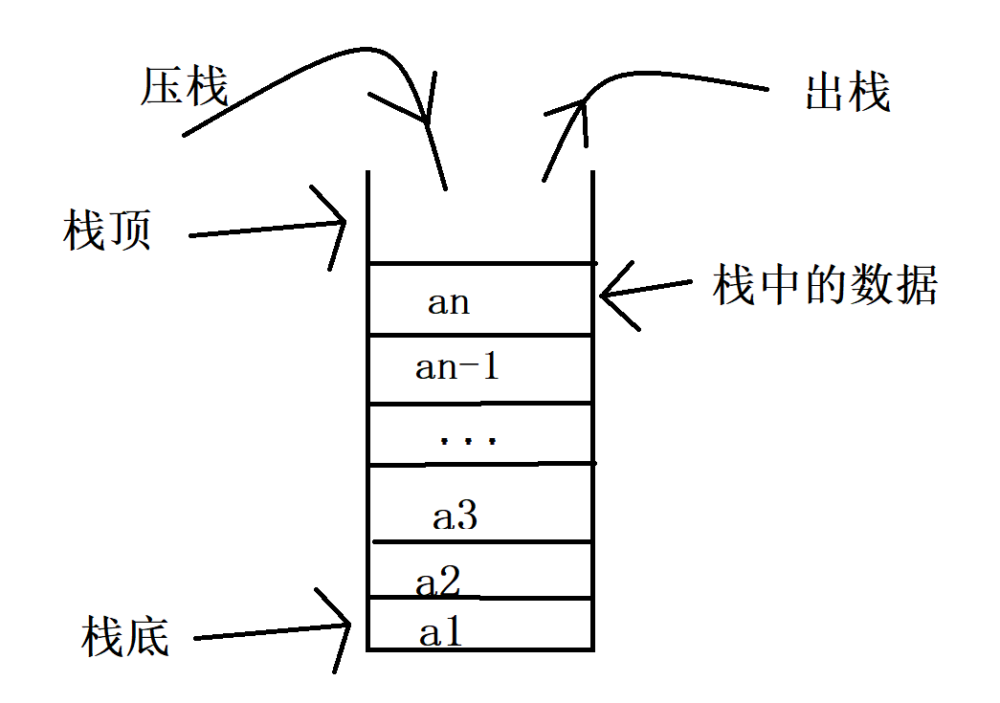

# List - Satck源码解析



## 介绍

Stack 是 Java 中的一个实现类，可以直接实例化为对象使用。继承自 Vector 类，底层的实现主要依赖于 Vector 中的实现方式，故要真正了解 Stack 中的底层实现需要去了解 Vector 的底层实现。


栈（stack）又名堆栈，它是一种运算受限的线性表。限定仅在表尾进行插入和删除操作的线性表。这一端被称为栈顶，相对地，把另一端称为栈底。向一个栈插入新元素又称作进栈、入栈或压栈，它是把新元素放到栈顶元素的上面，使之成为新的栈顶元素；从一个栈删除元素又称作出栈或退栈，它是把栈顶元素删除掉，使其相邻的元素成为新的栈顶元素。


::: tip Vector 的底层实现
// TODO vector 源码详解
:::

## 常用API

|方法名|功能|
|:---:|:---:|
|boolean empty()|判断栈是否为空|
|Object peek( )|查看栈顶元素|
|Object pop( )|弹出栈顶元素|
|Object push(Object element)|将元素 element 压栈|
|int search(Object element)|返回对象在堆栈中的位置|

## 底层实现

### 添加元素


```java
public E push(E item) {
    addElement(item);

    return item;
}
```

### 弹出元素


```java
public synchronized E pop() {
    E       obj;
    int     len = size();

    obj = peek();
    removeElementAt(len - 1);

    return obj;
}
```

### 查看栈顶元素

```java
public synchronized E peek() {
    int     len = size();

    if (len == 0)
        throw new EmptyStackException();
    return elementAt(len - 1);
}
```

### 判断栈是否为空

```java
public boolean empty() {
    return size() == 0;
}
```

### 查找某个元素的位置

```java
public synchronized int search(Object o) {
    int i = lastIndexOf(o);

    if (i >= 0) {
        return size() - i;
    }
    return -1;
}
```

## 造轮子

要求：使用 Java 中的数组实现 Stack 栈

```java
public class ArrayStack {
    // 栈的大小
    public int size;
    // 存储的数据
    public int[] data;
    // 栈顶元素
    public int top;

    /*
    *   构造方法
    * */
    public ArrayStack(int size){
        this.size = size;
        this.data = new int[size];
        this.top = -1;
    }

    /*
    *   empty()方法
    * */
    public boolean empty(){
        return (top == -1);
    }

    /*
    *   peek()方法
    * */
    public int peek(){
        return data[top];
    }

    /*
    *   pop()方法
    * */
    public int pop(){
        int ret = data[top];
        top--;
        return ret;
    }

    /*
    *   push()方法
    * */
    public boolean push(int num){
        if(top < size) {
            top++;
            data[top] = num;
            return true;
        }
        return false;
    }

    /*
    *   search()方法
    *       以1为基数，从栈顶向栈底
    * */
    public int search(int target){
        for(int i = top;i>=0;i--){
            if(data[i] == target) {
                return (top - i + 1);
            }
        }
        // 返回-1代表没有
        return -1;
    }
}
```