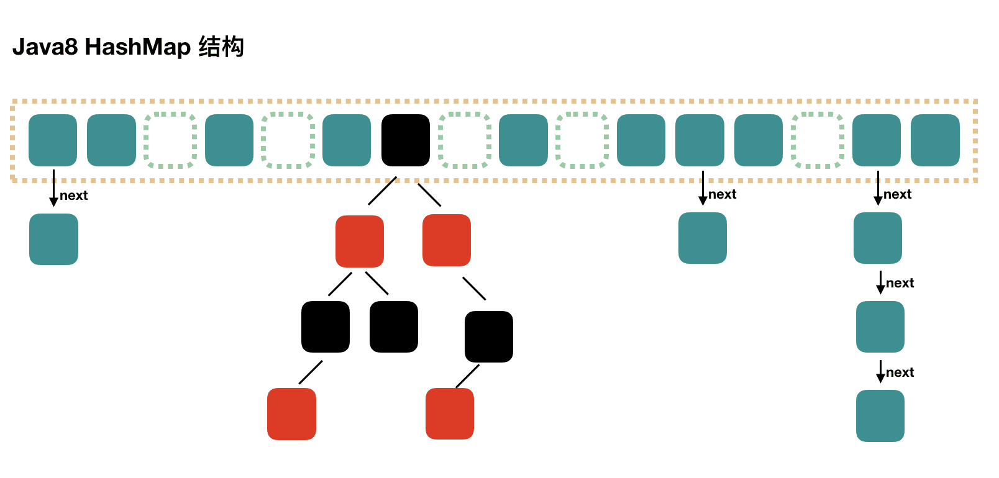

# Map - HashMap 源码解析

## 介绍

HashMap 是一个散列表，它存储的内容是键值对(key-value)映射，实现了 Map 接口，能够根据键的哈希值(HashCode)存储数据，具有很高的访问效率，最多允许一条键位 null 的值，不支持线程同步，即线程不安全。也不保证元素顺序，即根据需要容器可能会对元素重新哈希，元素的顺序就会被打乱，和 TreeMap 有所区别。

HashMap 是 HashSet、HashTable、ConcurrentHashMap 这三种数据结构的基础。

## 常用API

1. 添加元素
- `put(K key, V value)`: 将指定的键值对存储到 HashMap 中。
- `putAll(Map<? extends K, ? extends V> m)`: 将另一个 Map 中的所有键值对添加到当前 HashMap 中。

2. 获取元素
- `get(Object key)`: 获取指定键对应的值。
- `getOrDefault(key, defaultValue)`：获取指定键对应的值，如果指定键不存在则返回 defaultValue
- `keySet()`: 返回 HashMap 中所有键组成的 Set 集合。
- `values()`: 返回 HashMap 中所有值组成的 Collection 集合。
- `entrySet()`: 返回 HashMap 中所有键值对组成的 Set 集合，每个元素都是 Map.Entry 对象，包含键值对信息。

3. 删除元素
- `remove(Object key)`: 删除指定键对应的键值对。
- `clear()`: 清空 HashMap 中的所有键值对。

4. 修改元素
- `replace(K key, V oldValue, V newValue)`: 将指定键对应的值从 oldValue 替换为 newValue。
- `replaceAll(BiFunction<? super K,? super V,? extends V> function)`: 使用给定的函数对每个键值对执行替换操作。

5. 判断元素
- `containsKey(Object key)`: 判断 HashMap 是否包含指定的键。
- `containsValue(Object value)`: 判断 HashMap 是否包含指定的值。
- `isEmpty()`: 判断 HashMap 是否为空。

6. 其他操作
- `size()`: 返回 HashMap 中键值对的数量。

## 实现方式

### 底层存储

HashMap 在底层实际上是一个可以扩容的动态数组，数组中存储的是发生冲突的链表节点的头结点，或者是红黑树的根节点。

1. 在 JDK8 之前是直接将发生冲突的元素通过链表存储起来。

2. 在 JDK8 之后，考虑到了链表的效率不高，根据链表的结点数量将其动态的调整为红黑树。

::: important
[!caution]
警告文字
:::