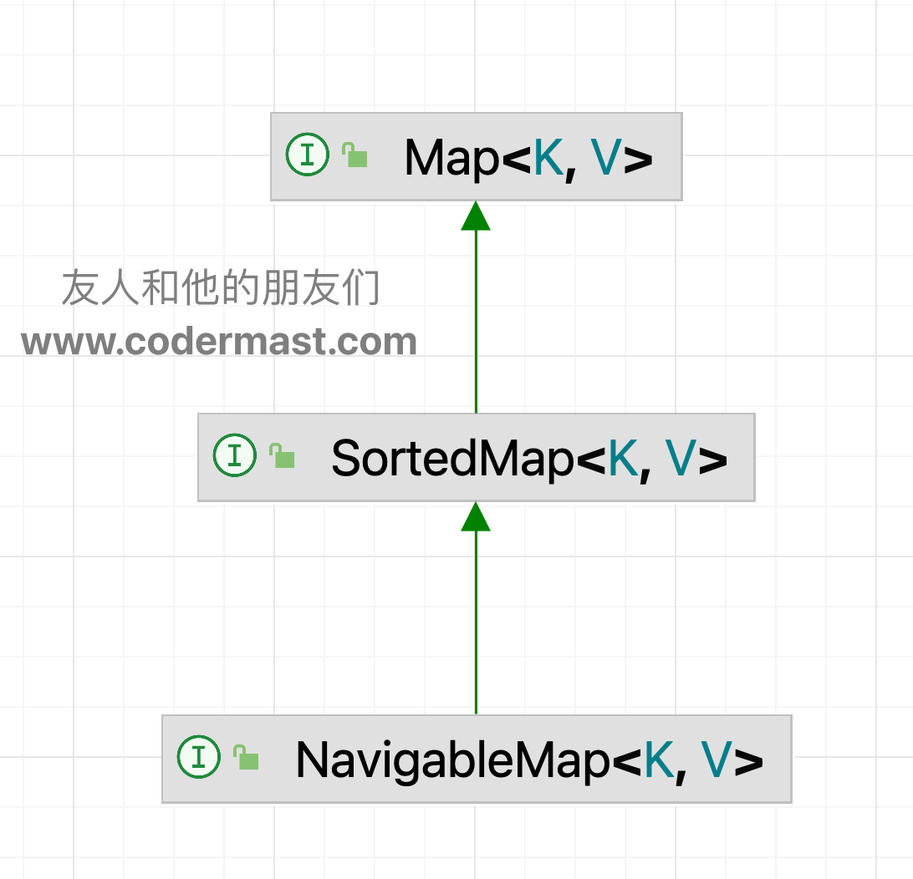

# Map - TreeMap 源码解析

## 介绍

TreeMap 和 HashMap 类似，都是 Map 接口的一个实现类，是一个能够存储 <K,V> 键值对的集合。与 HashMap 相比，其底层是存储 <K，V> 结点的一个红黑树，能自动对添加进来的元素节点进行排序，默认按照元素 Key 的自然顺序进行排列，也可在构造时传入比较器。

TreeMap 具有如下特点：
- 不允许出现重复的 Key
- 可以插入 null 键，null 值，但仅能一个 Key 为 null
- 可以对元素进行排序
- 无序集合，即插入顺序和其存储、遍历顺序不一致


## 常用API

- 新增元素：put()
- 获取指定K元素：get(K k)
- 遍历元素：entrySet()
- 获取所有的Key：keySet()
- 获取所有的Value：values()
- 删除元素：remove()
- 清空元素：clear()

```java
public class TreeMapTest {
    public static void main(String[] agrs){
        //创建TreeMap对象：
        TreeMap<String,Integer> treeMap = new TreeMap<String,Integer>();
        System.out.println("初始化后,TreeMap元素个数为：" + treeMap.size());

        //新增元素:
        treeMap.put("hello",1);
        treeMap.put("world",2);
        treeMap.put("my",3);
        treeMap.put("name",4);
        treeMap.put("is",5);
        treeMap.put("jiaboyan",6);
        treeMap.put("i",6);
        treeMap.put("am",6);
        treeMap.put("a",6);
        treeMap.put("developer",6);
        System.out.println("添加元素后,TreeMap元素个数为：" + treeMap.size());

        //遍历元素：
        Set<Map.Entry<String,Integer>> entrySet = treeMap.entrySet();
        for(Map.Entry<String,Integer> entry : entrySet){
            String key = entry.getKey();
            Integer value = entry.getValue();
            System.out.println("TreeMap元素的key:"+key+",value:"+value);
        }

        //获取所有的key：
        Set<String> keySet = treeMap.keySet();
        for(String strKey:keySet){
            System.out.println("TreeMap集合中的key:"+strKey);
        }

        //获取所有的value:
        Collection<Integer> valueList = treeMap.values();
        for(Integer intValue:valueList){
            System.out.println("TreeMap集合中的value:" + intValue);
        }

        //获取元素：
        Integer getValue = treeMap.get("jiaboyan");//获取集合内元素key为"jiaboyan"的值
        String firstKey = treeMap.firstKey();//获取集合内第一个元素
        String lastKey =treeMap.lastKey();//获取集合内最后一个元素
        String lowerKey =treeMap.lowerKey("jiaboyan");//获取集合内的key小于"jiaboyan"的key
        String ceilingKey =treeMap.ceilingKey("jiaboyan");//获取集合内的key大于等于"jiaboyan"的key
        SortedMap<String,Integer> sortedMap =treeMap.subMap("a","my");//获取集合的key从"a"到"jiaboyan"的元素

        //删除元素：
        Integer removeValue = treeMap.remove("jiaboyan");//删除集合中key为"jiaboyan"的元素
        treeMap.clear(); //清空集合元素：

        //判断方法：
        boolean isEmpty = treeMap.isEmpty();//判断集合是否为空
        boolean isContain = treeMap.containsKey("jiaboyan");//判断集合的key中是否包含"jiaboyan"
    }
}
```

## 底层实现

TreeMap 继承于 AbstractMap 抽象类，而 AbstractMap 又实现了 Map 接口，为其子类的继承提供了便利。

TreeMap 间接性的实现了 Map 接口，故其存储的是 <K,V> 格式的键值对数据。实现了 Cloneable 接口中的 clone() 方法，故其能够被克隆。还实现了 Java.io.Serializable 接口，故其能够被序列化。

特别的 TreeMap 实现了一个 NavigableMap 接口，具体该接口的关系图如下：



该接口继承了 SortedMap 接口，从字面上来看，实现该接口的 Map 都有排序功能，主要是因为 SortedMap 接口内定义了一个 comparator 方法，有了该方法就能对集合内的元素进行排序。

```java
Comparator<? super K> comparator()
```

另外 NavigableMap 接口中还定义了一些对集合内元素查找的方法，具体如下所示：

:::: details NavigableMap接口源码
```java
public interface NavigableMap<K,V> extends SortedMap<K,V> {  
  
    // 返回键小于指定 key 的第一个元素（Map.Entry），如果不存在则返回 null。  
    Map.Entry<K,V> lowerEntry(K key);  
  
    // 返回键小于指定 key 的第一个键，如果不存在则返回 null。  
    K lowerKey(K key);  
  
    // 返回键小于等于指定 key 的第一个元素（Map.Entry），如果不存在则返回 null。  
    Map.Entry<K,V> floorEntry(K key);  
  
    // 返回键小于等于指定 key 的第一个键，如果不存在则返回 null。  
    K floorKey(K key);  
  
    // 返回键大于等于指定 key 的第一个元素（Map.Entry），如果不存在则返回 null。  
    Map.Entry<K,V> ceilingEntry(K key);  
  
    // 返回键大于等于指定 key 的第一个键，如果不存在则返回 null。  
    K ceilingKey(K key);  
  
    // 返回键大于指定 key 的第一个元素（Map.Entry），如果不存在则返回 null。  
    Map.Entry<K,V> higherEntry(K key);  
  
    // 返回键大于指定 key 的第一个键，如果不存在则返回 null。  
    K higherKey(K key);  
  
    // 返回集合中的第一个元素（Map.Entry），如果不存在则返回 null。  
    Map.Entry<K,V> firstEntry();  
  
    // 返回集合中的最后一个元素（Map.Entry），如果不存在则返回 null。  
    Map.Entry<K,V> lastEntry();  
  
    // 返回并移除集合中的第一个元素（Map.Entry），如果不存在则返回 null。  
    Map.Entry<K,V> pollFirstEntry();  
  
    // 返回并移除集合中的最后一个元素（Map.Entry），如果不存在则返回 null。  
    Map.Entry<K,V> pollLastEntry();  
  
    // 返回此映射的逆序视图。  
    NavigableMap<K,V> descendingMap();  
  
    // 返回此映射中键的逆序视图。  
    NavigableSet<K> navigableKeySet();  
  
    // 返回此映射中键的逆序视图（NavigableSet）。  
    NavigableSet<K> descendingKeySet();  
  
    // 返回此映射的部分视图，其键的范围从 fromKey 到 toKey。  
    // 如果 fromInclusive 为 true，则包含 fromKey；如果 toInclusive 为 true，则包含 toKey。  
    NavigableMap<K,V> subMap(K fromKey, boolean fromInclusive, K toKey, boolean toInclusive);  
  
    // 返回此映射的部分视图，其键小于（或等于，如果 inclusive 为 true）给定的 toKey。  
    NavigableMap<K,V> headMap(K toKey, boolean inclusive);  
  
    // 返回此映射的部分视图，其键大于（或等于，如果 inclusive 为 true）给定的 fromKey。  
    NavigableMap<K,V> tailMap(K fromKey, boolean inclusive);  
  
    // 返回此映射的部分视图，其键的范围从 fromKey 到 toKey。  
    // 注意：这些方法返回的是 SortedMap，而非 NavigableMap，因此不提供导航功能。  
    SortedMap<K,V> subMap(K fromKey, K toKey);  
  
    SortedMap<K,V> headMap(K toKey);  
  
    SortedMap<K,V> tailMap(K fromKey);  
}
```
::::
NavigableMap 的目的主要是为了将对集合内元素的搜索、获取功能抽取出来，并进行增强和标准化，当子类实现其接口时，自动获得以上能力。

### 获取元素

```java
public V get(Object key) {
    Entry<K,V> p = getEntry(key);
    return (p==null ? null : p.value);
}

final Entry<K,V> getEntry(Object key) {
    // Offload comparator-based version for sake of performance
    if (comparator != null)
        return getEntryUsingComparator(key);
    if (key == null)
        throw new NullPointerException();
    @SuppressWarnings("unchecked")
        Comparable<? super K> k = (Comparable<? super K>) key;
    Entry<K,V> p = root;
    while (p != null) {
        int cmp = k.compareTo(p.key);
        if (cmp < 0)
            p = p.left;
        else if (cmp > 0)
            p = p.right;
        else
            return p;
    }
    return null;
}
```

### 添加元素
```java
public V put(K key, V value) {
    Entry<K,V> t = root;
    if (t == null) {
        compare(key, key); // type (and possibly null) check

        root = new Entry<>(key, value, null);
        size = 1;
        modCount++;
        return null;
    }
    int cmp;
    Entry<K,V> parent;
    // split comparator and comparable paths
    Comparator<? super K> cpr = comparator;
    if (cpr != null) {
        do {
            parent = t;
            cmp = cpr.compare(key, t.key);
            if (cmp < 0)
                t = t.left;
            else if (cmp > 0)
                t = t.right;
            else
                return t.setValue(value);
        } while (t != null);
    }
    else {
        if (key == null)
            throw new NullPointerException();
        @SuppressWarnings("unchecked")
            Comparable<? super K> k = (Comparable<? super K>) key;
        do {
            parent = t;
            cmp = k.compareTo(t.key);
            if (cmp < 0)
                t = t.left;
            else if (cmp > 0)
                t = t.right;
            else
                return t.setValue(value);
        } while (t != null);
    }
    Entry<K,V> e = new Entry<>(key, value, parent);
    if (cmp < 0)
        parent.left = e;
    else
        parent.right = e;
    fixAfterInsertion(e);
    size++;
    modCount++;
    return null;
}
```

### 删除元素

```java
public V remove(Object key) {
    Entry<K,V> p = getEntry(key);
    if (p == null)
        return null;

    V oldValue = p.value;
    deleteEntry(p);
    return oldValue;
}

public void clear() {
    modCount++;
    size = 0;
    root = null;
}
```
## 排序功能

正如前面所说，TreeMap 具有排序功能，默认是通过 键 的自然顺序排列，也可传入自定义的比较器，根据比较器规则排序。

需要注意的是，只能在创建 TreeMap 对象时通过构造器方法进行传入，这是因为一旦定义好了 TreeMap 对象，其中如果已经有元素，此时再添加或修改比较规则，会造成排序功能失效。

```java
public TreeMap() {
    comparator = null;
}

public TreeMap(Comparator<? super K> comparator) {
    this.comparator = comparator;
}

public TreeMap(Map<? extends K, ? extends V> m) {
    comparator = null;
    putAll(m);
}

public TreeMap(SortedMap<K, ? extends V> m) {
    comparator = m.comparator();
    try {
        buildFromSorted(m.size(), m.entrySet().iterator(), null, null);
    } catch (java.io.IOException cannotHappen) {

    } catch (ClassNotFoundException cannotHappen) {
        
    }
}
```

现在 TreeMap 有了比较器，知道是如何比较的，但是其底层是红黑树，又是具体怎么实现存储上的排序呢？

想要理解如何存储，就必须先了解红黑树，红黑树是一种特殊处理的二叉排序树，切记红黑树不是平衡二叉树。

::: tip 红黑树
具体关于红黑树的内容，红黑树的特点、如何保证其有序、左旋转、右旋转规则等知识，请移步

// TODO：「408」数据结构——红黑树详解 。
:::

既然红黑树是二叉排序树，那么其天然有序，只需要根据其排序规则进行不断调整即可，这里由于篇幅限制就不过多赘述。

调整好以后是一棵左右子树高度差不超过2倍的二叉排序树，通过中序遍历，即可得到按序遍历结果。

::: warning 二叉排序树、二叉搜索树、二叉查找树有什么区别？
三者是统一概念的不同叫法，没有任何区别。
:::
