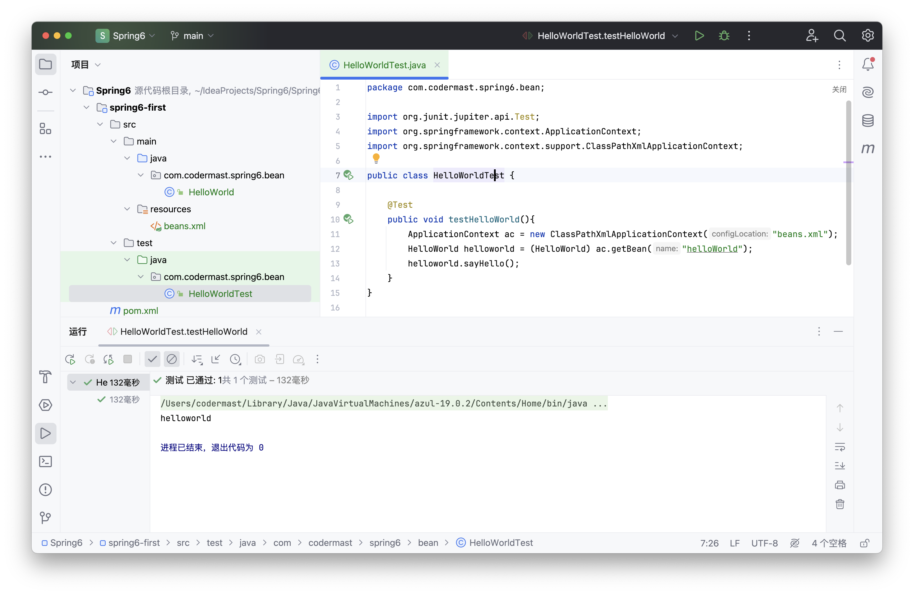

# Spring - 入门案例

1. 创建 Maven 工程

2. 引入 Spring 相关的依赖

```xml
<dependencies>
    <!--spring context依赖-->
    <!--当你引入Spring Context依赖之后，表示将Spring的基础依赖引入了-->
    <dependency>
        <groupId>org.springframework</groupId>
        <artifactId>spring-context</artifactId>
        <version>6.0.9</version>
    </dependency>

    <!--junit5测试-->
    <dependency>
        <groupId>org.junit.jupiter</groupId>
        <artifactId>junit-jupiter-api</artifactId>
        <version>5.3.1</version>
    </dependency>
</dependencies>
```
3. 创建java类

```java
package com.codermast.spring6.bean;

public class HelloWorld {
    
    public void sayHello(){
        System.out.println("helloworld");
    }

}
```

4. 创建配置文件

在resources目录创建一个 Spring 配置文件 beans.xml（配置文件名称可随意命名，如：springs.xml）

这里的命名需要和第五步中的使用的配置文件名称相同。

```xml
<?xml version="1.0" encoding="UTF-8"?>
<beans xmlns="http://www.springframework.org/schema/beans"
       xmlns:xsi="http://www.w3.org/2001/XMLSchema-instance"
       xsi:schemaLocation="http://www.springframework.org/schema/beans http://www.springframework.org/schema/beans/spring-beans.xsd">

    <!--
    配置HelloWorld所对应的bean，即将HelloWorld的对象交给Spring的IOC容器管理
    通过bean标签配置IOC容器所管理的bean
    属性：
        id：设置bean的唯一标识
        class：设置bean所对应类型的全类名
	-->
    <bean id="helloWorld" class="com.codermast.spring6.bean.HelloWorld"></bean>
    
</beans>
```

5. 创建测试类

```java
package com.codermast.spring6.bean;

import org.junit.jupiter.api.Test;
import org.springframework.context.ApplicationContext;
import org.springframework.context.support.ClassPathXmlApplicationContext;

public class HelloWorldTest {

    @Test
    public void testHelloWorld(){
        ApplicationContext ac = new ClassPathXmlApplicationContext("beans.xml");
        HelloWorld helloworld = (HelloWorld) ac.getBean("helloWorld");
        helloworld.sayHello();
    }
}
```

6. 测试运行



