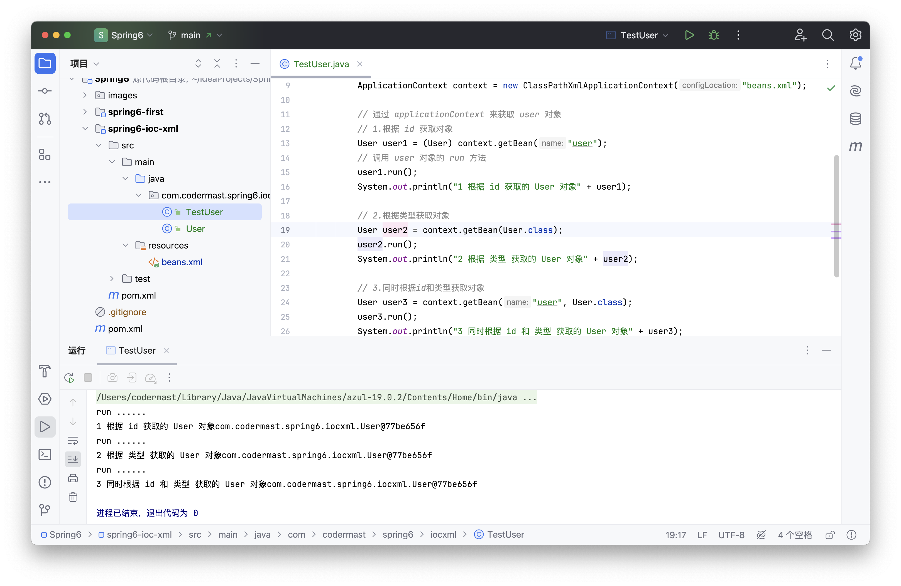
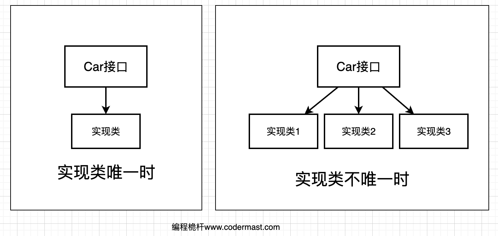
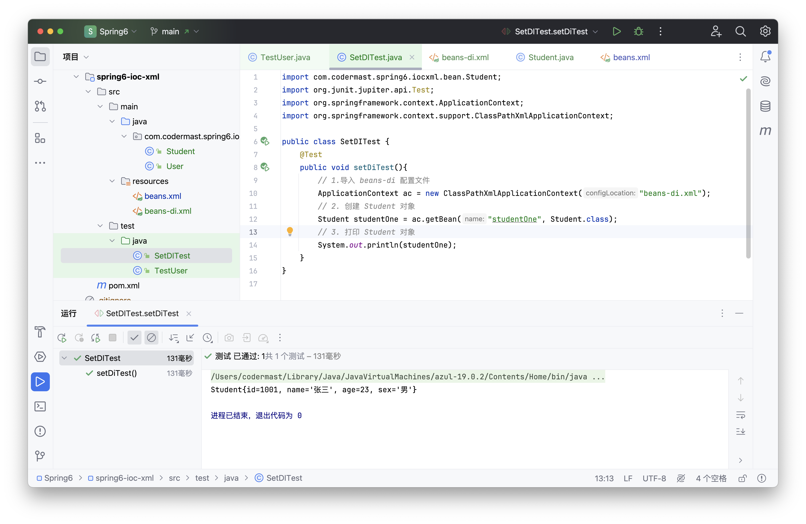
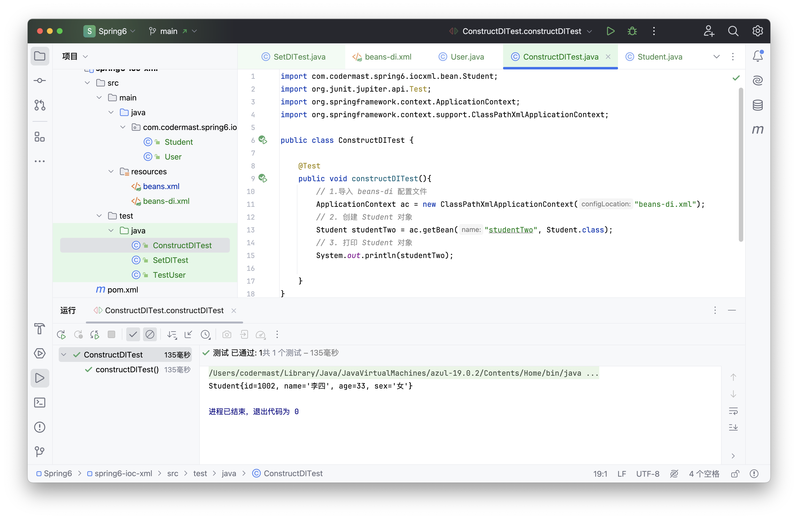
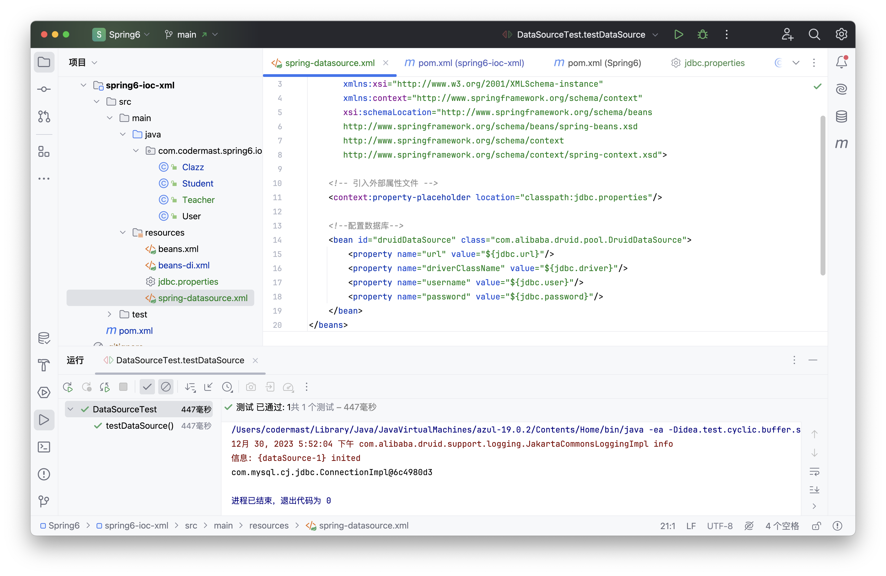
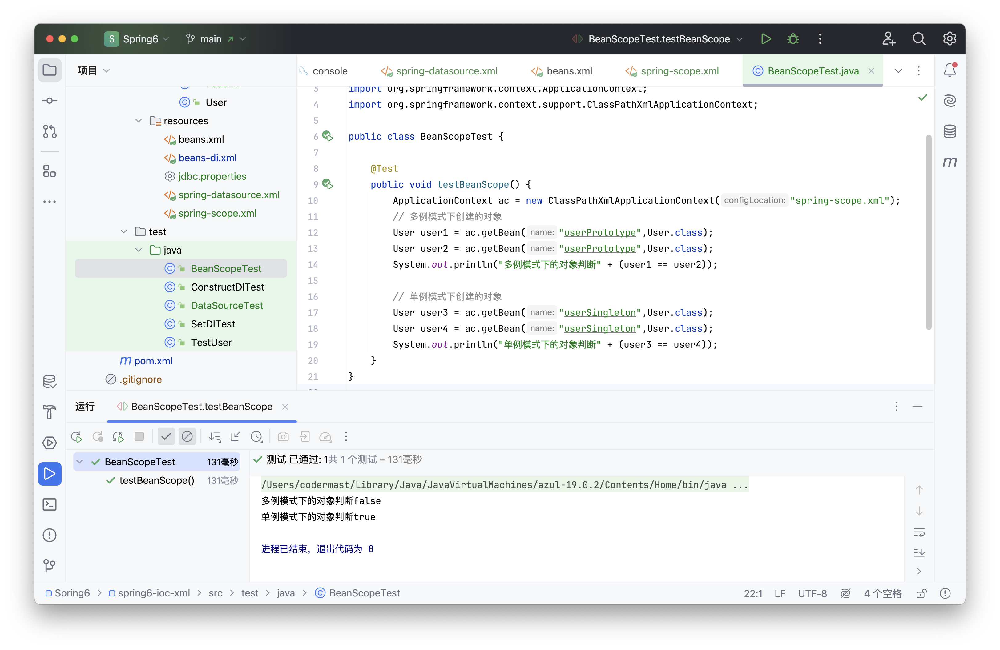
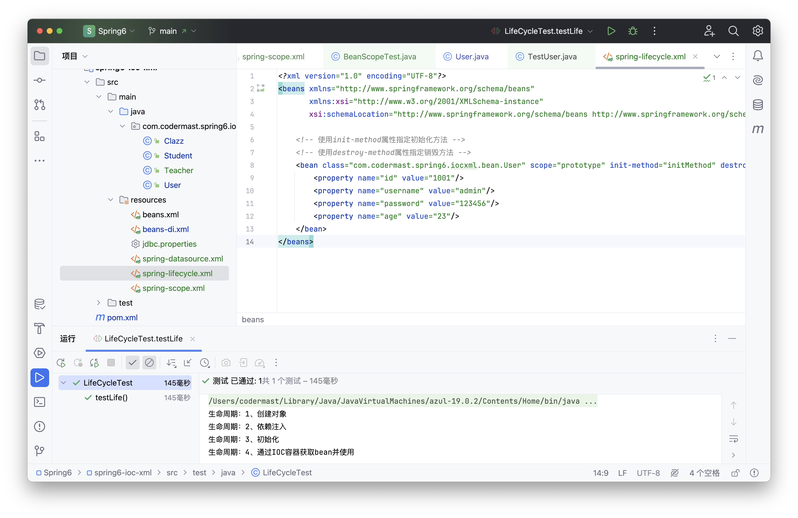
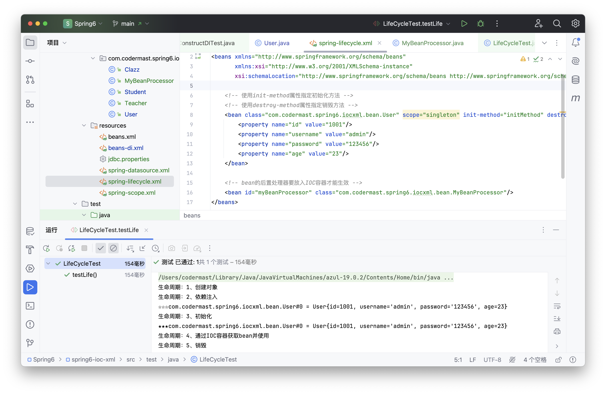
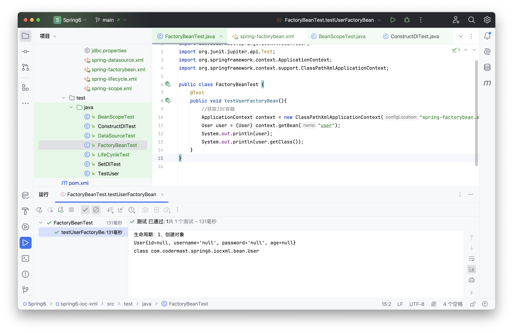
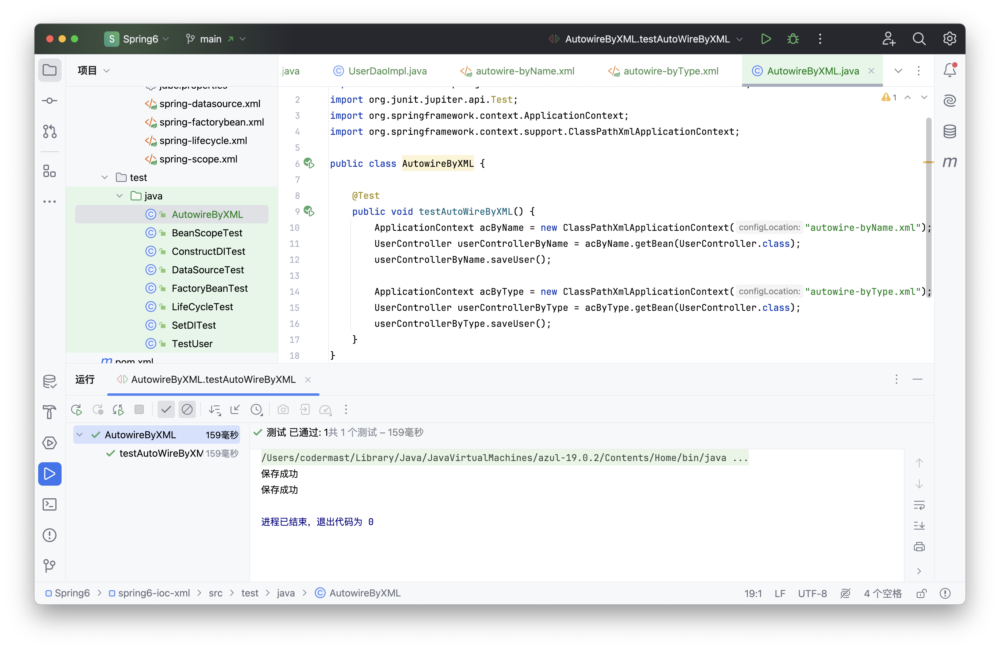

# Spring - 基于XML管理Bean


## 搭建子模块

在使用 XML 管理 Bean 之前，为了防止和之前的项目冲突，我们重新构建一个子模块，叫做 spring6-ioc-xml ，并且引入 beans.xml 文件即可。


## 获取bean
在通过 xml 方式获取 bean 之前，我们需要先导入对应的配置文件，这里我们是 beans.xml。构建 ApplicationContext 容器。

```java
// 导入 bean 的 xml 配置文件
ApplicationContext context = new ClassPathXmlApplicationContext("beans.xml");
```

在 xml 方式下获取 bean 对象的方式有三种：
1. 根据 id 获取

```java
// 1.根据 id 获取对象
User user1 = (User) context.getBean("user");
// 调用 user 对象的 run 方法
user1.run();
System.out.println("1 根据 id 获取的 User 对象" + user1);
```
2. 根据 Class 获取
```java
// 2.根据类型获取对象
User user2 = context.getBean(User.class);
user2.run();
System.out.println("2 根据 类型 获取的 User 对象" + user2);
```
3. 同时根据 id 和 Class 获取

```java
// 3.同时根据id和类型获取对象
User user3 = context.getBean("user", User.class);
user3.run();
System.out.println("3 同时根据 id 和 类型 获取的 User 对象" + user3);
```



::: warning 注意
- 要注意在 bean 的配置文件中，如果定义了两个相同的类，并赋予了不同的 id，那么此时就无法仅依靠类型来创建对象。

```xml
<!-- 创建user -->
<bean id="user" class="com.codermast.spring6.iocxml.User"/>
<bean id="user" class="com.codermast.spring6.iocxml.User"/>
```
报错信息：
```text
Exception in thread "main" org.springframework.beans.factory.NoUniqueBeanDefinition
Exception: No qualifying bean of type 'com.codermast.spring6.iocxml.User' 
available: expected single matching bean but found 2: user,user1
```

报错的意思就是，期望的应为单个匹配bean，但找到：user，user1 两个。

这个时候可以使用 id 或者 id和类型同时使用的方式进行获取，只要保证唯一性，理论上就可以创建。
:::

**是否可以根据接口类型来获取bean？**

- 如果接口的实现唯一，此时可根据接口类型来获取该实现类的Bean
- 如果接口的实现不唯一，那么久无法根据接口类型来获取该实现类的Bean



**结论**

根据类型来获取bean时，在满足 bean 唯一性的前提下，其实只是看：『对象 **instanceof** 指定的类型』的返回结果，只要返回的是 true 就可以认定为和类型匹配，能够获取到。

Java 中，instanceof运算符用于判断前面的对象是否是后面的类，或其子类、实现类的实例。如果是返回true，否则返回false。也就是说：用instanceof关键字做判断时， instanceof 操作符的左右操作必须有继承或实现关系

## 依赖注入

依赖注入DI（Dependency injection），是IOC的一个方面，是个通常的概念，它有多种解释。这概念是说你不用创建对象，而只需要描述它如何被创建。你不在代码里直接组装你的组件和服务，但是要在配置文件里描述哪些组件需要哪些服务，之后一个容器（IOC容器）负责把他们组装起来。

- 降低程序间的耦合（依赖关系）
- 依赖关系的管理：
- 以后都交给spring来维护
- 在当前类需要用到其他类的对象，由spring为我们提供，我们只需要在配置文件中说明依赖关系的维护,就称之为依赖注入。

::: tip 
简单的来讲，依赖注入你只需要告诉他，所需要的各种数据在哪里去找即可，你不必亲自去找好交给他，让他自己去找所需要的依赖。
:::

依赖注入主要有三种方式：Set方法注入、构造方法注入、注解注入

### Set注入
在使用 Set 注入时，需要先创建对应属性的 Set 方法，否则无法进行注入。

1. 创建 Student 类

:::: details 点击展开代码
```java
public class Student {

    private Integer id;

    private String name;

    private Integer age;

    private String sex;

    public Student() {
    }

    public Integer getId() {
        return id;
    }

    public void setId(Integer id) {
        this.id = id;
    }

    public String getName() {
        return name;
    }

    public void setName(String name) {
        this.name = name;
    }

    public Integer getAge() {
        return age;
    }

    public void setAge(Integer age) {
        this.age = age;
    }

    public String getSex() {
        return sex;
    }

    public void setSex(String sex) {
        this.sex = sex;
    }

    @Override
    public String toString() {
        return "Student{" +
                "id=" + id +
                ", name='" + name + '\'' +
                ", age=" + age +
                ", sex='" + sex + '\'' +
                '}';
    }

}
```
::::

2. 配置 bean 时为属性赋值

创建一个新配置文件，名为 beans-di.xml ，添加如下配置
```xml
<bean id="studentOne" class="com.codermast.spring6.iocxml.bean.Student">
    <!-- property标签：通过组件类的setXxx()方法给组件对象设置属性 -->
    <!-- name属性：指定属性名（这个属性名是getXxx()、setXxx()方法定义的，和成员变量无关） -->
    <!-- value属性：指定属性值 -->
    <property name="id" value="1001"/>
    <property name="name" value="张三"/>
    <property name="age" value="23"/>
    <property name="sex" value="男"/>
</bean>
```

3. 测试

```java
@Test
public void setDiTest(){
    // 1.导入 beans-di 配置文件
    ApplicationContext ac = new ClassPathXmlApplicationContext("beans-di.xml");
    // 2. 创建 Student 对象
    Student studentOne = ac.getBean("studentOne", Student.class);
    // 3. 打印 Student 对象
    System.out.println(studentOne);
}
```




### 构造器注入

在使用构造器注入时和 Set 注入同理，需要先提供构造器，才可以使用构造器注入。

1. 在 Student 类中添加有参构造器

```java
public Student(Integer id, String name, Integer age, String sex) {
    this.id = id;
    this.name = name;
    this.age = age;
    this.sex = sex;
}
```

2. 配置对应的 bean

```xml
<!--创建构造器 bean-->
<bean id="studentTwo" class="com.codermast.spring6.iocxml.bean.Student">
    <constructor-arg value="1002"/>
    <constructor-arg value="李四"/>
    <constructor-arg value="33"/>
    <constructor-arg value="女"/>
</bean>
```
::: tip 注意

constructor-arg标签还有两个属性可以进一步描述构造器参数：

- index属性：指定参数所在位置的索引（从0开始）
- name属性：指定参数名
:::
3. 测试

```java
@Test
public void constructDITest(){
    // 1.导入 beans-di 配置文件
    ApplicationContext ac = new ClassPathXmlApplicationContext("beans-di.xml");
    // 2. 创建 Student 对象
    Student studentTwo = ac.getBean("studentTwo", Student.class);
    // 3. 打印 Student 对象
    System.out.println(studentTwo);
}
```



## 数据赋值

### 特殊值赋值

1. 字面量值

> 字面量就是数据本身所代表的值，如 1、2、3、a、b、c等就代表的是实际的值，而在 int a = 10; 时，a 是变量，10为字面量。

```xml
<!-- 使用value属性给bean的属性赋值时，Spring会把value属性的值看做字面量 -->
<property name="name" value="张三"/>
```

2. null 值

```xml
<property name="name">
    <null />
</property>
```

需要注意的是，不能直接讲 null 作为 value 值进行传递，此时则为传递一个 内容为 null 的字符串，而并非传递 null 对象。

```xml
<property name="name" value="null"></property>
```

3. xml 实体

```xml
<!-- 小于号在XML文档中用来定义标签的开始，不能随便使用 -->
<!-- 解决方案一：使用XML实体来代替 -->
<property name="expression" value="a &lt; b"/>
```

4. cdata 节

```xml
<property name="expression">
    <!-- 解决方案二：使用CDATA节 -->
    <!-- CDATA中的C代表Character，是文本、字符的含义，CDATA就表示纯文本数据 -->
    <!-- XML解析器看到CDATA节就知道这里是纯文本，就不会当作XML标签或属性来解析 -->
    <!-- 所以CDATA节中写什么符号都随意 -->
    <value><![CDATA[a < b]]></value>
</property>
```

### 对象类型属性赋值

1. 创建 Clazz 类
在为对象类型属性赋值之前，我们先来创建一个名为 Clazz 的班级类（这里是为了避免和 Java 关键字 class 冲突）
:::: details 点我展开代码
```java
public class Clazz {

    private Integer clazzId;

    private String clazzName;

    public Integer getClazzId() {
        return clazzId;
    }

    public void setClazzId(Integer clazzId) {
        this.clazzId = clazzId;
    }

    public String getClazzName() {
        return clazzName;
    }

    public void setClazzName(String clazzName) {
        this.clazzName = clazzName;
    }

    @Override
    public String toString() {
        return "Clazz{" +
                "clazzId=" + clazzId +
                ", clazzName='" + clazzName + '\'' +
                '}';
    }

    public Clazz() {
    }

    public Clazz(Integer clazzId, String clazzName) {
        this.clazzId = clazzId;
        this.clazzName = clazzName;
    }
}
```
::::

2. 修改 Student 类

```java
private Clazz clazz;

public Clazz getClazz() {
	return clazz;
}

public void setClazz(Clazz clazz) {
	this.clazz = clazz;
}
```

3. 配置 Bean
> 这里我们在配置 Bean 的时候，有三种方式：外部bean、内部bean、级联属性赋值
- 外部bean
    1. 配置 Clazz 类
    ```xml
    <bean id="clazzOne" class="com.codermast.spring6.iocxml.bean.Clazz">
        <property name="clazzId" value="1111"/>
        <property name="clazzName" value="财源滚滚班"/>
    </bean>
    ```
    2. 为 Student 中的 clazz 属性赋值
    ```xml
    <bean id="studentFour" class="com.codermast.spring6.iocxml.bean.Student">
        <property name="id" value="1004"/>
        <property name="name" value="赵六"/>
        <property name="age" value="26"/>
        <property name="sex" value="女"/>
        <!-- ref属性：引用IOC容器中某个bean的id，将所对应的bean为属性赋值 -->
        <property name="clazz" ref="clazzOne"/>
    </bean>
    ```

- 内部bean

```xml
<bean id="studentFive" class="com.codermast.spring6.iocxml.bean.Student">
    <property name="id" value="1004"/>
    <property name="name" value="赵六"/>
    <property name="age" value="26"/>
    <property name="sex" value="女"/>
    <property name="clazz">
        <!-- 在一个bean中再声明一个bean就是内部bean -->
        <!-- 内部bean只能用于给属性赋值，不能在外部通过IOC容器获取，因此可以省略id属性 -->
        <bean id="clazzInner" class="com.codermast.spring6.iocxml.bean.Clazz">
            <property name="clazzId" value="2222"/>
            <property name="clazzName" value="远大前程班"/>
        </bean>
    </property>
</bean>
```
- 级联属性赋值

```xml
<bean id="studentSix" class="com.codermast.spring6.iocxml.bean.Student">
    <property name="id" value="1004"/>
    <property name="name" value="赵六"/>
    <property name="age" value="26"/>
    <property name="sex" value="女"/>
    <property name="clazz" ref="clazzOne"/>
    <property name="clazz.clazzId" value="3333"/>
    <property name="clazz.clazzName" value="最强王者班"/>
</bean>
```

### 数组类型属性赋值

1. 修改 Student 类

在 Student 类中增加如下代码：

```java
private String[] hobbies;

public String[] getHobbies() {
    return hobbies;
}

public void setHobbies(String[] hobbies) {
    this.hobbies = hobbies;
}
```

2. 配置 bean

```xml
<bean id="studentSeven" class="com.codermast.spring6.iocxml.bean.Student">
    <property name="id" value="1004"/>
    <property name="name" value="赵六"/>
    <property name="age" value="26"/>
    <property name="sex" value="女"/>
    <!-- ref属性：引用IOC容器中某个bean的id，将所对应的bean为属性赋值 -->
    <property name="clazz" ref="clazzOne"/>
    <property name="hobbies">
        <array>
            <value>抽烟</value>
            <value>喝酒</value>
            <value>烫头</value>
        </array>
    </property>
</bean>
```

### 集合类型属性赋值

- List 集合

1. 在 Clazz 类中加入如下代码

```java
private List<Student> students;

public List<Student> getStudents() {
    return students;
}

public void setStudents(List<Student> students) {
    this.students = students;
}
```

2. 配置 bean

```xml
<bean id="clazzTwo" class="com.codermast.spring6.iocxml.bean.Clazz">
    <property name="clazzId" value="4444"/>
    <property name="clazzName" value="Javaee0222"/>
    <property name="students">
        <list>
            <ref bean="studentOne"/>
            <ref bean="studentTwo"/>
            <ref bean="studentFour"/>
            <ref bean="studentFive"/>
        </list>
    </property>
</bean>
```
若为 Set 集合类型属性赋值，只需要将其中的 list 标签改为set标签即可。

- Map 集合

1. 创建 Teacher 类

:::: details 点我展开代码
```java
public class Teacher {

    private Integer teacherId;

    private String teacherName;

    public Integer getTeacherId() {
        return teacherId;
    }

    public void setTeacherId(Integer teacherId) {
        this.teacherId = teacherId;
    }

    public String getTeacherName() {
        return teacherName;
    }

    public void setTeacherName(String teacherName) {
        this.teacherName = teacherName;
    }

    public Teacher(Integer teacherId, String teacherName) {
        this.teacherId = teacherId;
        this.teacherName = teacherName;
    }

    public Teacher() {

    }
    
    @Override
    public String toString() {
        return "Teacher{" +
                "teacherId=" + teacherId +
                ", teacherName='" + teacherName + '\'' +
                '}';
    }
}
```
::::
2. 在 Student 类中加入如下代码

```java
private Map<String, Teacher> teacherMap;

public Map<String, Teacher> getTeacherMap() {
    return teacherMap;
}

public void setTeacherMap(Map<String, Teacher> teacherMap) {
    this.teacherMap = teacherMap;
}
```

3. 配置bean
```xml
<!-- Map 集合配置-->
<bean id="teacherOne" class="com.codermast.spring6.iocxml.bean.Teacher">
    <property name="teacherId" value="10010"/>
    <property name="teacherName" value="大宝"/>
</bean>

<bean id="teacherTwo" class="com.codermast.spring6.iocxml.bean.Teacher">
    <property name="teacherId" value="10086"/>
    <property name="teacherName" value="二宝"/>
</bean>

<bean id="studentFour" class="com.codermast.spring6.iocxml.bean.Student">
    <property name="id" value="1004"/>
    <property name="name" value="赵六"/>
    <property name="age" value="26"/>
    <property name="sex" value="女"/>
    <!-- ref属性：引用IOC容器中某个bean的id，将所对应的bean为属性赋值 -->
    <property name="clazz" ref="clazzOne"/>
    <property name="hobbies">
        <array>
            <value>抽烟</value>
            <value>喝酒</value>
            <value>烫头</value>
        </array>
    </property>
    <property name="teacherMap">
        <map>
            <entry value-ref="teacherOne">
                <key>
                    <value>10010</value>
                </key>
            </entry>
            <entry value-ref="teacherTwo">
                <key>
                    <value>10086</value>
                </key>
            </entry>
        </map>
    </property>
</bean>
```

- 引用集合类型

```xml
<!--list集合类型的bean-->
<util:list id="students">
    <ref bean="studentOne"/>
    <ref bean="studentTwo"/>
    <ref bean="studentFour"/>
</util:list>
<!--map集合类型的bean-->
<util:map id="teacherMap">
    <entry>
        <key>
            <value>10010</value>
        </key>
        <ref bean="teacherOne"/>
    </entry>
    <entry>
        <key>
            <value>10086</value>
        </key>
        <ref bean="teacherTwo"/>
    </entry>
</util:map>
<bean id="clazzTwo" class="com.codermast.spring6.iocxml.bean.Clazz">
    <property name="clazzId" value="4444"/>
    <property name="clazzName" value="Javaee0222"/>
    <property name="students" ref="students"/>
</bean>
<bean id="studentFour" class="com.codermast.spring6.iocxml.bean.Student">
    <property name="id" value="1004"/>
    <property name="name" value="赵六"/>
    <property name="age" value="26"/>
    <property name="sex" value="女"/>
    <!-- ref属性：引用IOC容器中某个bean的id，将所对应的bean为属性赋值 -->
    <property name="clazz" ref="clazzOne"/>
    <property name="hobbies">
        <array>
            <value>抽烟</value>
            <value>喝酒</value>
            <value>烫头</value>
        </array>
    </property>
    <property name="teacherMap" ref="teacherMap"/>
</bean>
```


::: note 使用util:list、util:map标签必须引入相应的命名空间
```xml
<?xml version="1.0" encoding="UTF-8"?>
<beans xmlns="http://www.springframework.org/schema/beans"
    xmlns:xsi="http://www.w3.org/2001/XMLSchema-instance"
    xmlns:util="http://www.springframework.org/schema/util"
    xsi:schemaLocation="http://www.springframework.org/schema/util
    http://www.springframework.org/schema/util/spring-util.xsd
    http://www.springframework.org/schema/beans
    http://www.springframework.org/schema/beans/spring-beans.xsd">
```
:::

## P命名空间

- 引入 P 命名空间

```xml
<?xml version="1.0" encoding="UTF-8"?>
<beans xmlns="http://www.springframework.org/schema/beans"
       xmlns:xsi="http://www.w3.org/2001/XMLSchema-instance"
       xmlns:util="http://www.springframework.org/schema/util"
       xmlns:p="http://www.springframework.org/schema/p"
       xsi:schemaLocation="http://www.springframework.org/schema/util
       http://www.springframework.org/schema/util/spring-util.xsd
       http://www.springframework.org/schema/beans
       http://www.springframework.org/schema/beans/spring-beans.xsd">
```
- 引入p命名空间后，可以通过以下方式为bean的各个属性赋值

```xml
<bean id="studentSix" class="com.codermast.spring6.iocxml.bean.Student"
    p:id="1006" p:name="小明" p:clazz-ref="clazzOne" p:teacherMap-ref="teacherMap"></bean>
```

## 引入外部属性文件

1. 加入依赖

即将下面的代码，加入到对应子模块中的 pom.xml 文件中

```xml
<!-- MySQL驱动 -->
<dependency>
    <groupId>mysql</groupId>
    <artifactId>mysql-connector-java</artifactId>
    <version>8.0.30</version>
</dependency>

<!-- 数据源 -->
<dependency>
    <groupId>com.alibaba</groupId>
    <artifactId>druid</artifactId>
    <version>1.2.15</version>
</dependency>
```


2. 创建外部属性配置文件jdbc.properties

```properties
jdbc.user=codermast
jdbc.password=123456
jdbc.url=jdbc:mysql://localhost:3306/ssm?serverTimezone=UTC
jdbc.driver=com.mysql.cj.jdbc.Driver
```

3. 引入配置文件

引入context 名称空间，这里我们为了防止和之前的冲突，新建一个 bean 配置文件，名为 `spring-datasource.xml`

```xml
<?xml version="1.0" encoding="UTF-8"?>
<beans xmlns="http://www.springframework.org/schema/beans"
       xmlns:xsi="http://www.w3.org/2001/XMLSchema-instance"
       xmlns:context="http://www.springframework.org/schema/context"
       xsi:schemaLocation="http://www.springframework.org/schema/beans
       http://www.springframework.org/schema/beans/spring-beans.xsd
       http://www.springframework.org/schema/context
       http://www.springframework.org/schema/context/spring-context.xsd">

    <!-- 引入外部属性文件 -->
    <context:property-placeholder location="classpath:jdbc.properties"/>
</beans>
```
::: note 注意：
在使用 `<context:property-placeholder>` 元素加载外包配置文件功能前，首先需要在 XML 配置的一级标签 `<beans>` 中添加 context 相关的约束。
:::

4. 配置bean

```xml
<bean id="druidDataSource" class="com.alibaba.druid.pool.DruidDataSource">
    <property name="url" value="${jdbc.url}"/>
    <property name="driverClassName" value="${jdbc.driver}"/>
    <property name="username" value="${jdbc.user}"/>
    <property name="password" value="${jdbc.password}"/>
</bean>
```

5. 测试

```java
@Test
public void testDataSource() throws SQLException {
    ApplicationContext ac = new ClassPathXmlApplicationContext("spring-datasource.xml");
    DataSource dataSource = ac.getBean(DataSource.class);
    Connection connection = dataSource.getConnection();
    System.out.println(connection);
}
```



## Bean的作用域

1. 概念

在Spring中可以通过配置bean标签的scope属性来指定bean的作用域范围，各取值含义参加下表：

| 取值              | 含义                                    | 创建对象的时机  |
| ----------------- | --------------------------------------- | --------------- |
| singleton（默认） | 在IOC容器中，这个bean的对象始终为单实例 | IOC容器初始化时 |
| prototype         | 这个bean在IOC容器中有多个实例           | 获取bean时      |

如果是在WebApplicationContext环境下还会有另外几个作用域（但不常用）：

| 取值    | 含义                 |
| ------- | -------------------- |
| request | 在一个请求范围内有效 |
| session | 在一个会话范围内有效 |

2. 创建 User 类

:::: details 点我展开代码
```java
package com.atguigu.spring6.bean;
public class User {

    private Integer id;

    private String username;

    private String password;

    private Integer age;

    public User() {
    }

    public User(Integer id, String username, String password, Integer age) {
        this.id = id;
        this.username = username;
        this.password = password;
        this.age = age;
    }

    public Integer getId() {
        return id;
    }

    public void setId(Integer id) {
        this.id = id;
    }

    public String getUsername() {
        return username;
    }

    public void setUsername(String username) {
        this.username = username;
    }

    public String getPassword() {
        return password;
    }

    public void setPassword(String password) {
        this.password = password;
    }

    public Integer getAge() {
        return age;
    }

    public void setAge(Integer age) {
        this.age = age;
    }

    @Override
    public String toString() {
        return "User{" +
                "id=" + id +
                ", username='" + username + '\'' +
                ", password='" + password + '\'' +
                ", age=" + age +
                '}';
    }
}
```
::::

这里也可以使用我们之前的 User 类，不影响后续的操作。

3. 配置bean

```xml
<!-- 配置 User 类 -->
<bean id="userSingleton" class="com.codermast.spring6.iocxml.bean.User" scope="singleton"/>
<bean id="userPrototype" class="com.codermast.spring6.iocxml.bean.User" scope="prototype"/>
```

4. 测试

```java
@Test
public void testBeanScope(){
    ApplicationContext ac = new ClassPathXmlApplicationContext("spring-scope.xml");
    User user1 = ac.getBean(User.class);
    User user2 = ac.getBean(User.class);
    System.out.println(user1==user2);
}
```



## Bean生命周期

1. 具体的生命周期过程

- bean对象创建（调用无参构造器）

- 给bean对象设置属性

- bean的后置处理器（初始化之前）

- bean对象初始化（需在配置bean时指定初始化方法）

- bean的后置处理器（初始化之后）

- bean对象就绪可以使用

- bean对象销毁（需在配置bean时指定销毁方法）

- IOC容器关闭

2. 修改 User 类
:::: details 点我展开代码
```java
public class User {

    private Integer id;

    private String username;

    private String password;

    private Integer age;

    public User() {
        System.out.println("生命周期：1、创建对象");
    }

    public User(Integer id, String username, String password, Integer age) {
        this.id = id;
        this.username = username;
        this.password = password;
        this.age = age;
    }

    public Integer getId() {
        return id;
    }

    public void setId(Integer id) {
        System.out.println("生命周期：2、依赖注入");
        this.id = id;
    }

    public String getUsername() {
        return username;
    }

    public void setUsername(String username) {
        this.username = username;
    }

    public String getPassword() {
        return password;
    }

    public void setPassword(String password) {
        this.password = password;
    }

    public Integer getAge() {
        return age;
    }

    public void setAge(Integer age) {
        this.age = age;
    }

    public void initMethod(){
        System.out.println("生命周期：3、初始化");
    }

    public void destroyMethod(){
        System.out.println("生命周期：5、销毁");
    }

    @Override
    public String toString() {
        return "User{" +
                "id=" + id +
                ", username='" + username + '\'' +
                ", password='" + password + '\'' +
                ", age=" + age +
                '}';
    }

    public void run(){
        System.out.println("run ......");
    }
}
```
::::

> 注意其中的initMethod()和destroyMethod()，可以通过配置bean指定为初始化和销毁的方法

3. 配置bean

```xml
<!-- 使用init-method属性指定初始化方法 -->
<!-- 使用destroy-method属性指定销毁方法 -->
<bean class="com.codermast.spring6.iocxml.bean.User" scope="prototype" init-method="initMethod" destroy-method="destroyMethod">
    <property name="id" value="1001"/>
    <property name="username" value="admin"/>
    <property name="password" value="123456"/>
    <property name="age" value="23"/>
</bean>
```

4. 测试

```java
@Test
public void testLife(){
    ClassPathXmlApplicationContext ac = new ClassPathXmlApplicationContext("spring-lifecycle.xml");
    User bean = ac.getBean(User.class);
    System.out.println("生命周期：4、通过IOC容器获取bean并使用");
    ac.close();
}
```




只有在单例模式下，执行 close 方法才会调用 destroyMethod 销毁方法。

5. bean的后置处理器

bean的后置处理器会在生命周期的初始化前后添加额外的操作，需要实现BeanPostProcessor接口，且配置到IOC容器中，需要注意的是，bean后置处理器不是单独针对某一个bean生效，而是针对IOC容器中所有bean都会执行

创建bean的后置处理器：

```java
public class MyBeanProcessor implements BeanPostProcessor {
    // 初始化之前调用
    @Override
    public Object postProcessBeforeInitialization(Object bean, String beanName) throws BeansException {
        System.out.println("☆☆☆" + beanName + " = " + bean);
        return bean;
    }

    // 初始化之后调用
    @Override
    public Object postProcessAfterInitialization(Object bean, String beanName) throws BeansException {
        System.out.println("★★★" + beanName + " = " + bean);
        return bean;
    }
}
```

在IOC容器中配置后置处理器：

```xml
<!-- bean的后置处理器要放入IOC容器才能生效 -->
<bean id="myBeanProcessor" class="com.atguigu.spring6.process.MyBeanProcessor"/>
```



## FactoryBean


1. 简介

FactoryBean是Spring提供的一种整合第三方框架的常用机制。和普通的bean不同，配置一个FactoryBean类型的bean，在获取bean的时候得到的并不是class属性中配置的这个类的对象，而是getObject()方法的返回值。通过这种机制，Spring可以帮我们把复杂组件创建的详细过程和繁琐细节都屏蔽起来，只把最简洁的使用界面展示给我们。

将来我们整合Mybatis时，Spring就是通过FactoryBean机制来帮我们创建SqlSessionFactory对象的。

:::: details FactoryBean接口源码
```java
/*
 * Copyright 2002-2020 the original author or authors.
 *
 * Licensed under the Apache License, Version 2.0 (the "License");
 * you may not use this file except in compliance with the License.
 * You may obtain a copy of the License at
 *
 *      https://www.apache.org/licenses/LICENSE-2.0
 *
 * Unless required by applicable law or agreed to in writing, software
 * distributed under the License is distributed on an "AS IS" BASIS,
 * WITHOUT WARRANTIES OR CONDITIONS OF ANY KIND, either express or implied.
 * See the License for the specific language governing permissions and
 * limitations under the License.
 */
package org.springframework.beans.factory;

import org.springframework.lang.Nullable;

/**
 * Interface to be implemented by objects used within a {@link BeanFactory} which
 * are themselves factories for individual objects. If a bean implements this
 * interface, it is used as a factory for an object to expose, not directly as a
 * bean instance that will be exposed itself.
 *
 * <p><b>NB: A bean that implements this interface cannot be used as a normal bean.</b>
 * A FactoryBean is defined in a bean style, but the object exposed for bean
 * references ({@link #getObject()}) is always the object that it creates.
 *
 * <p>FactoryBeans can support singletons and prototypes, and can either create
 * objects lazily on demand or eagerly on startup. The {@link SmartFactoryBean}
 * interface allows for exposing more fine-grained behavioral metadata.
 *
 * <p>This interface is heavily used within the framework itself, for example for
 * the AOP {@link org.springframework.aop.framework.ProxyFactoryBean} or the
 * {@link org.springframework.jndi.JndiObjectFactoryBean}. It can be used for
 * custom components as well; however, this is only common for infrastructure code.
 *
 * <p><b>{@code FactoryBean} is a programmatic contract. Implementations are not
 * supposed to rely on annotation-driven injection or other reflective facilities.</b>
 * {@link #getObjectType()} {@link #getObject()} invocations may arrive early in the
 * bootstrap process, even ahead of any post-processor setup. If you need access to
 * other beans, implement {@link BeanFactoryAware} and obtain them programmatically.
 *
 * <p><b>The container is only responsible for managing the lifecycle of the FactoryBean
 * instance, not the lifecycle of the objects created by the FactoryBean.</b> Therefore,
 * a destroy method on an exposed bean object (such as {@link java.io.Closeable#close()}
 * will <i>not</i> be called automatically. Instead, a FactoryBean should implement
 * {@link DisposableBean} and delegate any such close call to the underlying object.
 *
 * <p>Finally, FactoryBean objects participate in the containing BeanFactory's
 * synchronization of bean creation. There is usually no need for internal
 * synchronization other than for purposes of lazy initialization within the
 * FactoryBean itself (or the like).
 *
 * @author Rod Johnson
 * @author Juergen Hoeller
 * @since 08.03.2003
 * @param <T> the bean type
 * @see org.springframework.beans.factory.BeanFactory
 * @see org.springframework.aop.framework.ProxyFactoryBean
 * @see org.springframework.jndi.JndiObjectFactoryBean
 */
public interface FactoryBean<T> {

    /**
     * The name of an attribute that can be
     * {@link org.springframework.core.AttributeAccessor#setAttribute set} on a
     * {@link org.springframework.beans.factory.config.BeanDefinition} so that
     * factory beans can signal their object type when it can't be deduced from
     * the factory bean class.
     * @since 5.2
     */
    String OBJECT_TYPE_ATTRIBUTE = "factoryBeanObjectType";

    /**
     * Return an instance (possibly shared or independent) of the object
     * managed by this factory.
     * <p>As with a {@link BeanFactory}, this allows support for both the
     * Singleton and Prototype design pattern.
     * <p>If this FactoryBean is not fully initialized yet at the time of
     * the call (for example because it is involved in a circular reference),
     * throw a corresponding {@link FactoryBeanNotInitializedException}.
     * <p>As of Spring 2.0, FactoryBeans are allowed to return {@code null}
     * objects. The factory will consider this as normal value to be used; it
     * will not throw a FactoryBeanNotInitializedException in this case anymore.
     * FactoryBean implementations are encouraged to throw
     * FactoryBeanNotInitializedException themselves now, as appropriate.
     * @return an instance of the bean (can be {@code null})
     * @throws Exception in case of creation errors
     * @see FactoryBeanNotInitializedException
     */
    @Nullable
    T getObject() throws Exception;

    /**
     * Return the type of object that this FactoryBean creates,
     * or {@code null} if not known in advance.
     * <p>This allows one to check for specific types of beans without
     * instantiating objects, for example on autowiring.
     * <p>In the case of implementations that are creating a singleton object,
     * this method should try to avoid singleton creation as far as possible;
     * it should rather estimate the type in advance.
     * For prototypes, returning a meaningful type here is advisable too.
     * <p>This method can be called <i>before</i> this FactoryBean has
     * been fully initialized. It must not rely on state created during
     * initialization; of course, it can still use such state if available.
     * <p><b>NOTE:</b> Autowiring will simply ignore FactoryBeans that return
     * {@code null} here. Therefore it is highly recommended to implement
     * this method properly, using the current state of the FactoryBean.
     * @return the type of object that this FactoryBean creates,
     * or {@code null} if not known at the time of the call
     * @see ListableBeanFactory#getBeansOfType
     */
    @Nullable
    Class<?> getObjectType();

    /**
     * Is the object managed by this factory a singleton? That is,
     * will {@link #getObject()} always return the same object
     * (a reference that can be cached)?
     * <p><b>NOTE:</b> If a FactoryBean indicates to hold a singleton object,
     * the object returned from {@code getObject()} might get cached
     * by the owning BeanFactory. Hence, do not return {@code true}
     * unless the FactoryBean always exposes the same reference.
     * <p>The singleton status of the FactoryBean itself will generally
     * be provided by the owning BeanFactory; usually, it has to be
     * defined as singleton there.
     * <p><b>NOTE:</b> This method returning {@code false} does not
     * necessarily indicate that returned objects are independent instances.
     * An implementation of the extended {@link SmartFactoryBean} interface
     * may explicitly indicate independent instances through its
     * {@link SmartFactoryBean#isPrototype()} method. Plain {@link FactoryBean}
     * implementations which do not implement this extended interface are
     * simply assumed to always return independent instances if the
     * {@code isSingleton()} implementation returns {@code false}.
     * <p>The default implementation returns {@code true}, since a
     * {@code FactoryBean} typically manages a singleton instance.
     * @return whether the exposed object is a singleton
     * @see #getObject()
     * @see SmartFactoryBean#isPrototype()
     */
    default boolean isSingleton() {
        return true;
    }
}
```
::::

2. 创建类UserFactoryBean

```java
public class UserFactoryBean implements FactoryBean<User> {
    @Override
    public User getObject() throws Exception {
        return new User();
    }

    @Override
    public Class<?> getObjectType() {
        return User.class;
    }
}
```

3. 配置bean

```xml
<bean id="user" class="com.codermast.spring6.iocxml.bean.UserFactoryBean"/>
```

4. 测试

```java
@Test
public void testUserFactoryBean(){
    //获取IOC容器
    ApplicationContext ac = new ClassPathXmlApplicationContext("bean-factorybean.xml");
    User user = (User) ac.getBean("user");
    System.out.println(user);
    System.out.println(user.getClass());
}
```



## 基于xml自动装配

自动装配：根据指定的策略，在IOC容器中匹配某一个bean，自动为指定的bean中所依赖的类类型或接口类型属性赋值

1. 场景模拟

创建类UserController

```java
public class UserController {

    private UserService userService;

    public void setUserService(UserService userService) {
        this.userService = userService;
    }

    public void saveUser(){
        userService.saveUser();
    }
}
```

创建接口UserService

```java
public interface UserService {

    void saveUser();

}
```

创建类UserServiceImpl实现接口UserService

```java
public class UserServiceImpl implements UserService {

    private UserDao userDao;

    public void setUserDao(UserDao userDao) {
        this.userDao = userDao;
    }

    @Override
    public void saveUser() {
        userDao.saveUser();
    }
}
```

创建接口UserDao

```java
public interface UserDao {

    void saveUser();

}
```

创建类UserDaoImpl实现接口UserDao

```java
public class UserDaoImpl implements UserDao{
    @Override
    public void saveUser() {
        System.out.println("保存成功");
    }
}
```

2.配置bean

使用bean标签的autowire属性设置自动装配效果

- 自动装配方式：byType

byType：根据类型匹配IOC容器中的某个兼容类型的bean，为属性自动赋值

> 若在IOC中，没有任何一个兼容类型的bean能够为属性赋值，则该属性不装配，即值为默认值null

> 若在IOC中，有多个兼容类型的bean能够为属性赋值，则抛出异常NoUniqueBeanDefinitionException

`autowire-byType.xml`
```xml
<!--自动装配 ：byType 方式-->
<bean id="userController" class="com.codermast.spring6.iocxml.bean.autowire.controller.UserController"
    autowire="byType"/>

<bean id="userService" class="com.codermast.spring6.iocxml.bean.autowire.service.UserServiceImpl"
    autowire="byType"/>

<bean id="userDao" class="com.codermast.spring6.iocxml.bean.autowire.dao.UserDaoImpl"/>
```

- 自动装配方式：byName

byName：将自动装配的属性的属性名，作为bean的id在IOC容器中匹配相对应的bean进行赋值

`autowire-byName.xml`
```xml
<!--自动装配：byName 方式-->
<bean id="userController" class="com.codermast.spring6.iocxml.bean.autowire.controller.UserController"
    autowire="byName"/>

<bean id="userService" class="com.codermast.spring6.iocxml.bean.autowire.service.UserServiceImpl"
    autowire="byName"/>
<bean id="userServiceImpl" class="com.codermast.spring6.iocxml.bean.autowire.service.UserServiceImpl"
    autowire="byName"/>

<bean id="userDao" class="com.codermast.spring6.iocxml.bean.autowire.dao.UserDaoImpl"/>
<bean id="userDaoImpl" class="com.codermast.spring6.iocxml.bean.autowire.dao.UserDaoImpl"/>
```

3. 测试

```java
@Test
public void testAutoWireByXML() {
    ApplicationContext acByName = new ClassPathXmlApplicationContext("autowire-byName.xml");
    UserController userControllerByName = acByName.getBean(UserController.class);
    userControllerByName.saveUser();
    ApplicationContext acByType = new ClassPathXmlApplicationContext("autowire-byType.xml");
    UserController userControllerByType = acByType.getBean(UserController.class);
    userControllerByType.saveUser();
}
```



